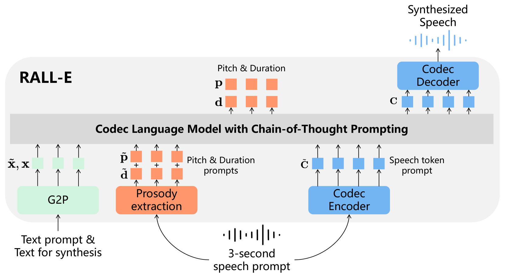
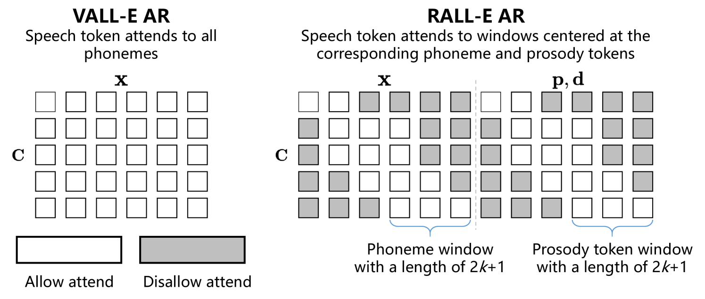
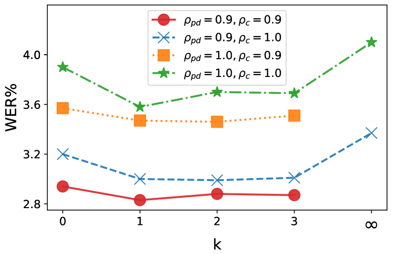

# RALL-E：采用链式思维引导的编解码器语言模型，增强文本至语音合成的鲁棒性

发布时间：2024年04月04日

`LLM应用` `音频处理` `语音合成`

> RALL-E: Robust Codec Language Modeling with Chain-of-Thought Prompting for Text-to-Speech Synthesis

# 摘要

> 我们推出了RALL-E，这是一种新型的文本转语音合成的稳健语言建模技术。尽管以往的大型语言模型（LLMs）在零-shot TTS方面表现出色，但这些方法常因语言模型的自回归特性而存在鲁棒性不足的问题，如音韵的不稳定性（音高和节奏/时长异常）及较高的单词错误率（WER）。RALL-E的核心在于采用思维链（CoT）提示，通过将任务分解为更易处理的小步骤，来提升基于LLM的TTS系统的鲁棒性。RALL-E首先预测输入文本的韵律特征（音高和时长），作为中间状态，进而以CoT方式预测语音单元。其次，RALL-E使用预测出的时长提示来指导Transformer中自注意力权重的计算，确保模型在预测语音单元时能集中注意力于相关的音素和韵律特征。经过一系列客观和主观的全面评估，结果显示，与VALL-E这一强大基线方法相比，RALL-E将零-shot TTS的WER从$6.3\%$（未重排）和$2.1\%$（已重排）分别降低至$2.8\%$和$1.0\%$。此外，RALL-E还能成功合成VALL-E难以应对的句子，并将错误率从$68\%$大幅降至$4\%$。

> We present RALL-E, a robust language modeling method for text-to-speech (TTS) synthesis. While previous work based on large language models (LLMs) shows impressive performance on zero-shot TTS, such methods often suffer from poor robustness, such as unstable prosody (weird pitch and rhythm/duration) and a high word error rate (WER), due to the autoregressive prediction style of language models. The core idea behind RALL-E is chain-of-thought (CoT) prompting, which decomposes the task into simpler steps to enhance the robustness of LLM-based TTS. To accomplish this idea, RALL-E first predicts prosody features (pitch and duration) of the input text and uses them as intermediate conditions to predict speech tokens in a CoT style. Second, RALL-E utilizes the predicted duration prompt to guide the computing of self-attention weights in Transformer to enforce the model to focus on the corresponding phonemes and prosody features when predicting speech tokens. Results of comprehensive objective and subjective evaluations demonstrate that, compared to a powerful baseline method VALL-E, RALL-E significantly improves the WER of zero-shot TTS from $6.3\%$ (without reranking) and $2.1\%$ (with reranking) to $2.8\%$ and $1.0\%$, respectively. Furthermore, we demonstrate that RALL-E correctly synthesizes sentences that are hard for VALL-E and reduces the error rate from $68\%$ to $4\%$.

[Arxiv](https://arxiv.org/abs/2404.03204)