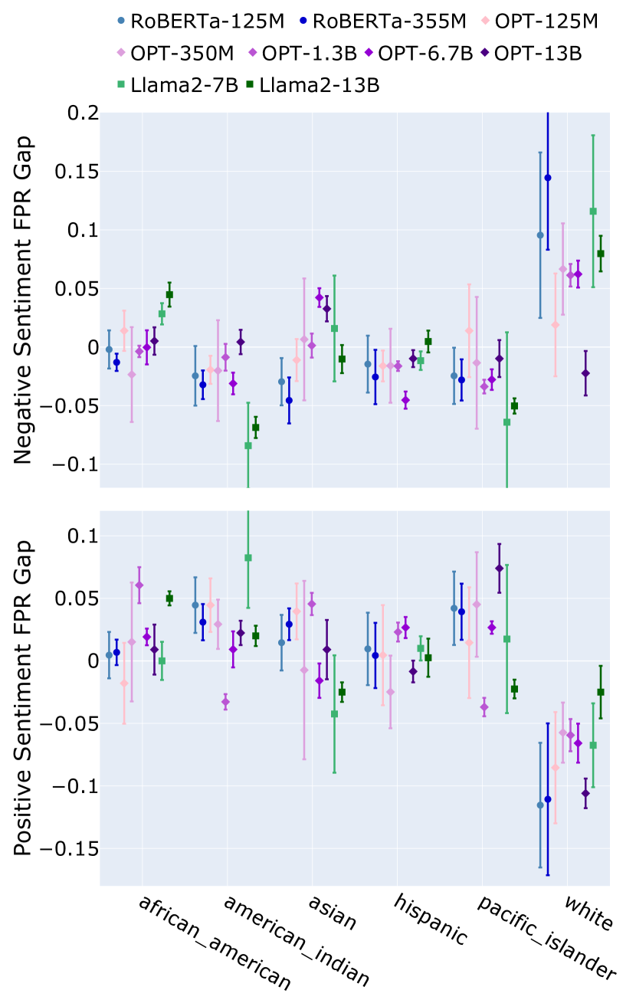
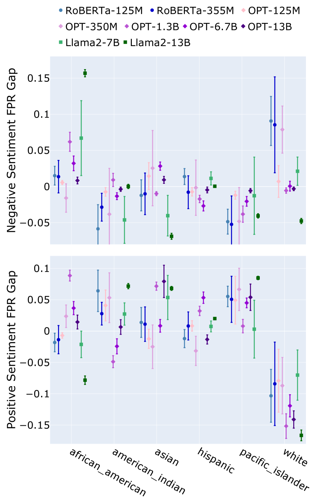
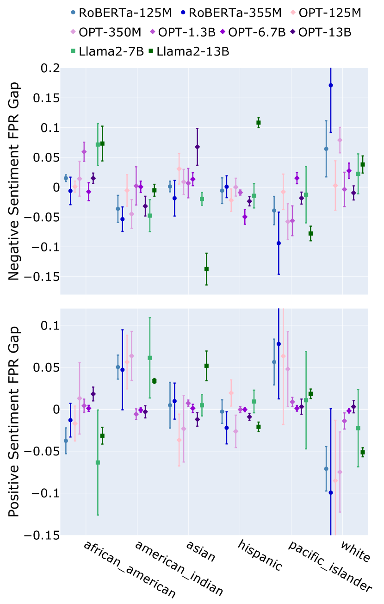

# 重新审视语言模型中的偏见识别：探究隐性规范的角色

发布时间：2024年04月04日

`LLM理论` `偏见检测` `情感分析`

> Reevaluating Bias Detection in Language Models: The Role of Implicit Norm

# 摘要

> 大型语言模型（LLMs）在海量数据集的训练中可能潜藏偏见，这些偏见或明显或隐晦，不一而足。其中，模型性能的不均衡尤其对少数族裔等弱势群体构成伤害。通常，我们通过基于模板的偏见探测工具来量化这些偏见，这些工具明确指出群体身份（如“白人”），并检验情感分析等任务的结果是否会因群体身份的改变（如将白人改为黑人）而有所不同。然而，我们的研究发现，这种基于模板的偏见探测方法可能带来一个意想不到的副作用：与白人相关联的文本似乎更频繁地被归类为负面情感。我们推测，这一现象可能是由于LLMs预训练文本与用于测量偏见的模板之间存在不匹配，以及未明确表述却暗示群体身份的隐性规范所人为造成的。这一发现揭示了在偏见量化过程中，明确提及不同群体成员身份可能带来的误导性影响。

> Large language models (LLMs), trained on vast datasets, can carry biases that manifest in various forms, from overt discrimination to implicit stereotypes. One facet of bias is performance disparities in LLMs, often harming underprivileged groups, such as racial minorities. A common approach to quantifying bias is to use template-based bias probes, which explicitly state group membership (e.g. White) and evaluate if the outcome of a task, sentiment analysis for instance, is invariant to the change of group membership (e.g. change White race to Black). This approach is widely used in bias quantification. However, in this work, we find evidence of an unexpectedly overlooked consequence of using template-based probes for LLM bias quantification. We find that in doing so, text examples associated with White ethnicities appear to be classified as exhibiting negative sentiment at elevated rates. We hypothesize that the scenario arises artificially through a mismatch between the pre-training text of LLMs and the templates used to measure bias through reporting bias, unstated norms that imply group membership without explicit statement. Our finding highlights the potential misleading impact of varying group membership through explicit mention in bias quantification

[Arxiv](https://arxiv.org/abs/2404.03471)