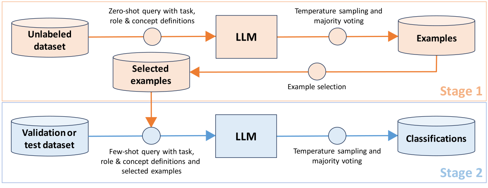
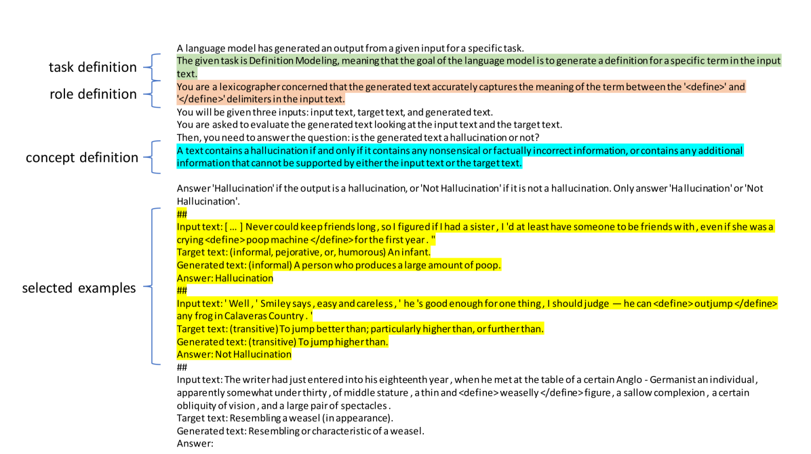
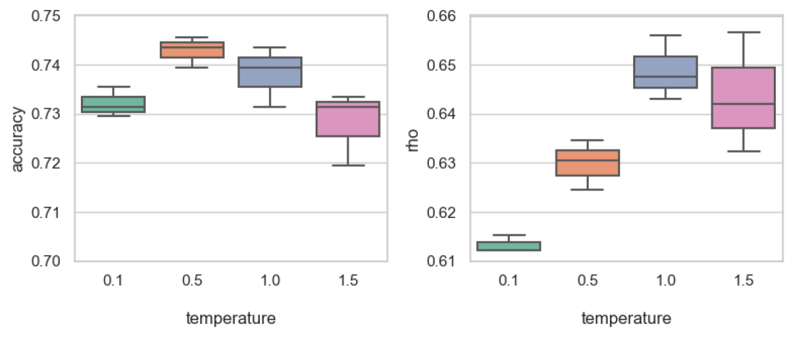
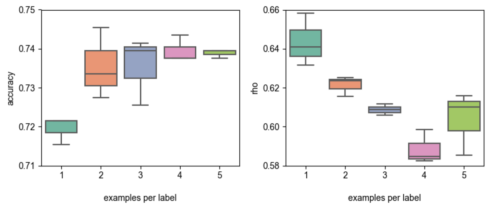
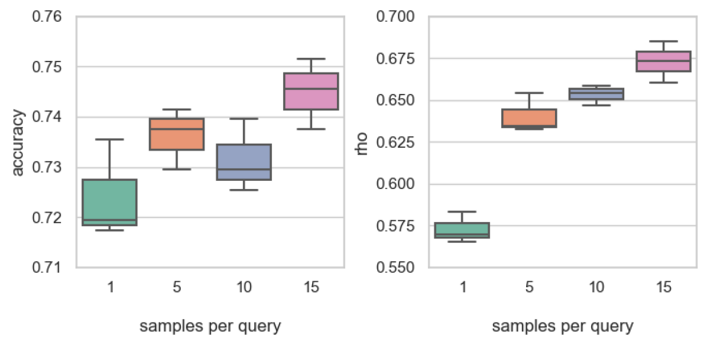
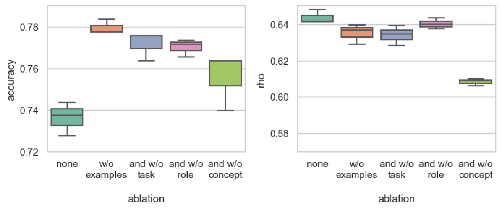

# SHROOM-INDElab 参与 SemEval-2024 第六任务：基于大型语言模型的零样本和少样本分类技术，以检测文本中的虚构信息。

发布时间：2024年04月04日

`LLM应用` `智能数据工程` `幻觉检测`

> SHROOM-INDElab at SemEval-2024 Task 6: Zero- and Few-Shot LLM-Based Classification for Hallucination Detection

# 摘要

> 阿姆斯特丹大学智能数据工程实验室的SHROOM-INDElab团队在SemEval-2024任务6竞赛中表现出色。该系统利用大型语言模型（LLMs）进行提示编程和上下文学习，创新性地结合了特定任务的上下文定义和自动生成示例，进一步提升了幻觉检测分类器的性能。在模型不可知和模型感知两个赛道中，分别斩获第四和第六的佳绩。验证集的评估结果与众包标注者高度一致，同时发现零-shot方法在自动生成示例的辅助下，准确度超过了少数-shot方法。相关代码已在Github公开。

> We describe the University of Amsterdam Intelligent Data Engineering Lab team's entry for the SemEval-2024 Task 6 competition. The SHROOM-INDElab system builds on previous work on using prompt programming and in-context learning with large language models (LLMs) to build classifiers for hallucination detection, and extends that work through the incorporation of context-specific definition of task, role, and target concept, and automated generation of examples for use in a few-shot prompting approach. The resulting system achieved fourth-best and sixth-best performance in the model-agnostic track and model-aware tracks for Task 6, respectively, and evaluation using the validation sets showed that the system's classification decisions were consistent with those of the crowd-sourced human labellers. We further found that a zero-shot approach provided better accuracy than a few-shot approach using automatically generated examples. Code for the system described in this paper is available on Github.

[Arxiv](https://arxiv.org/abs/2404.03732)