# Sailor：面向东南亚地区的开放语言模型

发布时间：2024年04月04日

`LLM应用` `东南亚语言` `多语言模型`

> Sailor: Open Language Models for South-East Asia

# 摘要

> 我们自豪地推出了Sailor系列，这是一款专为东南亚语言设计的开放式语言模型，参数规模从5亿到70亿不等。这些模型基于Qwen1.5进行持续预训练，后者已是一款多语言环境下的佼佼者。Sailor模型处理的文本量在200亿到400亿个标记之间，覆盖了包括英语、中文、越南语、泰语、印尼语、马来语和老挝语在内的多种语言。在训练过程中，我们采用了BPE dropout技术增强模型的鲁棒性，进行了严格的数据清洗和去重，并通过小型代理模型优化了数据组合。在常识推理、问题回答、阅读理解和考试等四项典型任务的实验中，Sailor模型展现了卓越的性能。我们秉承开源的理念，通过本报告分享我们的研究成果，希望能激发更多人对开发适用于多语言环境的大型语言模型的兴趣。

> We present Sailor, a family of open language models ranging from 0.5B to 7B parameters, tailored for South-East Asian (SEA) languages. These models are continually pre-trained from Qwen1.5, a great language model for multilingual use cases. From Qwen1.5, Sailor models accept 200B to 400B tokens, primarily covering the languages of English, Chinese, Vietnamese, Thai, Indonesian, Malay, and Lao. The training leverages several techniques, including BPE dropout for improving the model robustness, aggressive data cleaning and deduplication, and small proxy models to optimize data mixture. Experimental results on four typical tasks indicate that Sailor models demonstrate strong performance across different benchmarks, including commonsense reasoning, question answering, reading comprehension and examination. Embracing the open-source spirit, we share our insights through this report to spark a wider interest in developing large language models for multilingual use cases.

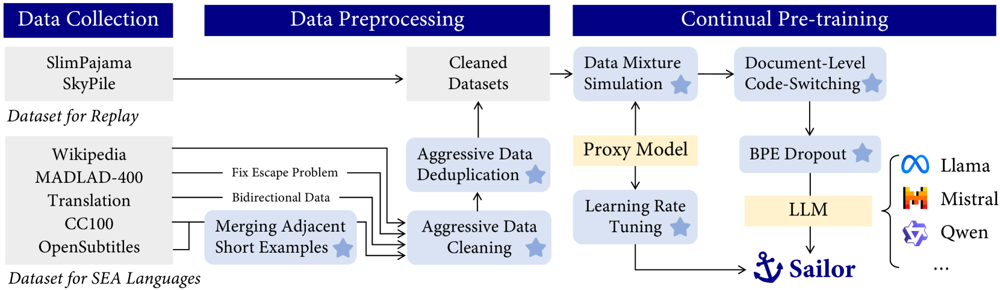

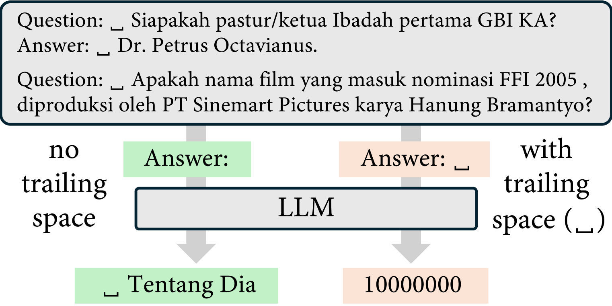

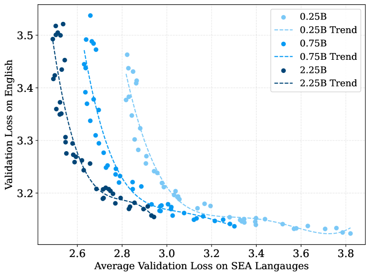

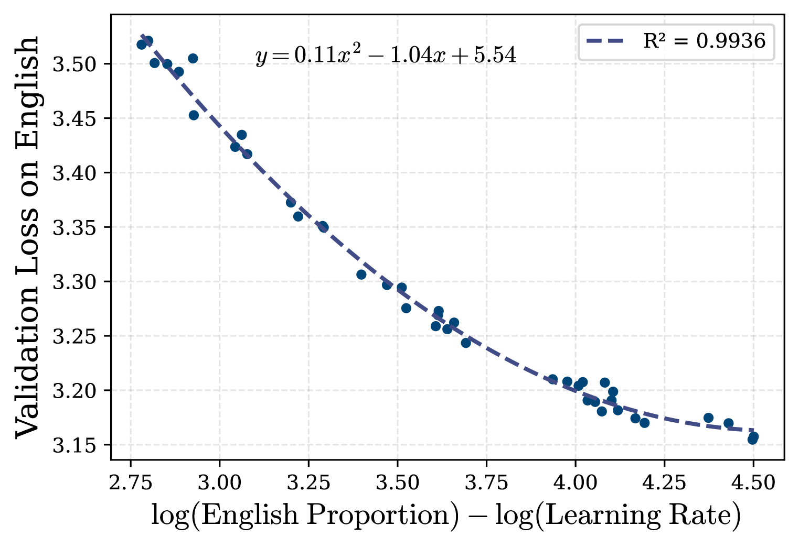

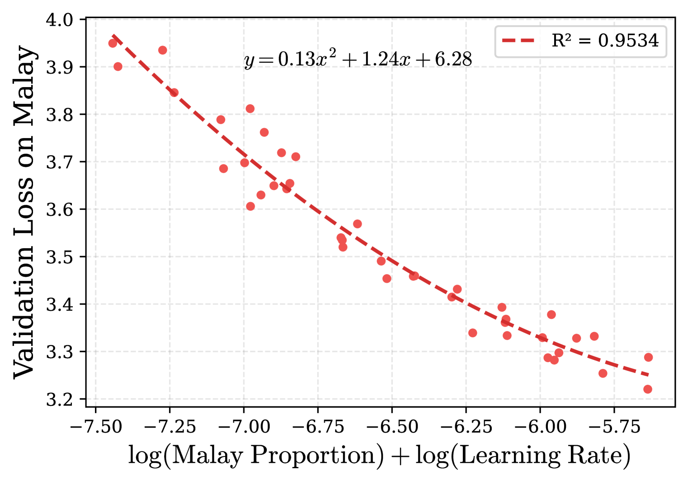

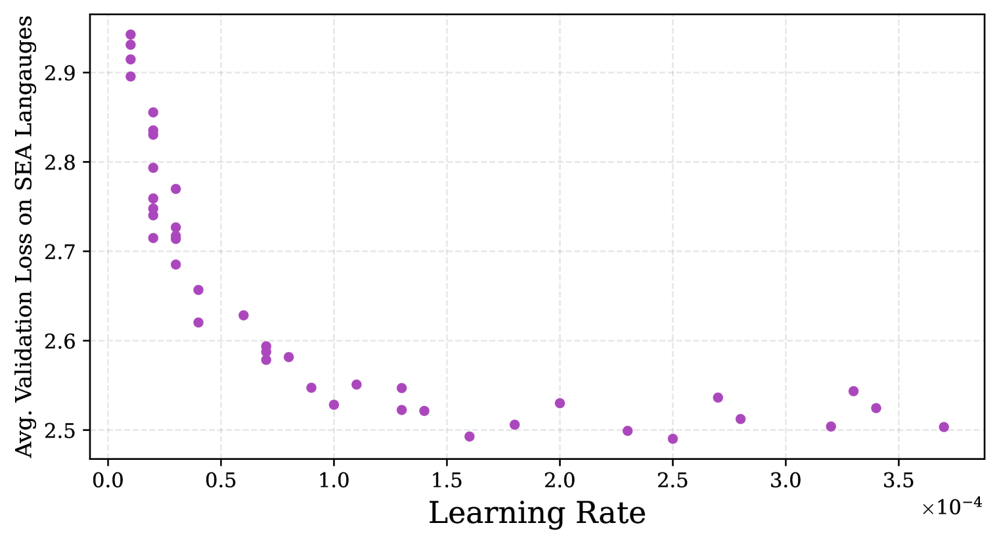

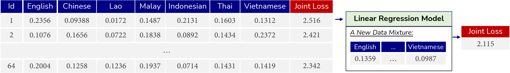

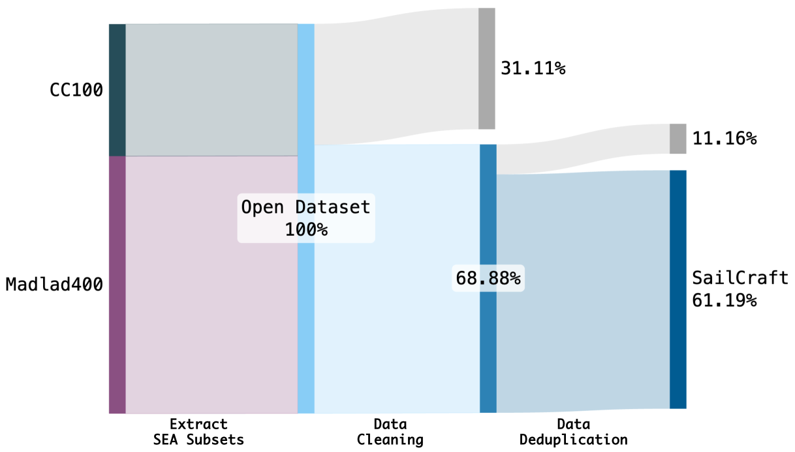

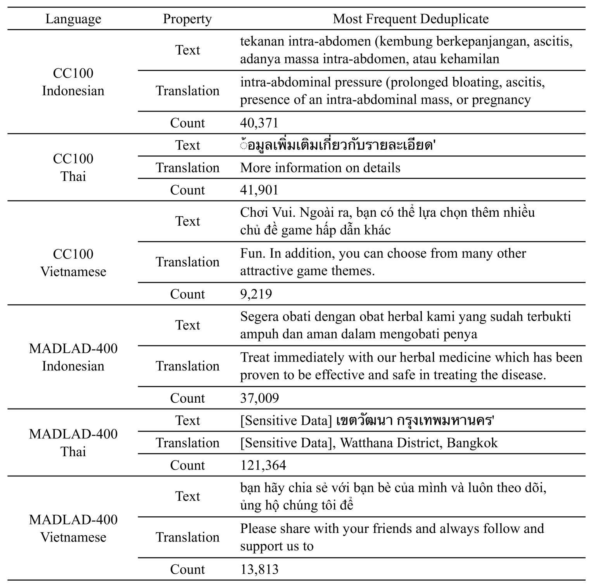

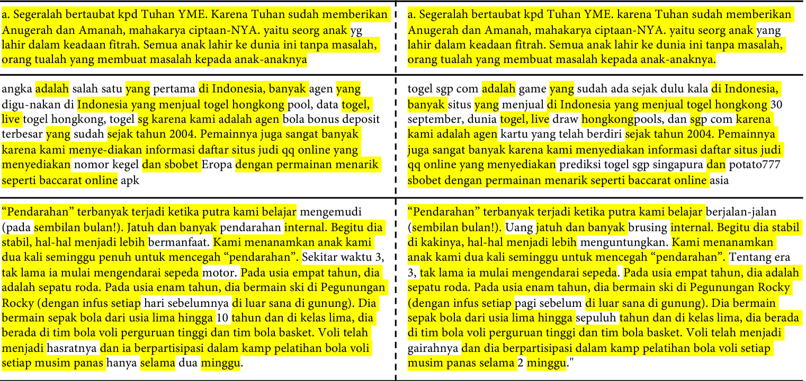

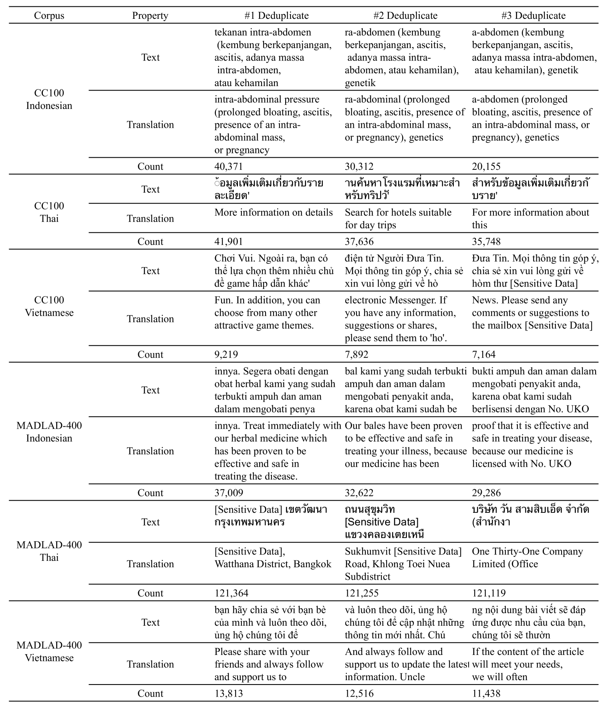

[Arxiv](https://arxiv.org/abs/2404.03608)