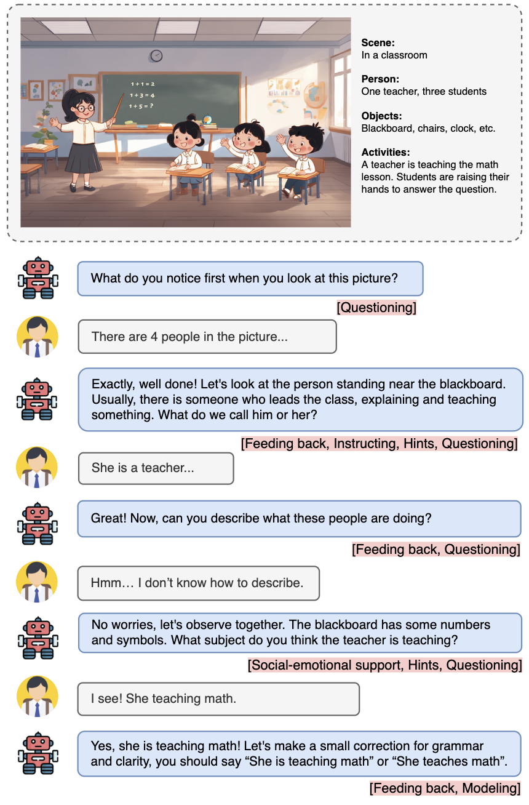
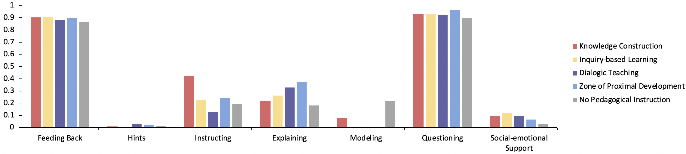
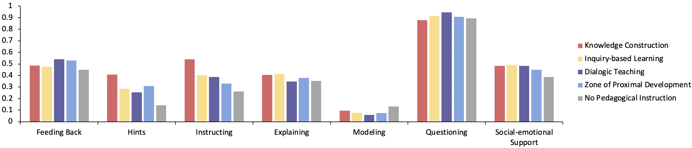
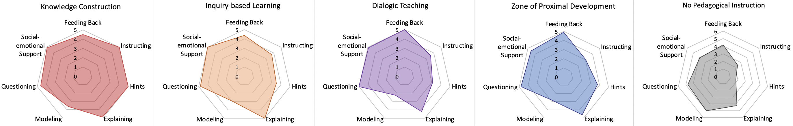

# 利用融入教学指导的多模态辅导系统，为语言学习提供有效支撑。

发布时间：2024年04月04日

`LLM应用` `智能辅导系统`

> Scaffolding Language Learning via Multi-modal Tutoring Systems with Pedagogical Instructions

# 摘要

> 智能辅导系统（ITSs）正模仿人类教师，为学习者提供即时定制化指导，已在教育实践中证明有效。随着生成性AI的兴起，大型语言模型（LLMs）让系统能进行更复杂的对话互动，这对语言教育尤其有益，尽管这一点尚未得到充分重视。针对儿童认知发展的特殊性，我们更需要努力实现其实用性。脚手架教学法通过教师提供支持，帮助学生掌握新知识和技能，有效满足多样化的学习需求。本研究通过案例分析，探索教学指导如何助力ITSs中的脚手架教学，构建了基于四大学习理论的辅导系统。我们开发了一个七维度评估标准，对脚手架教学过程进行评估。在GPT-4V的实验中，我们发现LLMs能很好地遵循教学指导，助力学生按自己的节奏学习。我们还把评估方法从手动升级到自动化，为评估各种对话式辅导系统奠定了基础。

> Intelligent tutoring systems (ITSs) that imitate human tutors and aim to provide immediate and customized instructions or feedback to learners have shown their effectiveness in education. With the emergence of generative artificial intelligence, large language models (LLMs) further entitle the systems to complex and coherent conversational interactions. These systems would be of great help in language education as it involves developing skills in communication, which, however, drew relatively less attention. Additionally, due to the complicated cognitive development at younger ages, more endeavors are needed for practical uses. Scaffolding refers to a teaching technique where teachers provide support and guidance to students for learning and developing new concepts or skills. It is an effective way to support diverse learning needs, goals, processes, and outcomes. In this work, we investigate how pedagogical instructions facilitate the scaffolding in ITSs, by conducting a case study on guiding children to describe images for language learning. We construct different types of scaffolding tutoring systems grounded in four fundamental learning theories: knowledge construction, inquiry-based learning, dialogic teaching, and zone of proximal development. For qualitative and quantitative analyses, we build and refine a seven-dimension rubric to evaluate the scaffolding process. In our experiment on GPT-4V, we observe that LLMs demonstrate strong potential to follow pedagogical instructions and achieve self-paced learning in different student groups. Moreover, we extend our evaluation framework from a manual to an automated approach, paving the way to benchmark various conversational tutoring systems.

[Arxiv](https://arxiv.org/abs/2404.03429)