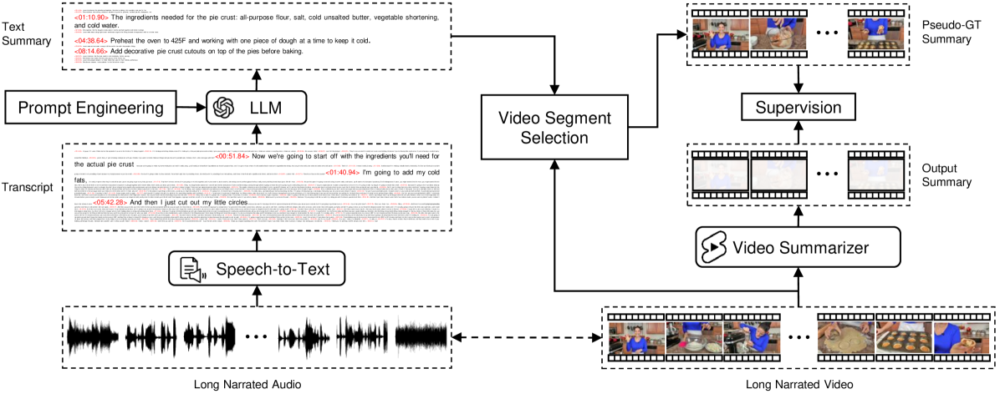
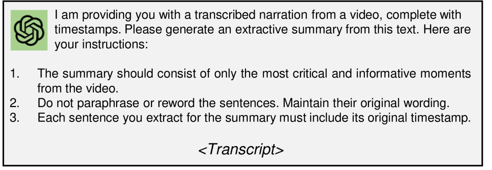
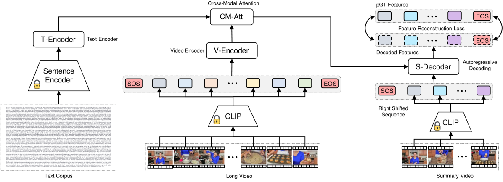

# 借助大型语言模型，我们正在扩大视频摘要预训练的规模。

发布时间：2024年04月04日

`LLM应用` `视频处理` `自动化摘要`

> Scaling Up Video Summarization Pretraining with Large Language Models

# 摘要

> 长篇视频内容在互联网流量中占据了相当的比例，因此自动化视频摘要成为了一个至关重要的研究课题。然而，现有的视频摘要数据集规模普遍偏小，这限制了现有方法在泛化能力上的发挥。我们的研究致力于通过充分利用大量长视频资源和精确的语音到视频对齐技术，以及最新大型语言模型（LLMs）在长篇文本摘要方面的出色表现，来突破这一局限。我们提出了一个自动化、可扩展的流程，利用LLMs作为摘要生成器，创建了一个大规模的视频摘要数据集。借助这个新数据集，我们深入分析了现有方法的不足，并提出了一个创新的视频摘要模型，有效地克服了这些局限。此外，为了推动该领域的发展，我们还推出了一个全新的基准数据集，涵盖了1200段长视频及其由专业人士精心编写的高质量摘要。通过一系列广泛的实验验证，我们的方法在多个评估标准上均达到了视频摘要领域的新高度。

> Long-form video content constitutes a significant portion of internet traffic, making automated video summarization an essential research problem. However, existing video summarization datasets are notably limited in their size, constraining the effectiveness of state-of-the-art methods for generalization. Our work aims to overcome this limitation by capitalizing on the abundance of long-form videos with dense speech-to-video alignment and the remarkable capabilities of recent large language models (LLMs) in summarizing long text. We introduce an automated and scalable pipeline for generating a large-scale video summarization dataset using LLMs as Oracle summarizers. By leveraging the generated dataset, we analyze the limitations of existing approaches and propose a new video summarization model that effectively addresses them. To facilitate further research in the field, our work also presents a new benchmark dataset that contains 1200 long videos each with high-quality summaries annotated by professionals. Extensive experiments clearly indicate that our proposed approach sets a new state-of-the-art in video summarization across several benchmarks.

[Arxiv](https://arxiv.org/abs/2404.03398)