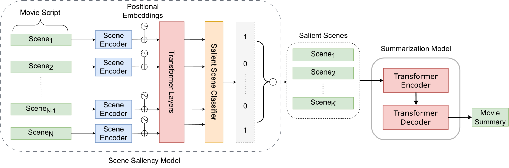
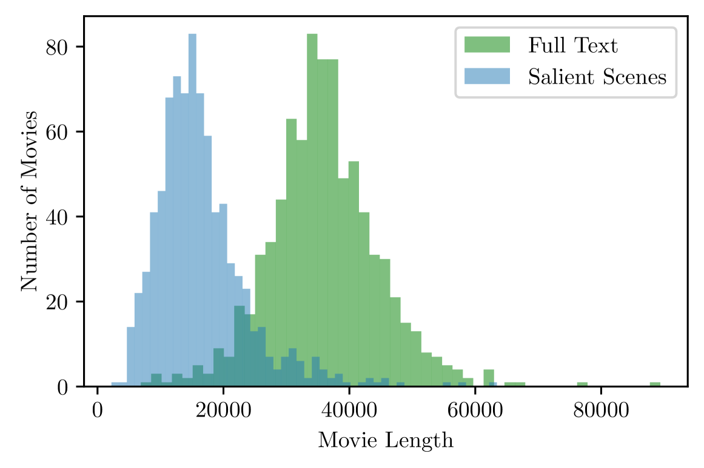

# 精选与概述：电影剧本摘要中的场景焦点

发布时间：2024年04月04日

`LLM应用` `文本摘要`

> Select and Summarize: Scene Saliency for Movie Script Summarization

# 摘要

> 长篇叙事文本，比如电影剧本的摘要性总结，因现有语言模型的计算与记忆限制而充满挑战。电影剧本涵盖众多场景，但仅有少数场景对理解整体故事至关重要。场景的显著性可通过其在摘要中的提及来确定。由于缺乏适宜的数据集，自动识别这些关键场景变得复杂。本研究推出了一个包含100部影片人工标注的关键场景数据集，并提出了一种新颖的两阶段摘要方法：先筛选出剧本中的关键场景，再基于这些场景撰写摘要。通过问答式评估，我们证实，相较于全面分析整部剧本的模型，我们的模型在总结性能上取得了显著提升，并能更准确地捕捉电影的信息精华。

> Abstractive summarization for long-form narrative texts such as movie scripts is challenging due to the computational and memory constraints of current language models. A movie script typically comprises a large number of scenes; however, only a fraction of these scenes are salient, i.e., important for understanding the overall narrative. The salience of a scene can be operationalized by considering it as salient if it is mentioned in the summary. Automatically identifying salient scenes is difficult due to the lack of suitable datasets. In this work, we introduce a scene saliency dataset that consists of human-annotated salient scenes for 100 movies. We propose a two-stage abstractive summarization approach which first identifies the salient scenes in script and then generates a summary using only those scenes. Using QA-based evaluation, we show that our model outperforms previous state-of-the-art summarization methods and reflects the information content of a movie more accurately than a model that takes the whole movie script as input.

[Arxiv](https://arxiv.org/abs/2404.03561)