# SemGrasp：利用语言对齐离散化技术实现语义抓取的生成

发布时间：2024年04月04日

`Agent` `机器人` `人工智能`

> SemGrasp: Semantic Grasp Generation via Language Aligned Discretization

# 摘要

> 要创造出自然的人类抓取动作，我们不仅要考虑物体的形状，还要融入语义信息。如果只依据物体的形状来设计抓取动作，那么之前的方法在后续应用中就会受到限制。在本文中，我们提出了一种创新的基于语义的抓取生成技术——SemGrasp。它通过融合语义信息到抓取动作的表征中，生成符合语言指令的自然人类抓取姿势。我们设计了一种离散型表示法，将抓取空间与语义空间相结合，从而可以根据语言指令来生成相应的抓取姿势。我们还对多模态大型语言模型（MLLM）进行了精细调整，将物体、抓取动作和语言整合在一个统一的语义空间内。为了促进 SemGrasp 的训练，我们创建了一个包含约 26 万个详细描述和 5 万个多样化抓取的大型抓取文本对齐数据集 CapGrasp。实验结果显示，SemGrasp 能够高效地生成与语言指令相匹配的自然人类抓取动作。我们的代码、模型和数据集已经公开发布在：https://kailinli.github.io/SemGrasp.

> Generating natural human grasps necessitates consideration of not just object geometry but also semantic information. Solely depending on object shape for grasp generation confines the applications of prior methods in downstream tasks. This paper presents a novel semantic-based grasp generation method, termed SemGrasp, which generates a static human grasp pose by incorporating semantic information into the grasp representation. We introduce a discrete representation that aligns the grasp space with semantic space, enabling the generation of grasp postures in accordance with language instructions. A Multimodal Large Language Model (MLLM) is subsequently fine-tuned, integrating object, grasp, and language within a unified semantic space. To facilitate the training of SemGrasp, we have compiled a large-scale, grasp-text-aligned dataset named CapGrasp, featuring about 260k detailed captions and 50k diverse grasps. Experimental findings demonstrate that SemGrasp efficiently generates natural human grasps in alignment with linguistic intentions. Our code, models, and dataset are available publicly at: https://kailinli.github.io/SemGrasp.

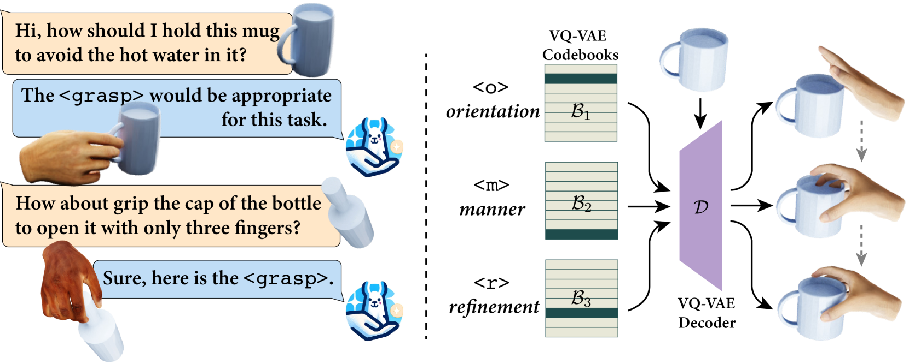

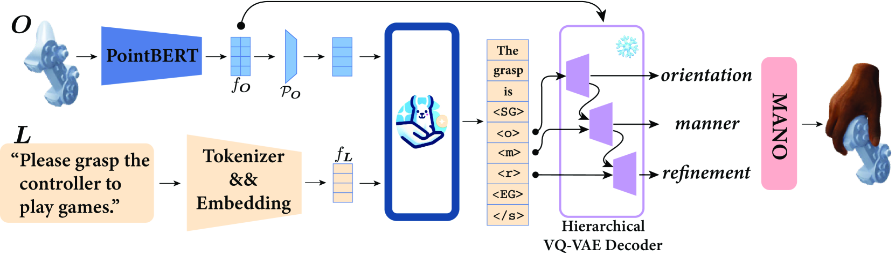

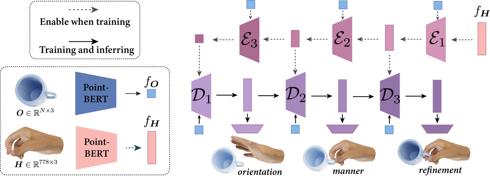

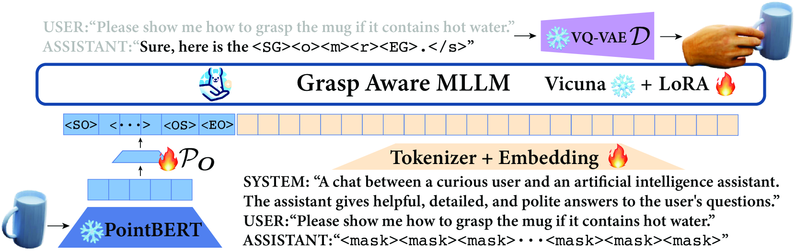

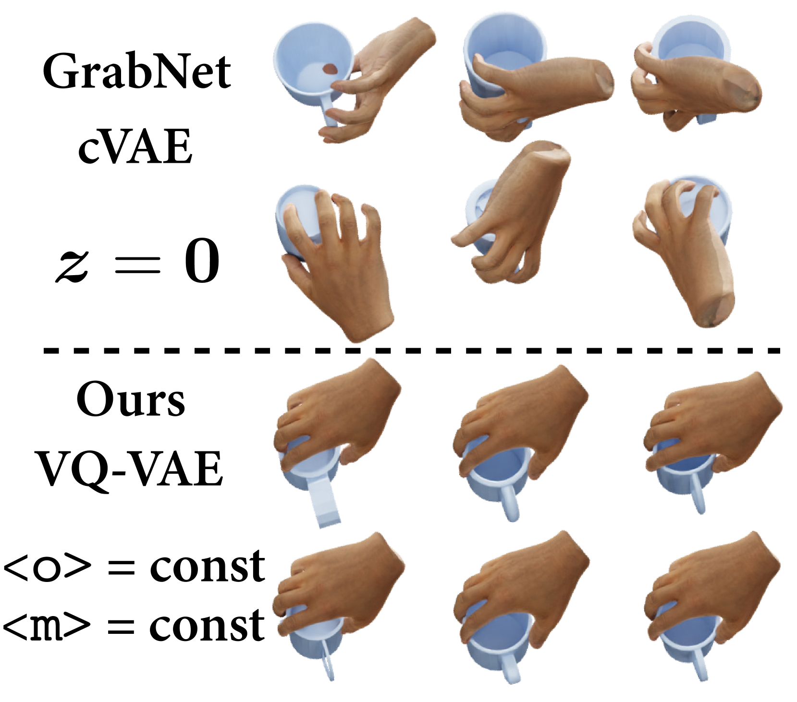

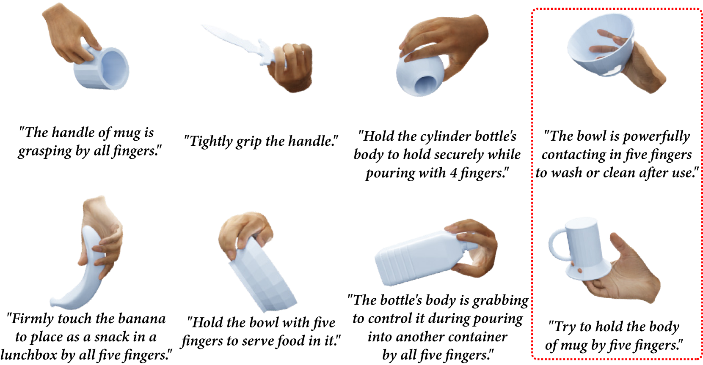

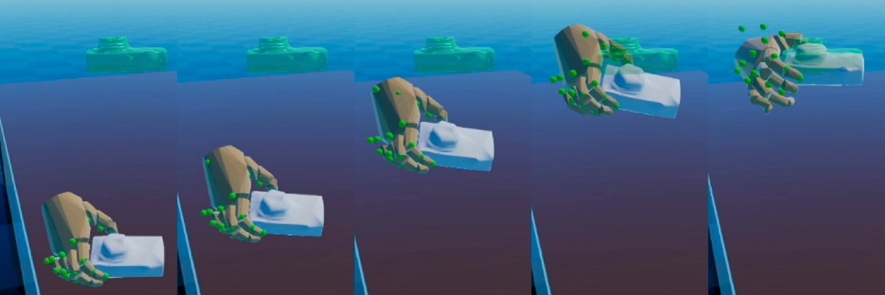

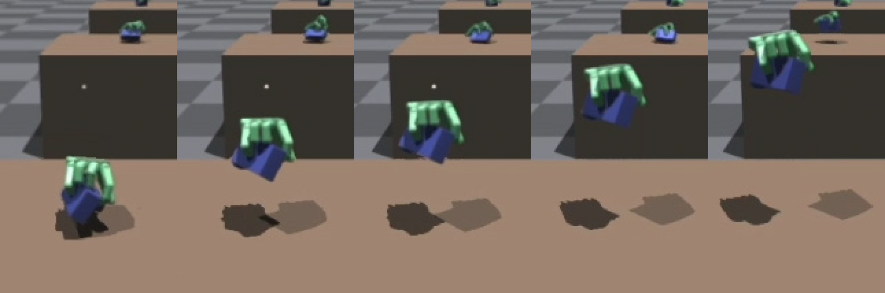

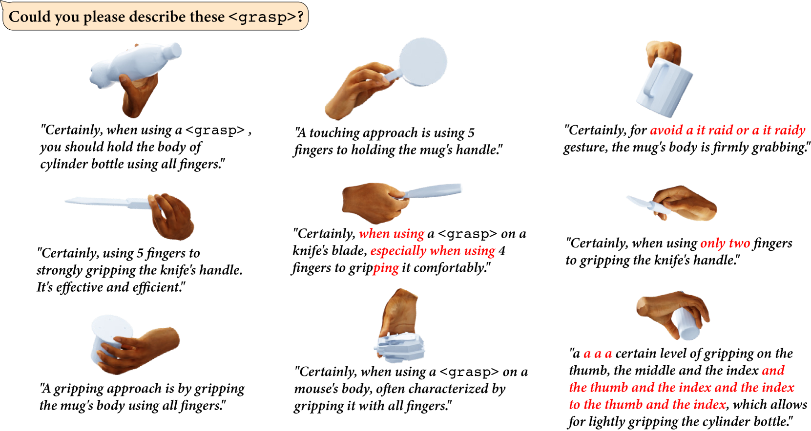

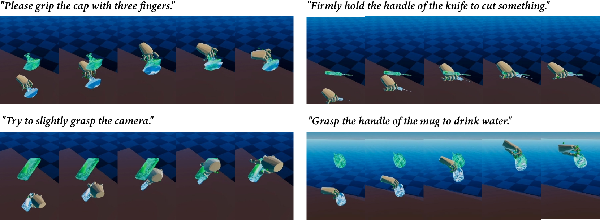

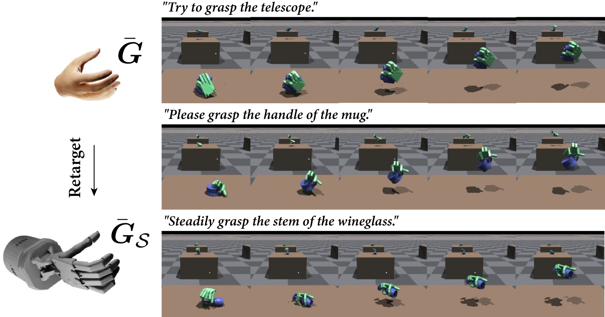

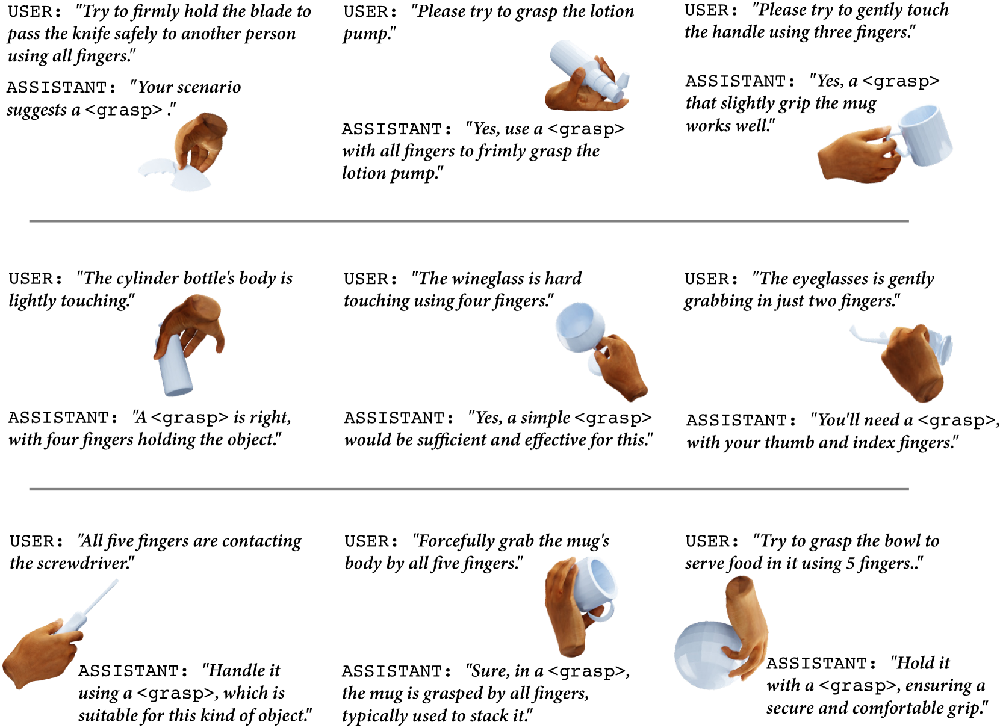

[Arxiv](https://arxiv.org/abs/2404.03590)