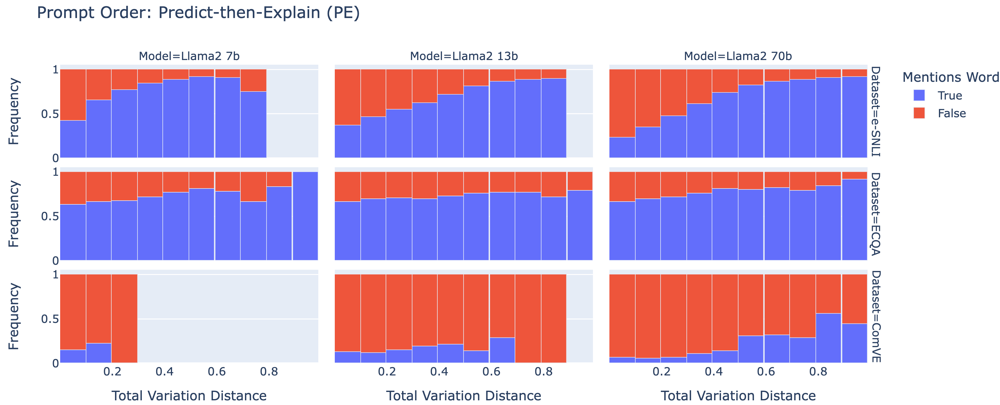
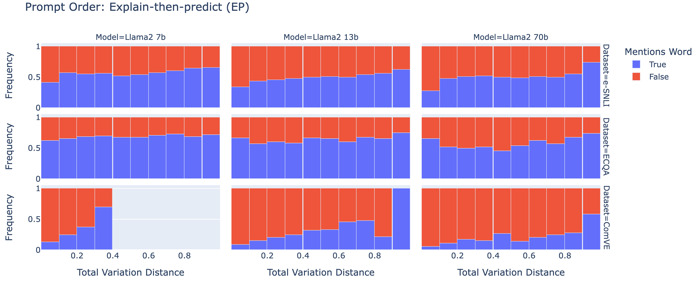

# 概率的权重：构建更精确衡量大型语言模型自由文本解释准确性的指标

发布时间：2024年04月04日

`LLM理论` `人工智能监管` `模型解释性`

> The Probabilities Also Matter: A More Faithful Metric for Faithfulness of Free-Text Explanations in Large Language Models

# 摘要

> 要有效监管先进的AI系统，深入理解它们的决策机制至关重要。大型语言模型（LLMs）能够在提示下生成看似合理的自然语言解释，并获得人类评价者的好评。但这些解释的真实性——即它们是否真正反映了模型预测的关键因素——尚不明朗。本研究提出了一种新度量标准——相关性解释忠实度（CEF），用于基于输入干预的模型忠实度测试。与传统的仅关注预测变化的二元性度量不同，CEF能够全面衡量模型预测标签分布的转移，从而更精确地评估解释的真实性。基于此，我们进一步推出了相关性反事实测试（CCT），它是对Atanasova等人（2023年）提出的反事实测试（CT）的一次创新应用。我们对Llama2系列LLMs在三个自然语言处理（NLP）任务中，通过少量示例提示生成的自由文本解释的忠实度进行了评估。研究发现，我们的度量能够捕捉到CT所忽略的忠实度要素。

> In order to oversee advanced AI systems, it is important to understand their underlying decision-making process. When prompted, large language models (LLMs) can provide natural language explanations or reasoning traces that sound plausible and receive high ratings from human annotators. However, it is unclear to what extent these explanations are faithful, i.e., truly capture the factors responsible for the model's predictions. In this work, we introduce Correlational Explanatory Faithfulness (CEF), a metric that can be used in faithfulness tests based on input interventions. Previous metrics used in such tests take into account only binary changes in the predictions. Our metric accounts for the total shift in the model's predicted label distribution, more accurately reflecting the explanations' faithfulness. We then introduce the Correlational Counterfactual Test (CCT) by instantiating CEF on the Counterfactual Test (CT) from Atanasova et al. (2023). We evaluate the faithfulness of free-text explanations generated by few-shot-prompted LLMs from the Llama2 family on three NLP tasks. We find that our metric measures aspects of faithfulness which the CT misses.

[Arxiv](https://arxiv.org/abs/2404.03189)