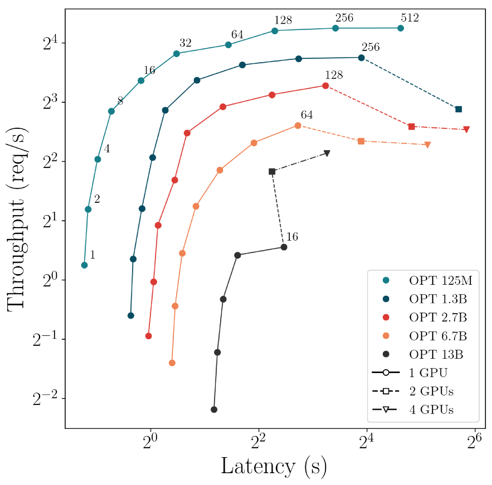
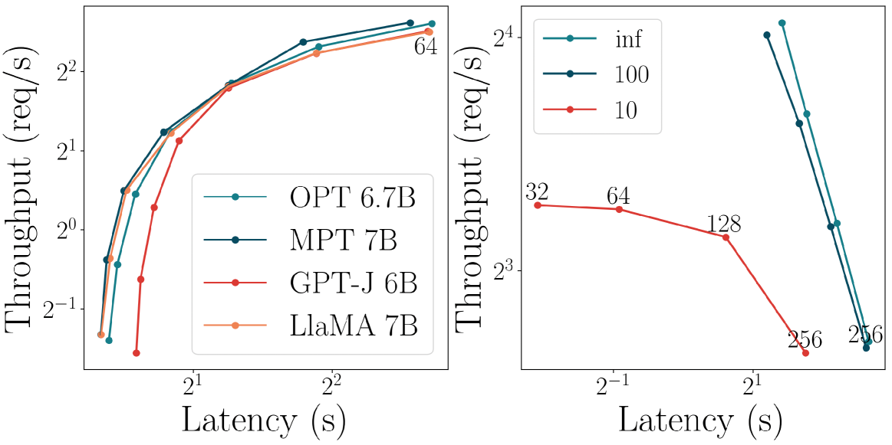
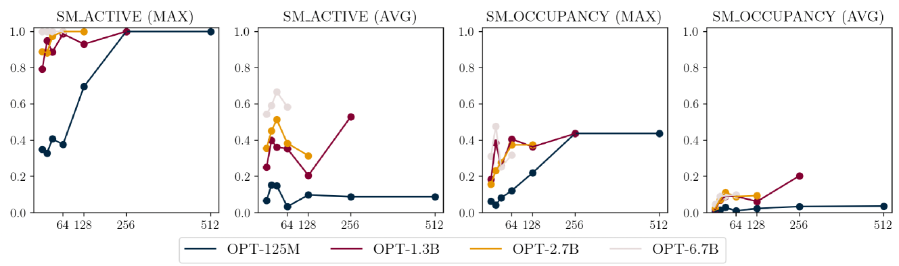
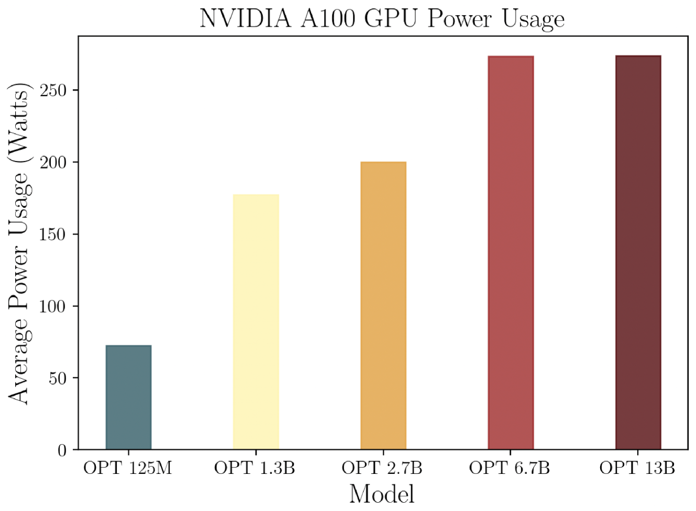
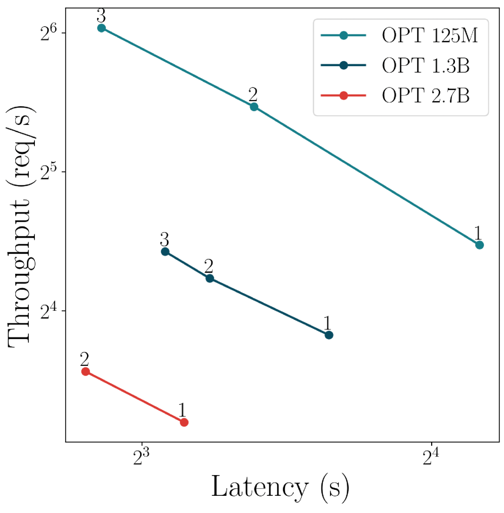
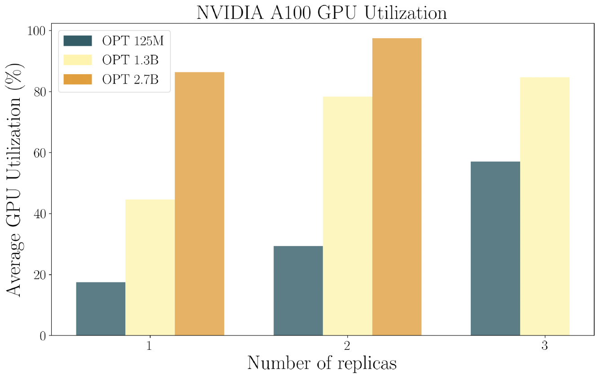
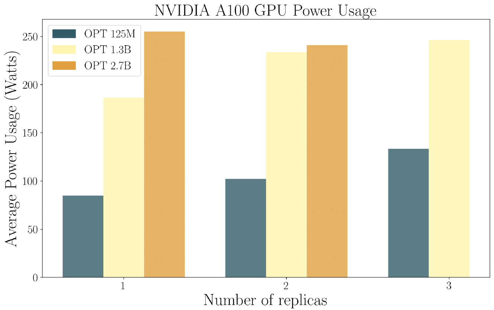

# 追求在小型语言模型服务中的帕累托最优吞吐量

发布时间：2024年04月04日

`LLM理论` `资源受限计算` `模型优化`

> Towards Pareto Optimal Throughput in Small Language Model Serving

# 摘要

> 大型语言模型（LLMs）引领了自然语言处理领域的技术革新。尽管运行LLMs对计算和内存资源要求颇高，但小型语言模型（SLMs）的兴起为资源受限用户带来了新的可能性，使他们也能享受到高性能的小型模型服务。本文展示了一系列针对SLM推理性能和能耗的基准测试实验。我们的分析揭示了一个新的视角：SLMs较小的内存占用有助于在单一加速器资源范围内实现最优吞吐量。研究初步发现，通过模型复制可以有效提升SLMs服务的资源使用效率。

> Large language models (LLMs) have revolutionized the state-of-the-art of many different natural language processing tasks. Although serving LLMs is computationally and memory demanding, the rise of Small Language Models (SLMs) offers new opportunities for resource-constrained users, who now are able to serve small models with cutting-edge performance. In this paper, we present a set of experiments designed to benchmark SLM inference at performance and energy levels. Our analysis provides a new perspective in serving, highlighting that the small memory footprint of SLMs allows for reaching the Pareto-optimal throughput within the resource capacity of a single accelerator. In this regard, we present an initial set of findings demonstrating how model replication can effectively improve resource utilization for serving SLMs.

[Arxiv](https://arxiv.org/abs/2404.03353)