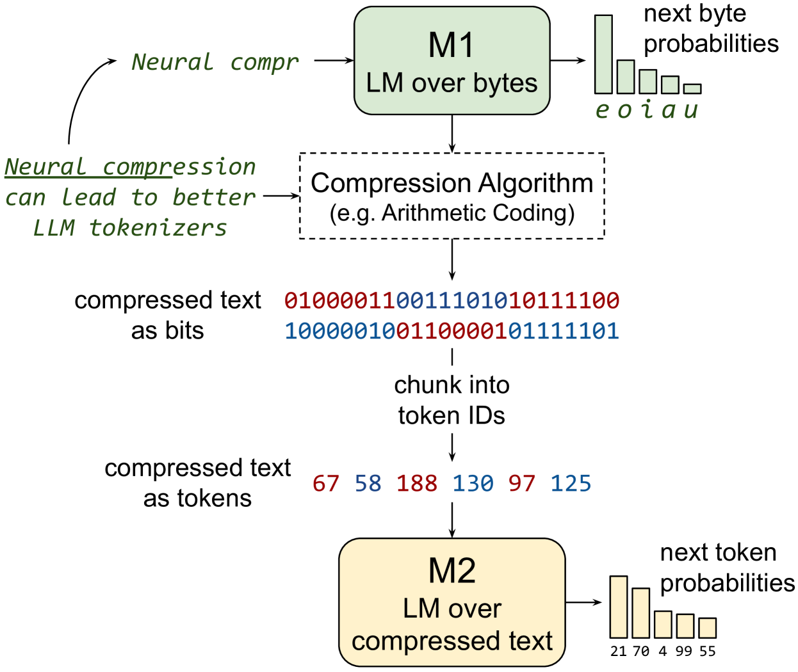

# 通过对神经网络压缩的文本进行训练，提升了大型语言模型（LLM）的能力。

发布时间：2024年04月04日

`LLM理论` `压缩文本` `大型语言模型`

> Training LLMs over Neurally Compressed Text

# 摘要

> 本文探讨了直接在神经网络压缩文本上训练大型语言模型（LLMs）的潜力。尽管传统子词分词器能轻微压缩文本，但神经压缩技术能实现更高压缩率。直接对神经压缩文本进行训练，将提升训练效率和服务性能，同时便于处理长文本。不过，强压缩产生的不透明输出对学习不太友好，尤其是通过算术编码的文本，LLMs难以学习。为此，我们提出了“等信息窗口”（Equal-Info Windows）技术，它通过将文本分割成等长比特的块来压缩，使得学习成为可能。我们的实验表明，这种学习方式随着规模扩大而效果更佳，并在多个基准测试中超越了传统字节级处理方法。虽然在相同参数量的模型中，我们的方法在困惑度上不如子词分词器，但短序列的优势在于减少生成步骤和延迟。我们还深入分析了影响学习性的因素，并为提升高压缩分词器的性能提出了建议。

> In this paper, we explore the idea of training large language models (LLMs) over highly compressed text. While standard subword tokenizers compress text by a small factor, neural text compressors can achieve much higher rates of compression. If it were possible to train LLMs directly over neurally compressed text, this would confer advantages in training and serving efficiency, as well as easier handling of long text spans. The main obstacle to this goal is that strong compression tends to produce opaque outputs that are not well-suited for learning. In particular, we find that text naïvely compressed via Arithmetic Coding is not readily learnable by LLMs. To overcome this, we propose Equal-Info Windows, a novel compression technique whereby text is segmented into blocks that each compress to the same bit length. Using this method, we demonstrate effective learning over neurally compressed text that improves with scale, and outperforms byte-level baselines by a wide margin on perplexity and inference speed benchmarks. While our method delivers worse perplexity than subword tokenizers for models trained with the same parameter count, it has the benefit of shorter sequence lengths. Shorter sequence lengths require fewer autoregressive generation steps, and reduce latency. Finally, we provide extensive analysis of the properties that contribute to learnability, and offer concrete suggestions for how to further improve the performance of high-compression tokenizers.

[Arxiv](https://arxiv.org/abs/2404.03626)