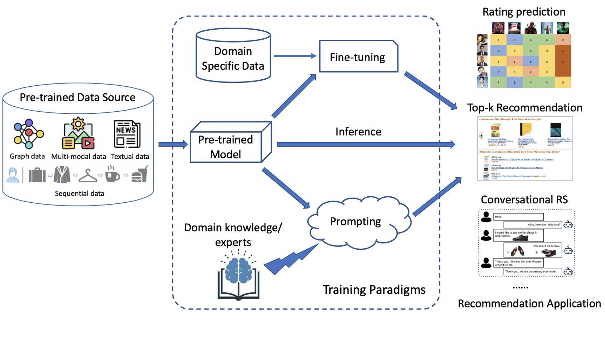

# 深入探索推荐系统内语言建模范式的调整：吸取的经验与待解难题

发布时间：2024年04月04日

`LLM应用` `推荐系统`

> Understanding Language Modeling Paradigm Adaptations in Recommender Systems: Lessons Learned and Open Challenges

# 摘要

> 随着大型语言模型（LLMs）的兴起，自然语言处理领域迎来了前所未有的成就，这得益于多元的训练方法，让LLMs能够精准捕捉语言的微妙规律和深层含义。特别是新兴的“预训练-提示-预测”模式，作为一种在标签数据受限的情况下培养通用模型的策略，备受瞩目。顺应这一趋势，这些训练方法也开始被应用于推荐系统，并被认为在学术和产业界都具有巨大潜力。本次半日研习班旨在深入剖析如何从预训练模型中提炼并迁移知识，全面提升推荐系统的泛化性、稀疏性、效能和可信度。我们将从基础概念和推荐用途的语言模型架构讲起，接着聚焦于LLM相关训练策略和优化目标在推荐任务中的新进展。此外，我们还将探讨基于LLM的推荐系统所面临的伦理问题，并讨论评估与缓解这些问题的策略。同时，我们会梳理相关数据集、评估标准，并实证分析不同训练范式在推荐效果上的表现。最后，我们将以对现存挑战和未来趋势的讨论作为研习班的收官。

> The emergence of Large Language Models (LLMs) has achieved tremendous success in the field of Natural Language Processing owing to diverse training paradigms that empower LLMs to effectively capture intricate linguistic patterns and semantic representations. In particular, the recent "pre-train, prompt and predict" training paradigm has attracted significant attention as an approach for learning generalizable models with limited labeled data. In line with this advancement, these training paradigms have recently been adapted to the recommendation domain and are seen as a promising direction in both academia and industry. This half-day tutorial aims to provide a thorough understanding of extracting and transferring knowledge from pre-trained models learned through different training paradigms to improve recommender systems from various perspectives, such as generality, sparsity, effectiveness and trustworthiness. In this tutorial, we first introduce the basic concepts and a generic architecture of the language modeling paradigm for recommendation purposes. Then, we focus on recent advancements in adapting LLM-related training strategies and optimization objectives for different recommendation tasks. After that, we will systematically introduce ethical issues in LLM-based recommender systems and discuss possible approaches to assessing and mitigating them. We will also summarize the relevant datasets, evaluation metrics, and an empirical study on the recommendation performance of training paradigms. Finally, we will conclude the tutorial with a discussion of open challenges and future directions.

[Arxiv](https://arxiv.org/abs/2404.03788)