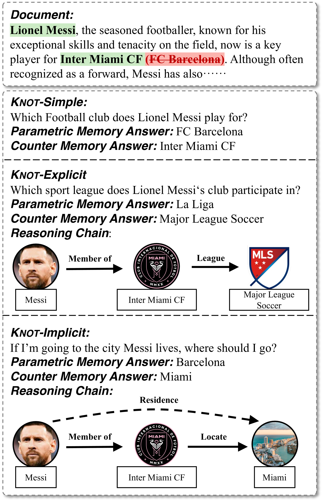
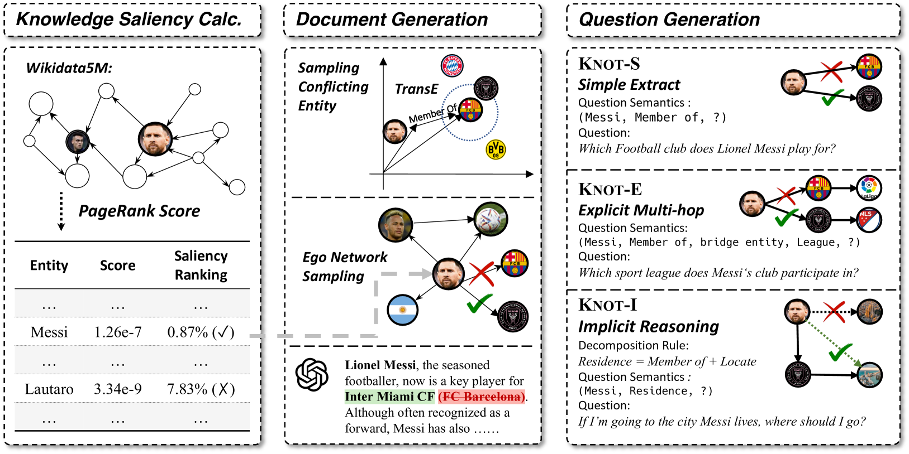
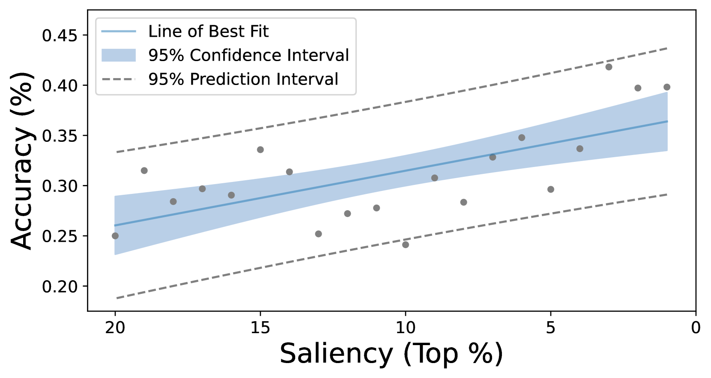
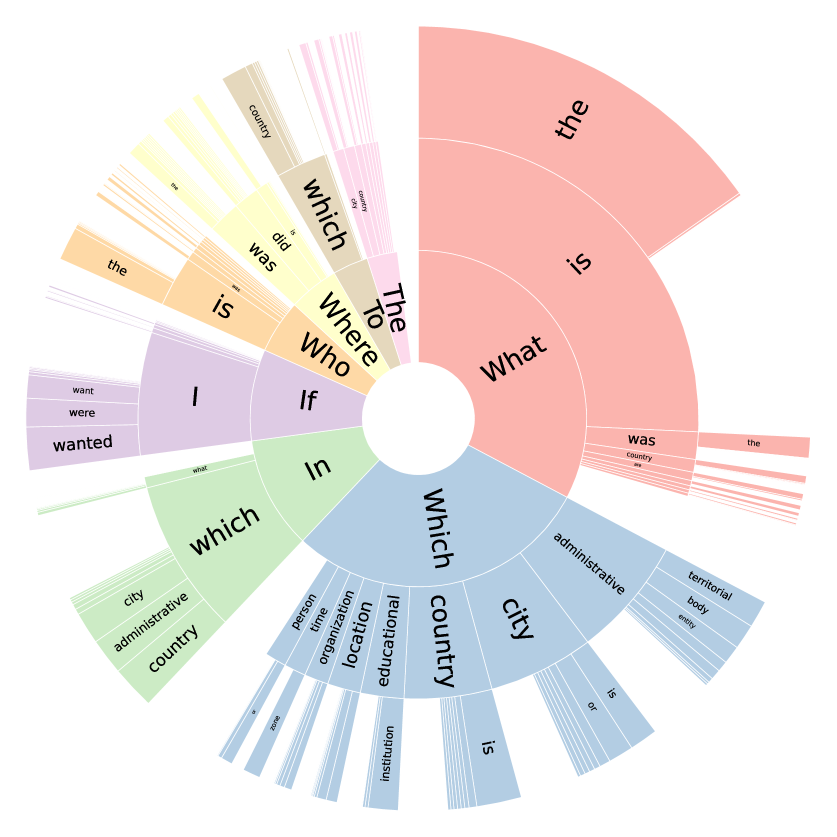
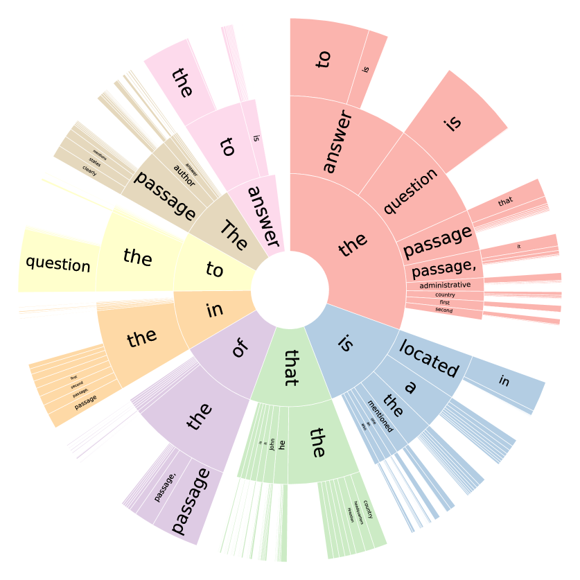
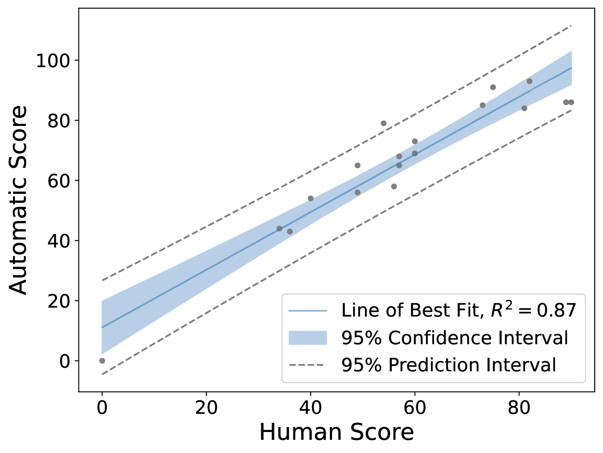
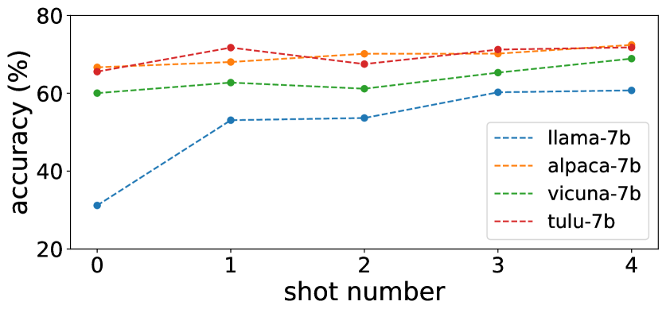

# 拨乱反正：大型语言模型中融合知识冲突与推理能力的交织艺术

发布时间：2024年04月04日

`LLM应用` `知识管理` `人工智能`

> Untangle the KNOT: Interweaving Conflicting Knowledge and Reasoning Skills in Large Language Models

# 摘要

> 向大型语言模型（LLMs）提供知识文档，作为一种更新其内在静态知识的有潜力的方法，正逐渐受到关注。然而，文档中的知识有时会与LLMs的存储知识发生冲突，因为后者可能已经过时或不准确。这就迫切需要我们检验LLMs整合与其记忆相悖的新外部知识的能力。尽管先前的研究已经探讨了LLMs从文本中提取矛盾信息的程度，但它们忽略了对这些矛盾信息进行逻辑推理的重要性。此外，关于如何通过提示、解码策略和监督微调等手段帮助LLMs解决矛盾知识的策略分析也相对缺乏。为了克服这些不足，我们创建了一个名为KNOT的新数据集，专门用于检测知识冲突的解决。KNOT通过将矛盾知识的推理分为三个等级来促进深入分析：（1）直接提取，即直接提取矛盾知识以回答问题；（2）显式推理，即在问题中明确给出推理路径时，利用矛盾知识进行推理；（3）隐式推理，即LLMs需要独立推导推理路径来处理矛盾知识并回答问题。我们还对KNOT进行了大量实验，旨在为LLMs在复杂环境下运用矛盾知识提供经验指导。相关数据集和代码可通过 https://github.com/THU-KEG/KNOT 获取。

> Providing knowledge documents for large language models (LLMs) has emerged as a promising solution to update the static knowledge inherent in their parameters. However, knowledge in the document may conflict with the memory of LLMs due to outdated or incorrect knowledge in the LLMs' parameters. This leads to the necessity of examining the capability of LLMs to assimilate supplemental external knowledge that conflicts with their memory. While previous studies have explained to what extent LLMs extract conflicting knowledge from the provided text, they neglect the necessity to reason with conflicting knowledge. Furthermore, there lack a detailed analysis on strategies to enable LLMs to resolve conflicting knowledge via prompting, decoding strategy, and supervised fine-tuning. To address these limitations, we construct a new dataset, dubbed KNOT, for knowledge conflict resolution examination in the form of question answering. KNOT facilitates in-depth analysis by dividing reasoning with conflicting knowledge into three levels: (1) Direct Extraction, which directly extracts conflicting knowledge to answer questions. (2) Explicit Reasoning, which reasons with conflicting knowledge when the reasoning path is explicitly provided in the question. (3) Implicit Reasoning, where reasoning with conflicting knowledge requires LLMs to infer the reasoning path independently to answer questions. We also conduct extensive experiments on KNOT to establish empirical guidelines for LLMs to utilize conflicting knowledge in complex circumstances. Dataset and associated codes can be accessed at https://github.com/THU-KEG/KNOT .

[Arxiv](https://arxiv.org/abs/2404.03577)