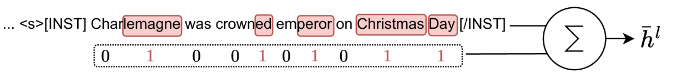
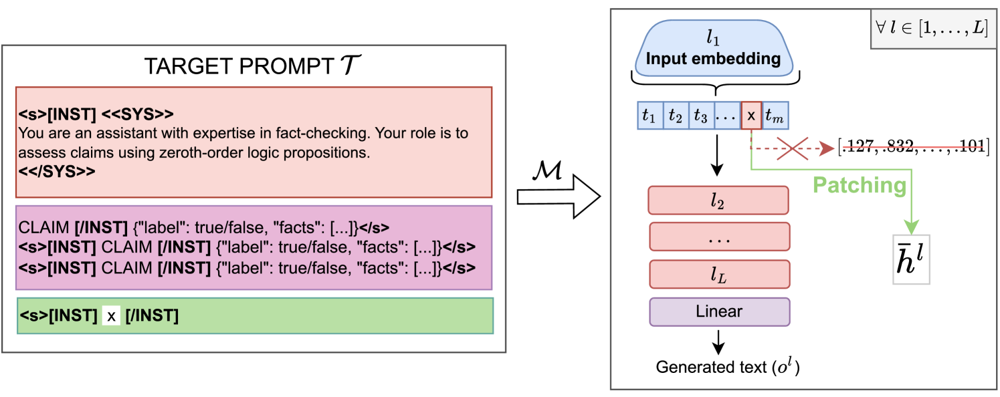
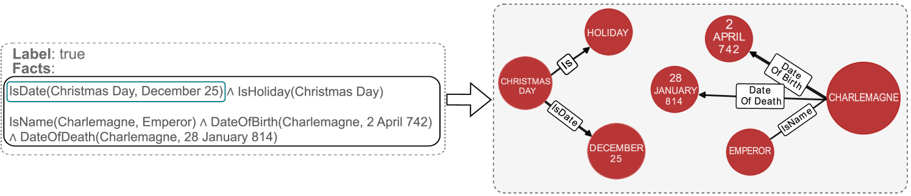
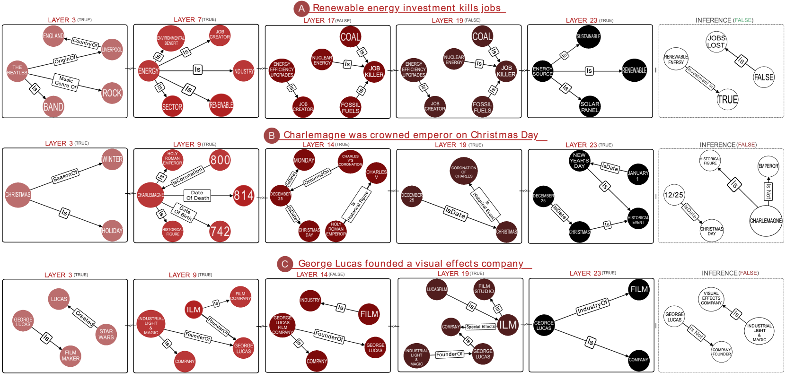
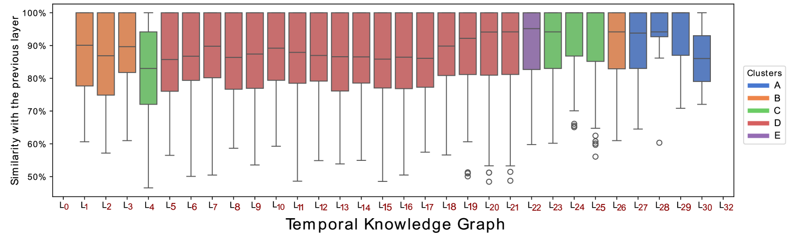
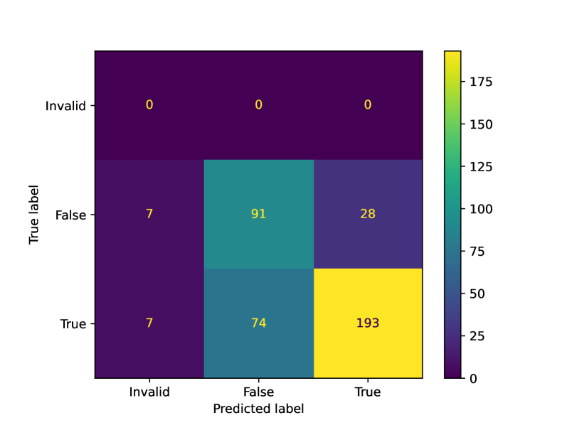
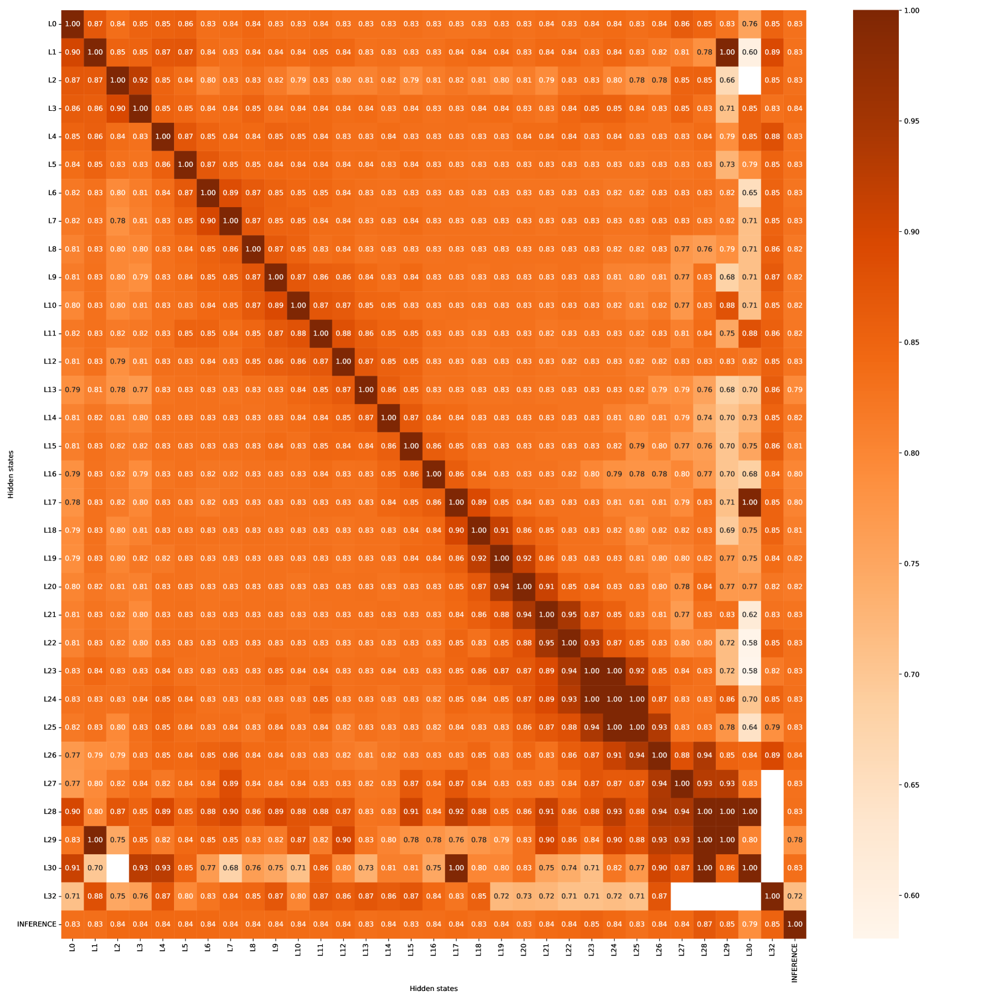
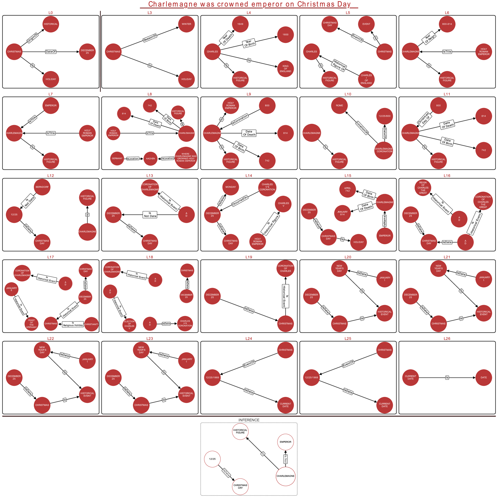

# 探究大型语言模型：时间知识库中潜在表达的进化之旅

发布时间：2024年04月04日

`LLM理论` `事实知识` `推理分析`

> Unveiling LLMs: The Evolution of Latent Representations in a Temporal Knowledge Graph

# 摘要

> 大型语言模型（LLMs）展现出了惊人的记忆力，能够回忆起大量普遍的事实知识。但是，要理解LLMs如何推理并运用这些知识，仍是研究的热点。我们的研究分析了LLMs在评估事实声明真伪时所编码的事实知识。我们设计了一个全新的框架，能够将LLMs潜在空间中的事实知识解码为一系列基础谓词，并利用时间知识图谱追踪其在不同层级的演变过程。该框架采用了激活补丁技术，通过动态调整模型的潜在表示来干预其推理过程，无需依赖外部模型或训练。我们利用FEVER和CLIMATE-FEVER两个数据集，通过局部和全局可解释性分析展示了框架的效果。局部分析揭示了从数据表示到复杂推理过程中的各种潜在错误，而全局分析则揭示了模型在事实知识处理上的演变模式。这项工作通过基于图的潜在表示分析，为理解LLMs的内部机制迈出了重要一步。

> Large Language Models (LLMs) demonstrate an impressive capacity to recall a vast range of common factual knowledge information. However, unravelling the underlying reasoning of LLMs and explaining their internal mechanisms of exploiting this factual knowledge remain active areas of investigation. Our work analyzes the factual knowledge encoded in the latent representation of LLMs when prompted to assess the truthfulness of factual claims. We propose an end-to-end framework that jointly decodes the factual knowledge embedded in the latent space of LLMs from a vector space to a set of ground predicates and represents its evolution across the layers using a temporal knowledge graph. Our framework relies on the technique of activation patching which intervenes in the inference computation of a model by dynamically altering its latent representations. Consequently, we neither rely on external models nor training processes. We showcase our framework with local and global interpretability analyses using two claim verification datasets: FEVER and CLIMATE-FEVER. The local interpretability analysis exposes different latent errors from representation to multi-hop reasoning errors. On the other hand, the global analysis uncovered patterns in the underlying evolution of the model's factual knowledge (e.g., store-and-seek factual information). By enabling graph-based analyses of the latent representations, this work represents a step towards the mechanistic interpretability of LLMs.

[Arxiv](https://arxiv.org/abs/2404.03623)