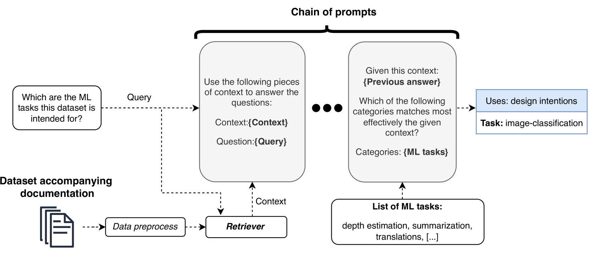
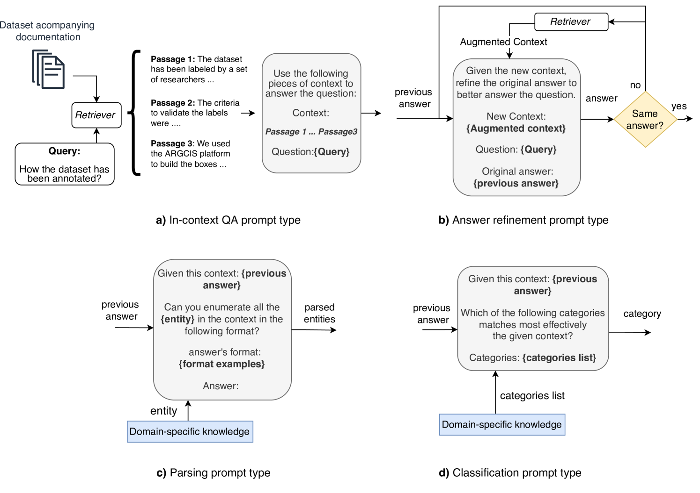
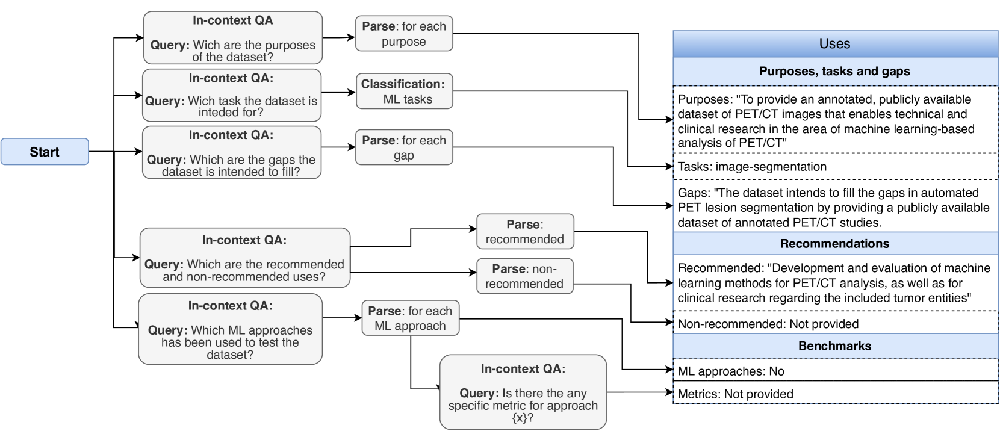
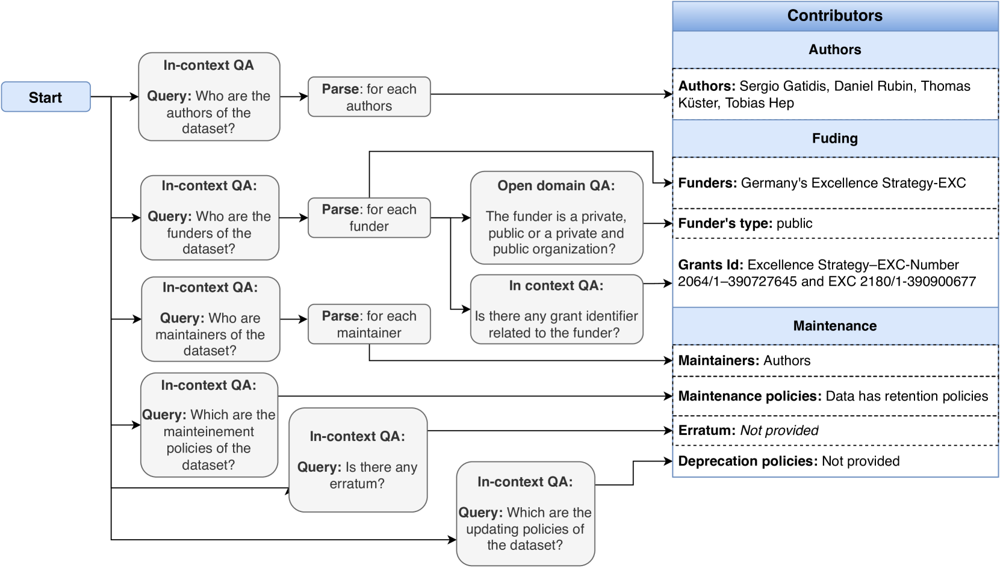
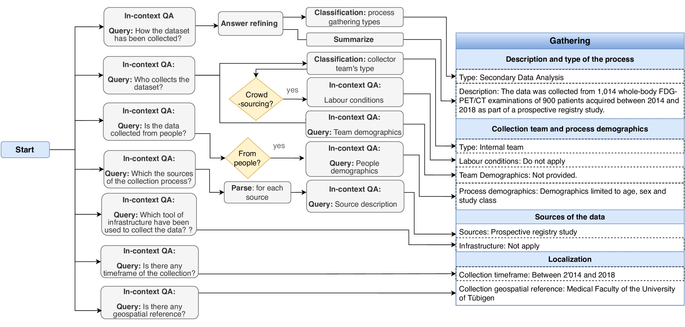
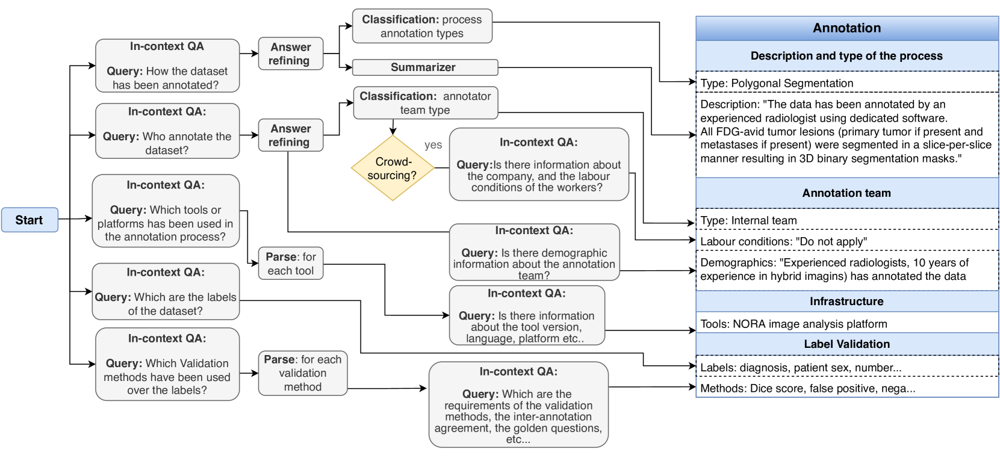
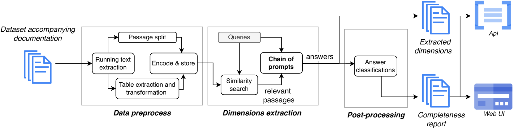
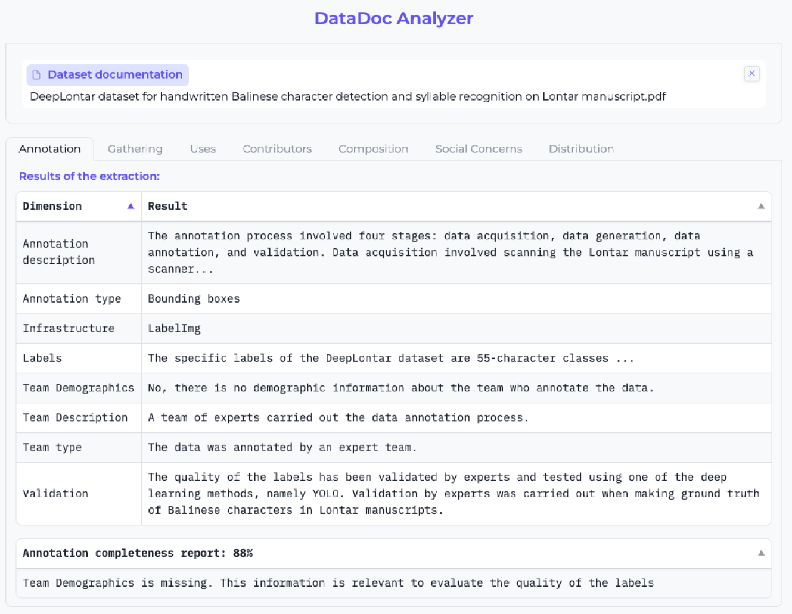

# 利用大型语言模型为机器学习数据集的文档增色添彩。

发布时间：2024年04月04日

`LLM应用` `人工智能法规` `数据管理`

> Using Large Language Models to Enrich the Documentation of Datasets for Machine Learning

# 摘要

> 最新监管动态，例如欧洲AI法案，以及机器学习界的声音，都强调了为构建可信AI而对数据集进行多维度描述的必要性，包括数据来源、处理流程以及社会关注点。然而，这些关键信息往往仅以文档中的非结构化文本形式存在，这限制了它们的自动化分析和处理能力。本研究尝试利用大型语言模型（LLM）搭配一系列提示策略，自动从文档中抽取这些关键维度，进而丰富数据集的描述。该方法有望辅助数据发布者和实践者生成机器可读的文档，从而提升数据集的可检索性，评估其符合当前AI法规的程度，并优化在这些数据集上训练的机器学习模型的质量。在本论文中，我们采用两种不同的大型语言模型（GPT3.5和Flan-UL2）对发表在《自然》科学数据和《爱思唯尔》数据简报上的12篇科学数据集论文进行了方法评估。研究结果表明，我们的提示提取策略准确度较高。尽管具体成效因维度而异，但总体来看，GPT3.5（准确度81.21%）略胜一筹，尽管它更可能出现误报。此外，我们已经发布了一个开源工具，实现了我们的方法论，并提供了一个包含实验代码和结果的复制包，以便在开源仓库中进行进一步的研究和应用。

> Recent regulatory initiatives like the European AI Act and relevant voices in the Machine Learning (ML) community stress the need to describe datasets along several key dimensions for trustworthy AI, such as the provenance processes and social concerns. However, this information is typically presented as unstructured text in accompanying documentation, hampering their automated analysis and processing. In this work, we explore using large language models (LLM) and a set of prompting strategies to automatically extract these dimensions from documents and enrich the dataset description with them. Our approach could aid data publishers and practitioners in creating machine-readable documentation to improve the discoverability of their datasets, assess their compliance with current AI regulations, and improve the overall quality of ML models trained on them.
  In this paper, we evaluate the approach on 12 scientific dataset papers published in two scientific journals (Nature's Scientific Data and Elsevier's Data in Brief) using two different LLMs (GPT3.5 and Flan-UL2). Results show good accuracy with our prompt extraction strategies. Concrete results vary depending on the dimensions, but overall, GPT3.5 shows slightly better accuracy (81,21%) than FLAN-UL2 (69,13%) although it is more prone to hallucinations. We have released an open-source tool implementing our approach and a replication package, including the experiments' code and results, in an open-source repository.

[Arxiv](https://arxiv.org/abs/2404.15320)