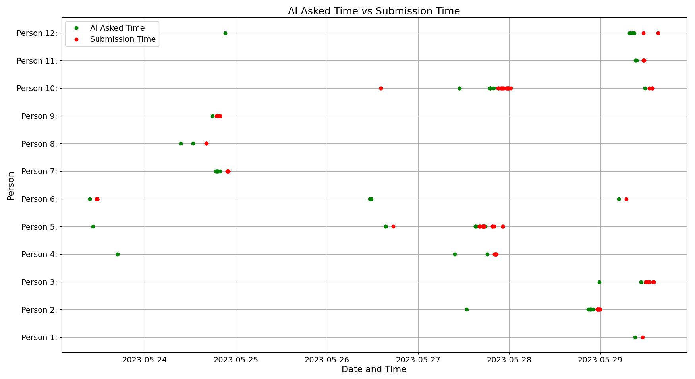

# 软件工程教育中的人工智能辅导

发布时间：2024年04月05日

`Agent

理由：这篇论文主要探讨了大型语言模型（LLMs）如GPT-3.5-Turbo在自动化编程评估系统（APASs）中的应用，特别是在作为AI导师的角色中与学生的互动模式。这种应用涉及到模型的具体使用和用户交互，属于Agent类别的研究，即研究如何将LLM作为智能代理在特定环境中执行任务和与用户交互。` `人工智能`

> AI-Tutoring in Software Engineering Education

# 摘要

> 随着AI技术的飞速发展，教育领域正迎来一场革命。AI工具在提升编程学习体验方面展现出巨大潜力。然而，作为AI导师的大型语言模型（LLMs）在自动化编程评估系统（APASs）中的科学评估尚未深入探索。本文通过将GPT-3.5-Turbo模型融入APAS Artemis，探索了学生与AI导师的互动模式，并识别了不同用户类型。研究发现，AI导师能提供及时反馈并具有可扩展性，但也面临通用回复和学生对学习进度受阻的担忧等挑战。这项研究深化了我们对AI在教育中作用的认识。

> With the rapid advancement of artificial intelligence (AI) in various domains, the education sector is set for transformation. The potential of AI-driven tools in enhancing the learning experience, especially in programming, is immense. However, the scientific evaluation of Large Language Models (LLMs) used in Automated Programming Assessment Systems (APASs) as an AI-Tutor remains largely unexplored. Therefore, there is a need to understand how students interact with such AI-Tutors and to analyze their experiences. In this paper, we conducted an exploratory case study by integrating the GPT-3.5-Turbo model as an AI-Tutor within the APAS Artemis. Through a combination of empirical data collection and an exploratory survey, we identified different user types based on their interaction patterns with the AI-Tutor. Additionally, the findings highlight advantages, such as timely feedback and scalability. However, challenges like generic responses and students' concerns about a learning progress inhibition when using the AI-Tutor were also evident. This research adds to the discourse on AI's role in education.

[Arxiv](https://arxiv.org/abs/2404.02548)