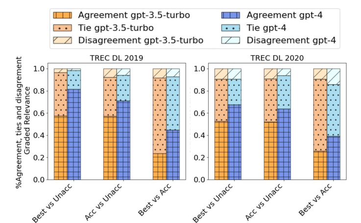
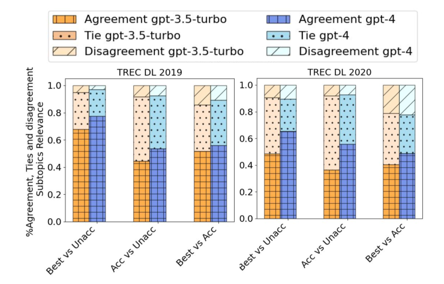
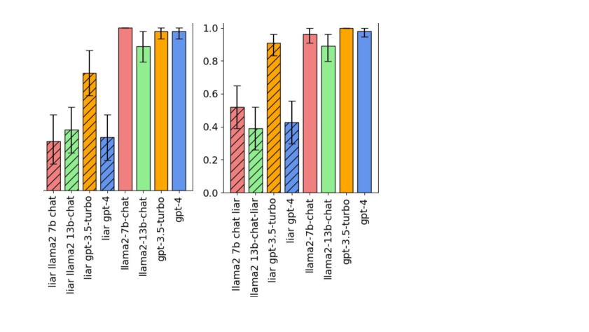
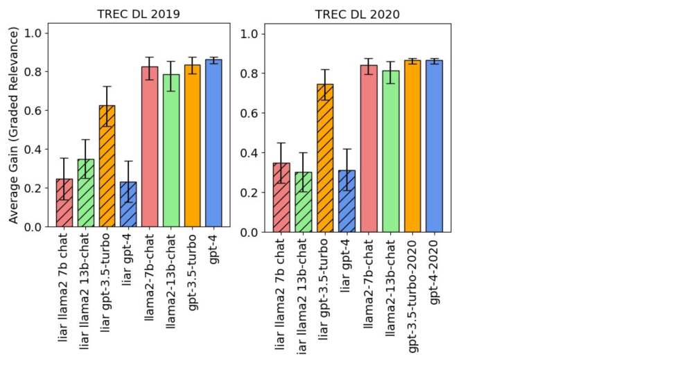
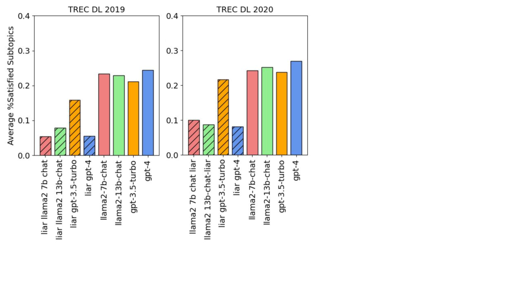
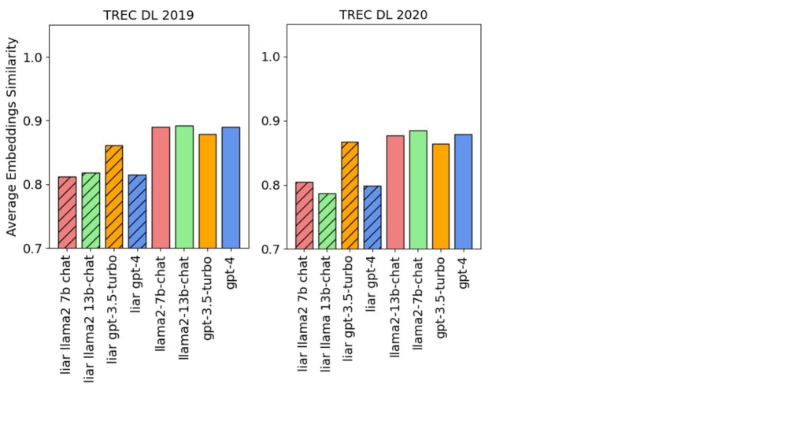
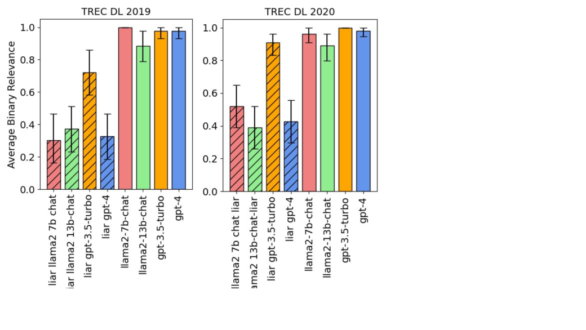

# 本研究对比了不同的生成式信息检索评估方法。

发布时间：2024年04月05日

`RAG` `信息检索` `生成式系统`

> A Comparison of Methods for Evaluating Generative IR

# 摘要

> 信息检索系统正逐步融入创新的生成组件。以检索增强生成（RAG）系统为例，检索部分负责提供真实信息，而生成部分则负责总结与扩展回答。在某些系统中，大型语言模型（LLM）能够独立生成回答，无需外部检索。本文聚焦于那些不依赖固定文档集生成回答的Gen-IR系统。在这种模式下，查询的回应可能是全新的文本内容。由于传统评估方法不适用于此，我们研究了将传统离线评估扩展到Gen-IR领域的多种方法。虽然传统评估依赖人工评估，但LLM的评估能力正逐渐替代人工评估，且表现出相当的或更高的效能。考虑到Gen-IR系统的回答不基于固定集，我们认为其评估方法应主要基于LLM生成的标签。我们尝试了基于二元和分级相关性的方法，并探索了基于明确子主题、成对偏好和嵌入的方法。我们先在多个TREC深度学习任务中用人工评估来验证这些方法，然后将它们应用于评估几个纯生成系统的结果。对于每种方法，我们既考虑其无需人工标签或其他输入的自主性，也考虑其支持人工审计的能力。为了确保对这些方法的信任，我们必须确信它们的评估结果与人工评估保持一致。为此，评估标准需保持透明，以便人类评估员能够进行审计。

> Information retrieval systems increasingly incorporate generative components. For example, in a retrieval augmented generation (RAG) system, a retrieval component might provide a source of ground truth, while a generative component summarizes and augments its responses. In other systems, a large language model (LLM) might directly generate responses without consulting a retrieval component. While there are multiple definitions of generative information retrieval (Gen-IR) systems, in this paper we focus on those systems where the system's response is not drawn from a fixed collection of documents or passages. The response to a query may be entirely new text never. Since traditional IR evaluation methods break down under this model, we explore various methods that extend traditional offline evaluation approaches to the Gen-IR context. Offline IR evaluation traditionally employs paid human assessors, but increasingly LLMs are replacing human assessment, demonstrating capabilities similar or superior to crowdsourced labels. Given that Gen-IR systems do not generate responses from a fixed set, we assume that methods for Gen-IR evaluation must largely depend on LLM-generated labels. Along with methods based on binary and graded relevance, we explore methods based on explicit subtopics, pairwise preferences, and embeddings. We first validate these methods against human assessments on several TREC Deep Learning Track tasks; we then apply these methods to evaluate the output of several purely generative systems. For each method we consider both its ability to act autonomously, without the need for human labels or other input, and its ability to support human auditing. To trust these methods, we must be assured that their results align with human assessments. In order to do so, evaluation criteria must be transparent, so that outcomes can be audited by human assessors.

[Arxiv](https://arxiv.org/abs/2404.04044)