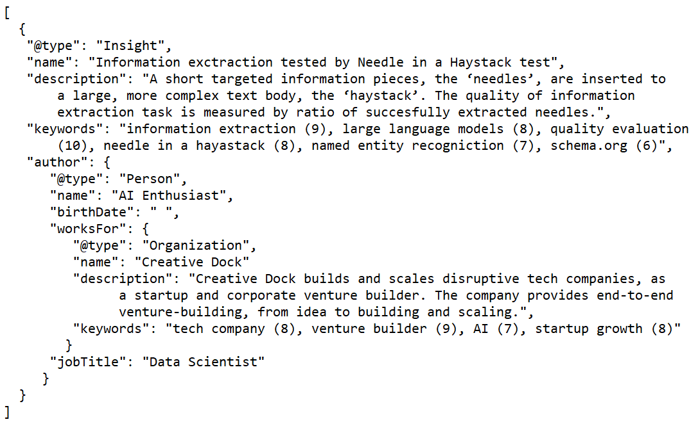
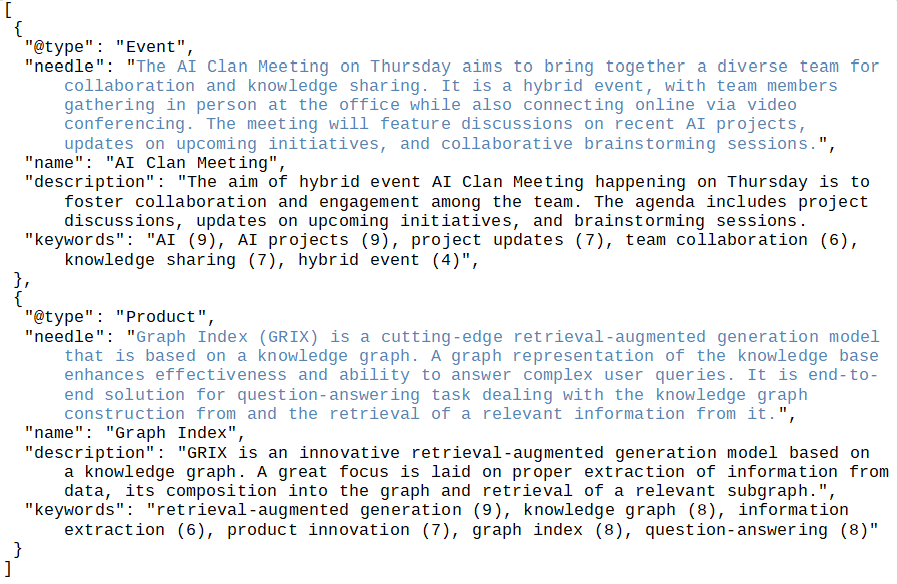
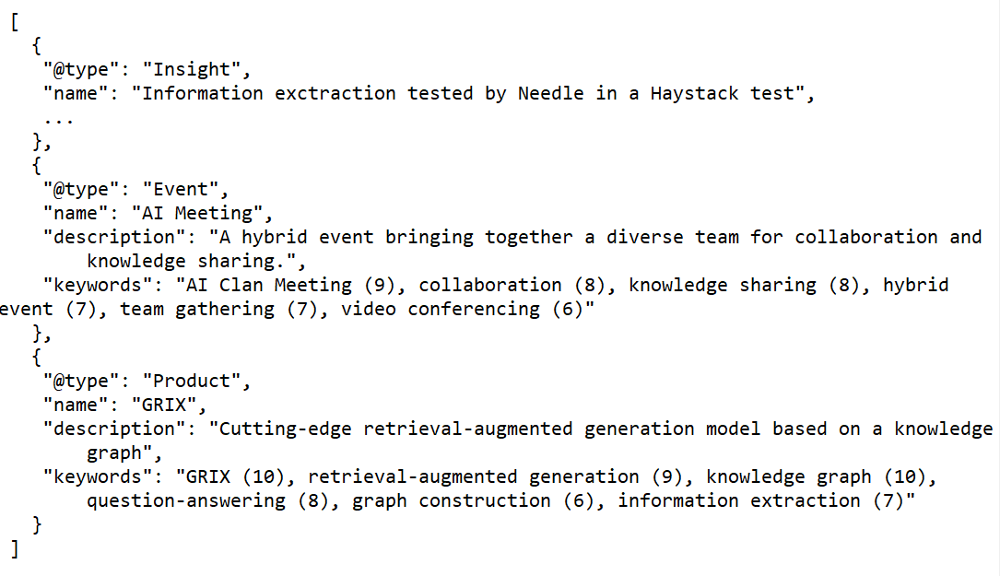
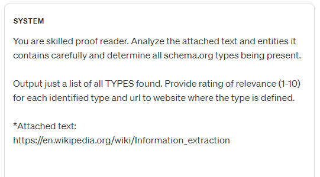
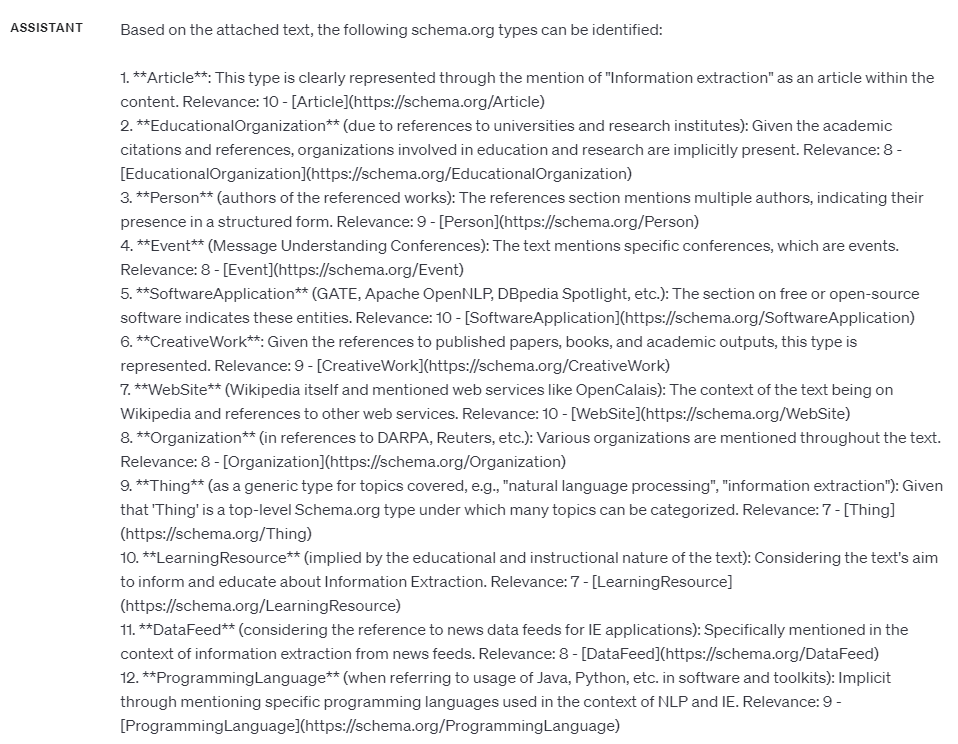
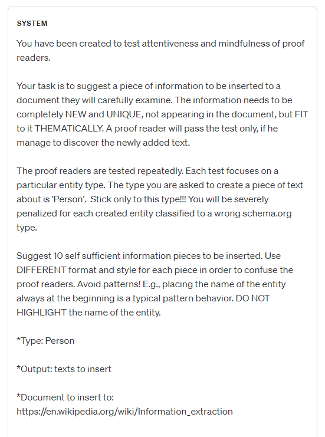
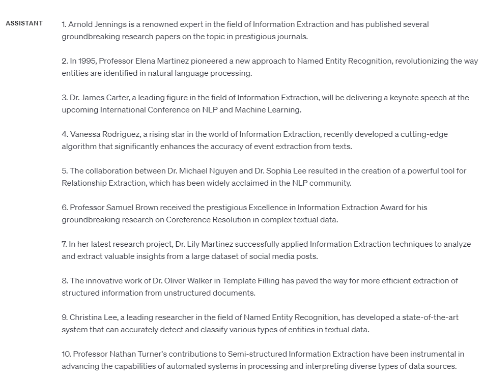
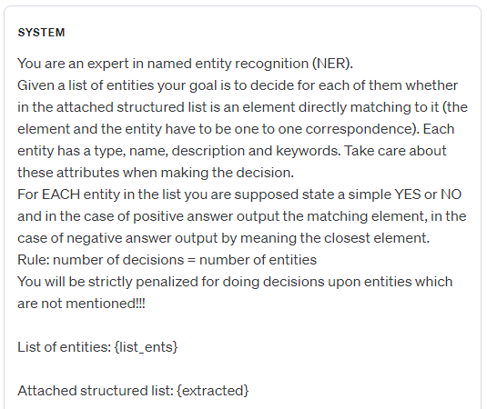

# 对信息提取品质进行评定

发布时间：2024年04月05日

`LLM应用` `信息提取` `自动化框架`

> Assessing the quality of information extraction

# 摘要

> 随着大型语言模型技术的飞速发展，我们从杂乱无章的数据中提取信息的能力得到了极大的提升。但要为信息提取的质量设定一个公正的评判标准，却因标记数据的匮乏而困难重重。本文提出了一种自动化框架，用以衡量信息提取的质量和全面性，重点关注实体及其属性的提取。我们探讨了如何应对大型语言模型在输入输出规模上的限制，并对其在逐步提取信息过程中的表现进行了分析。最终，我们引入了一系列评估提取质量的指标，并深入讨论了如何正确解读这些指标。

> Advances in large language models have notably enhanced the efficiency of information extraction from unstructured and semi-structured data sources. As these technologies become integral to various applications, establishing an objective measure for the quality of information extraction becomes imperative. However, the scarcity of labeled data presents significant challenges to this endeavor. In this paper, we introduce an automatic framework to assess the quality of the information extraction and its completeness. The framework focuses on information extraction in the form of entity and its properties. We discuss how to handle the input/output size limitations of the large language models and analyze their performance when iteratively extracting the information. Finally, we introduce metrics to evaluate the quality of the extraction and provide an extensive discussion on how to interpret the metrics.

[Arxiv](https://arxiv.org/abs/2404.04068)