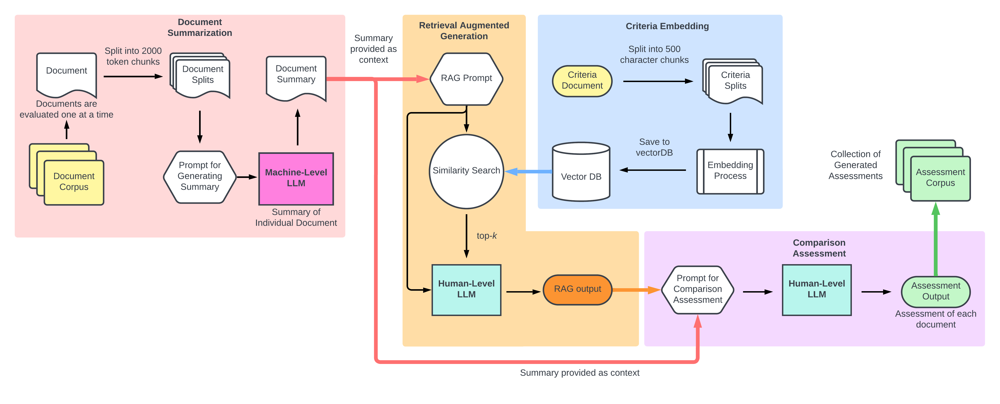
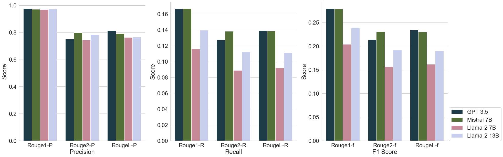
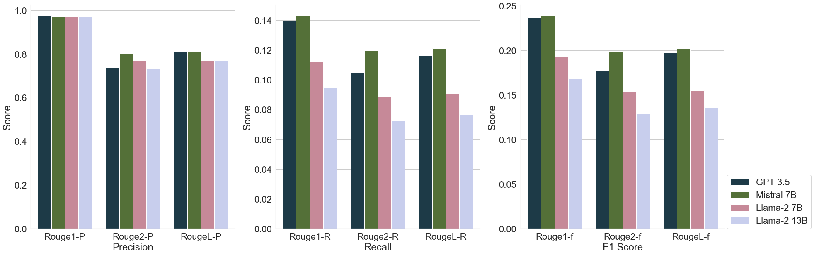

# 本文探讨了如何在海量数据中，通过自动化技术辅助人类进行细致入微的比较分析。

发布时间：2024年04月05日

`LLM应用` `跨知识领域分析` `信息对比`

> Assisting humans in complex comparisons: automated information comparison at scale

# 摘要

> 生成式大型语言模型让跨知识领域的深度分析变得高效，其信息对比能力堪比人类专家。但面对大规模信息对比的挑战，如保持大篇幅上下文信息和突破模型标记限制，我们设计了创新的ASC$^2$End系统，通过自动化实现大规模信息对比。该系统运用语义文本相似性对比，生成有据可依的深度分析。结合摘要式摘要和增强生成等成熟数据策略，解决了标记限制问题，确保模型推理时信息的完整性。通过零-shot策略设计提示，优化信息的上下文理解，提升模型的推理效果。我们通过ROUGE评分对摘要质量进行评估，并通过用户调研反馈来衡量比较结果的质量。ASC$^2$End系统在评估中表现出色，展示了其在知识领域中进行大规模、准确信息对比的潜力，有效克服了传统上下文和检索限制。

> Generative Large Language Models enable efficient analytics across knowledge domains, rivalling human experts in information comparisons. However, the applications of LLMs for information comparisons face scalability challenges due to the difficulties in maintaining information across large contexts and overcoming model token limitations. To address these challenges, we developed the novel Abstractive Summarization \& Criteria-driven Comparison Endpoint (ASC$^2$End) system to automate information comparison at scale. Our system employs Semantic Text Similarity comparisons for generating evidence-supported analyses. We utilize proven data-handling strategies such as abstractive summarization and retrieval augmented generation to overcome token limitations and retain relevant information during model inference. Prompts were designed using zero-shot strategies to contextualize information for improved model reasoning. We evaluated abstractive summarization using ROUGE scoring and assessed the generated comparison quality using survey responses. Models evaluated on the ASC$^2$End system show desirable results providing insights on the expected performance of the system. ASC$^2$End is a novel system and tool that enables accurate, automated information comparison at scale across knowledge domains, overcoming limitations in context length and retrieval.

[Arxiv](https://arxiv.org/abs/2404.04351)