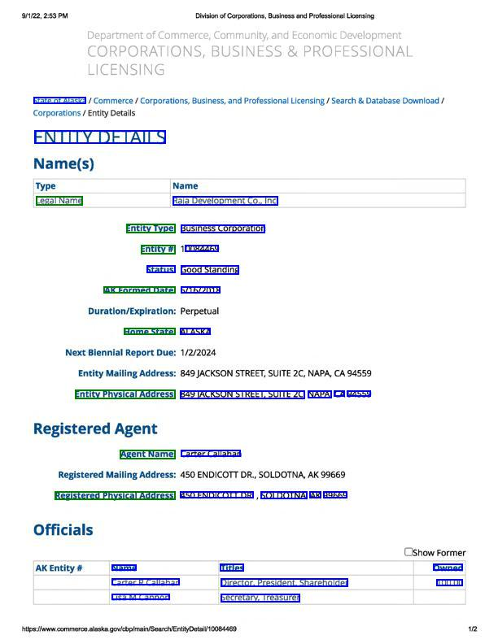
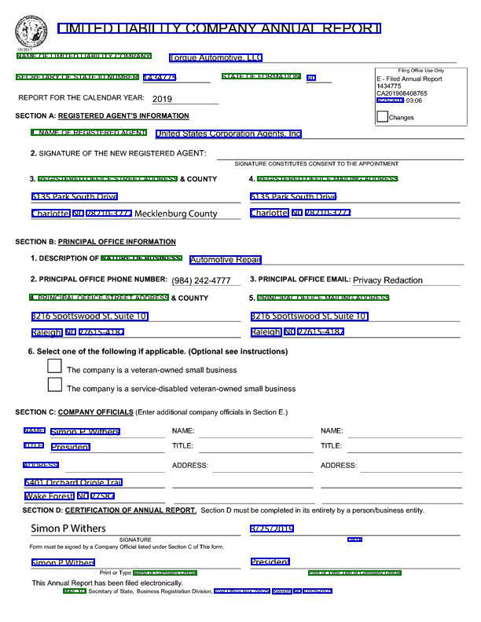
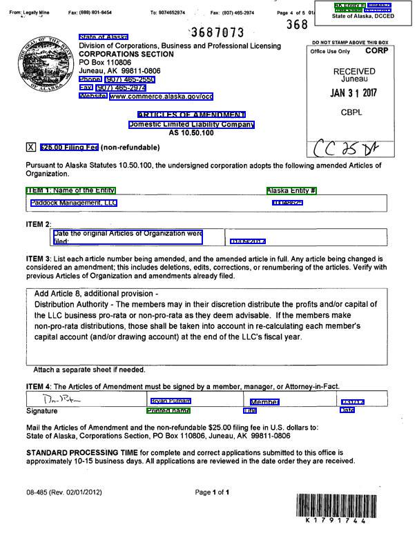
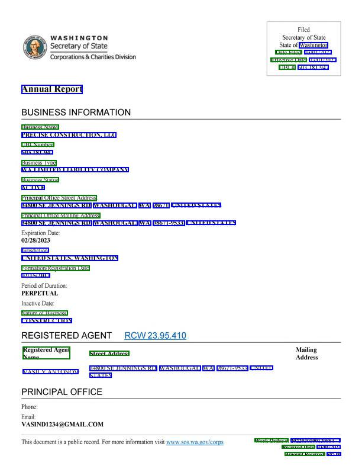

# BuDDIE：专为多任务信息提取打造的商业文档数据集

发布时间：2024年04月05日

`LLM应用` `多模态文档处理` `商业智能`

> BuDDIE: A Business Document Dataset for Multi-task Information Extraction

# 摘要

> 视觉丰富文档理解（VRDU）领域致力于攻克多模态环境下的NLP任务难题。现有数据集专注于VRDU的特定任务，如文档分类、关键实体提取、实体链接和视觉问答等。这些数据集虽然涵盖了发票和收据等文档类型，但其注释稀疏，难以满足现实世界中文档处理的多样性需求。本文介绍了BuDDIE——首个多任务商业文档数据集，包含1,665份真实商业文档，对文档分类、关键实体提取和视觉问答等任务进行了详尽的注释。数据集源自美国州政府网站的公开商业文档，结构化且风格多样。我们还提供了BuDDIE的数据多样性和质量评估指标，并为各项任务设定了一系列基线，包括传统文本分析、多模态和大型语言模型等VRDU处理方法。

> The field of visually rich document understanding (VRDU) aims to solve a multitude of well-researched NLP tasks in a multi-modal domain. Several datasets exist for research on specific tasks of VRDU such as document classification (DC), key entity extraction (KEE), entity linking, visual question answering (VQA), inter alia. These datasets cover documents like invoices and receipts with sparse annotations such that they support one or two co-related tasks (e.g., entity extraction and entity linking). Unfortunately, only focusing on a single specific of documents or task is not representative of how documents often need to be processed in the wild - where variety in style and requirements is expected. In this paper, we introduce BuDDIE (Business Document Dataset for Information Extraction), the first multi-task dataset of 1,665 real-world business documents that contains rich and dense annotations for DC, KEE, and VQA. Our dataset consists of publicly available business entity documents from US state government websites. The documents are structured and vary in their style and layout across states and types (e.g., forms, certificates, reports, etc.). We provide data variety and quality metrics for BuDDIE as well as a series of baselines for each task. Our baselines cover traditional textual, multi-modal, and large language model approaches to VRDU.

[Arxiv](https://arxiv.org/abs/2404.04003)