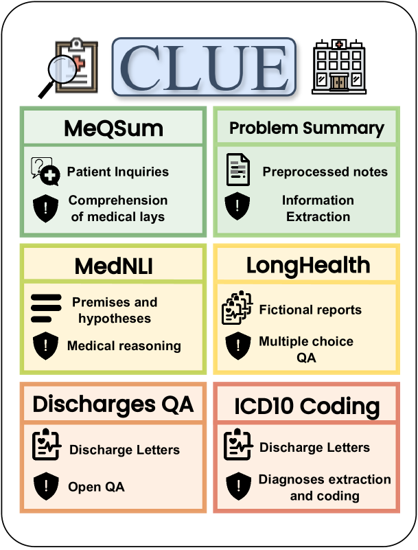
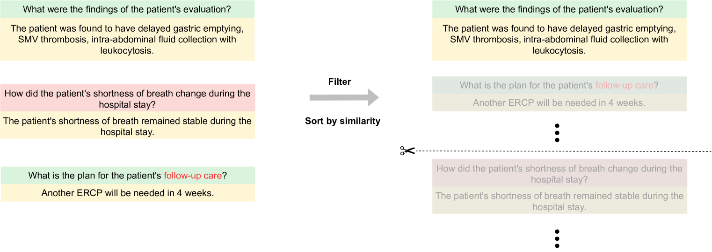
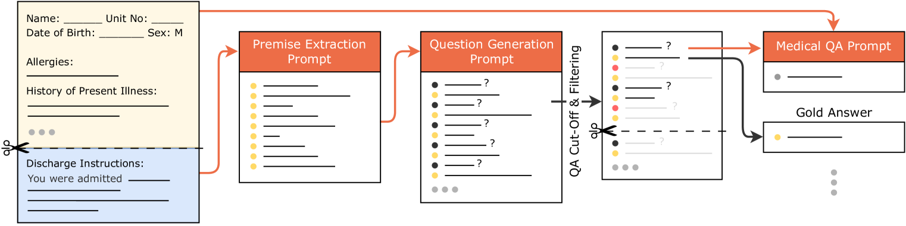

# CLUE：一套针对大型语言模型的临床级语言理解评估体系

发布时间：2024年04月05日

`LLM应用` `评估基准`

> CLUE: A Clinical Language Understanding Evaluation for LLMs

# 摘要

> 大型语言模型（LLMs）展现出在医疗护理、诊断和行政管理方面的巨大潜力。专为医疗领域设计的新兴生物医学LLMs，应对了隐私保护和计算资源等挑战。但这些模型的评估往往局限于非临床任务，未能充分映射临床实践的复杂性。同时，生物医学LLMs与通用领域LLMs在临床任务上缺乏深入比较。为此，我们推出了临床语言理解评估（CLUE）基准，旨在评估LLMs在现实临床任务中的表现。CLUE包含两个基于MIMIC IV出院信件的新数据集，以及四个旨在检验LLMs在医疗环境中实用性的任务。我们的评估覆盖了多个生物医学和通用领域的LLMs，深入探讨了它们在临床应用中的性能和适用性。CLUE是向着标准化评估和发展医疗保健领域LLMs迈出的重要一步，旨在使未来的模型开发与临床实际需求相匹配。评估结果和数据生成脚本已发布：https://github.com/dadaamin/CLUE

> Large Language Models (LLMs) have shown the potential to significantly contribute to patient care, diagnostics, and administrative processes. Emerging biomedical LLMs address healthcare-specific challenges, including privacy demands and computational constraints. However, evaluation of these models has primarily been limited to non-clinical tasks, which do not reflect the complexity of practical clinical applications. Additionally, there has been no thorough comparison between biomedical and general-domain LLMs for clinical tasks. To fill this gap, we present the Clinical Language Understanding Evaluation (CLUE), a benchmark tailored to evaluate LLMs on real-world clinical tasks. CLUE includes two novel datasets derived from MIMIC IV discharge letters and four existing tasks designed to test the practical applicability of LLMs in healthcare settings. Our evaluation covers several biomedical and general domain LLMs, providing insights into their clinical performance and applicability. CLUE represents a step towards a standardized approach to evaluating and developing LLMs in healthcare to align future model development with the real-world needs of clinical application. We publish our evaluation and data generation scripts: https://github.com/dadaamin/CLUE

[Arxiv](https://arxiv.org/abs/2404.04067)