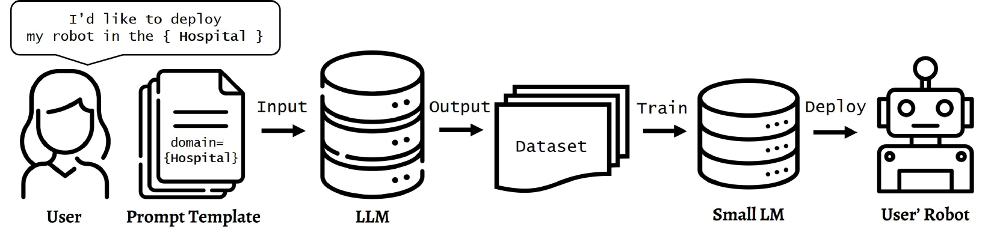
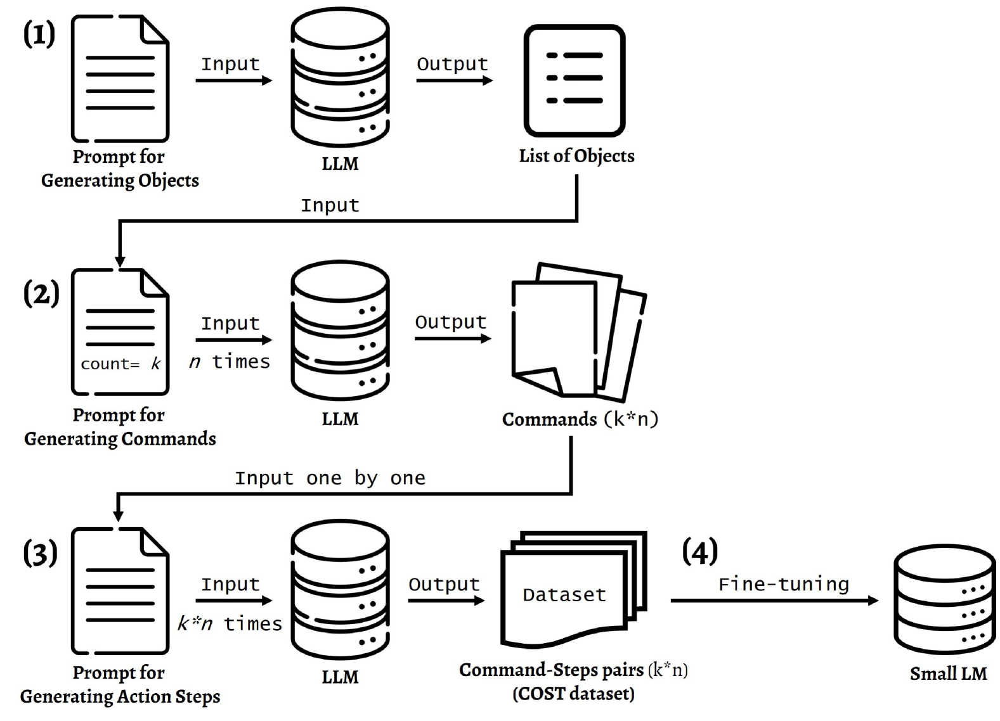
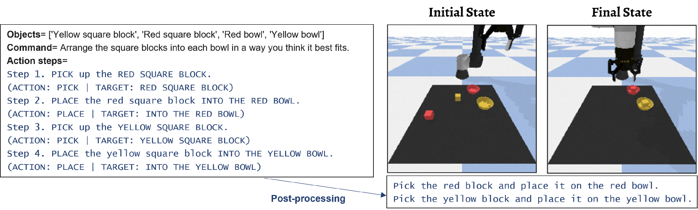
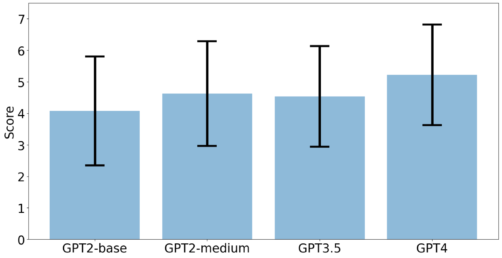

# 难道只有大型语言模型才具备推理能力吗？其实不然，小型语言模型在任务规划领域同样拥有不可忽视的潜力。

发布时间：2024年04月05日

`LLM应用` `机器人` `任务规划`

> Can only LLMs do Reasoning?: Potential of Small Language Models in Task Planning

# 摘要

> 在机器人学中，大型语言模型（LLMs）正变得日益流行，尤其擅长解读人类指令。LLMs充当通用任务规划器，得益于它们的思维链（CoT）推理能力。但现代机器人在执行复杂动作上仍有局限，可应用领域也相对受限。这引发我们的思考：若能训练小型LMs在特定领域内进行链式推理，它们是否能成为机器人的得力任务规划器？为此，我们创建了“命令-步骤数据集”（COST），内含高级指令及LLMs生成的对应低级可执行步骤。我们公开了数据集及生成模板，方便他人针对自己的领域创建数据集。在桌面和厨房场景中，我们对比了GPT3.5、GPT4与微调后的GPT2在任务规划上的表现，发现GPT2在特定任务规划上与GPT3.5不相上下。相关资料、代码和更多示例可在 https://github.com/Gawon-Choi/small-LMs-Task-Planning 查看。

> In robotics, the use of Large Language Models (LLMs) is becoming prevalent, especially for understanding human commands. In particular, LLMs are utilized as domain-agnostic task planners for high-level human commands. LLMs are capable of Chain-of-Thought (CoT) reasoning, and this allows LLMs to be task planners. However, we need to consider that modern robots still struggle to perform complex actions, and the domains where robots can be deployed are limited in practice. This leads us to pose a question: If small LMs can be trained to reason in chains within a single domain, would even small LMs be good task planners for the robots? To train smaller LMs to reason in chains, we build `COmmand-STeps datasets' (COST) consisting of high-level commands along with corresponding actionable low-level steps, via LLMs. We release not only our datasets but also the prompt templates used to generate them, to allow anyone to build datasets for their domain. We compare GPT3.5 and GPT4 with the finetuned GPT2 for task domains, in tabletop and kitchen environments, and the result shows that GPT2-medium is comparable to GPT3.5 for task planning in a specific domain. Our dataset, code, and more output samples can be found in https://github.com/Gawon-Choi/small-LMs-Task-Planning

[Arxiv](https://arxiv.org/abs/2404.03891)