# 起飞在即？组合与条件推理或许会成为机票预订语言助手的软肋。

发布时间：2024年04月05日

`LLM应用` `航空旅行` `人工智能评估`

> Cleared for Takeoff? Compositional & Conditional Reasoning may be the Achilles Heel to (Flight-Booking) Language Agents

# 摘要

> 大型语言模型（LLMs）的迅猛发展让它们在各项标准测试中屡创佳绩，甚至常常超越人类。这为众多下游应用，例如LLM代理，提供了强大的支持，使其能够凭借精细的推理能力处理复杂的任务。然而，LLMs在处理一些简单任务时却意外地表现不佳，这突显出我们需要更多元、更精确的评估体系来真正衡量它们的能力。本研究聚焦于组合推理和条件推理——人类认知的两大核心要素，并通过新推出的GroundCocoa基准测试，将这两种推理能力与实际的航班预订问题相连。我们的任务是将用户的具体偏好与多项选择形式展现的航班选项相匹配。研究发现，即便是性能领先的GPT-4 Turbo模型，在最先进的提示技术支持下，准确率也仅为67%，这揭示了当前顶尖LLMs在性能上的巨大差异。

> The rapid progress of large language models (LLMs) has seen them excel and frequently surpass human performance on standard benchmarks. This has enabled many downstream applications, such as LLM agents, to rely on their sophisticated reasoning to navigate complex task requirements. However, LLMs are known to unexpectedly falter in simple tasks and under seemingly straightforward circumstances - underscoring the need for better and more diverse evaluation setups to measure their true capabilities. To this end, we choose to study compositional and conditional reasoning, two cornerstones of human cognition, and introduce GroundCocoa - a lexically diverse benchmark connecting these reasoning skills to the real-world problem of flight booking. Our task involves aligning detailed user preferences with available flight options presented in a multiple-choice format. Results indicate a significant disparity in performance among current state-of-the-art LLMs with even the best performing model, GPT-4 Turbo, not exceeding 67% accuracy despite advanced prompting techniques.

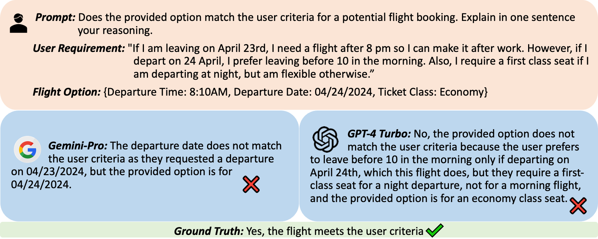

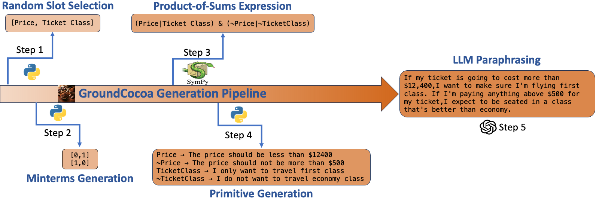

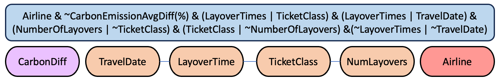

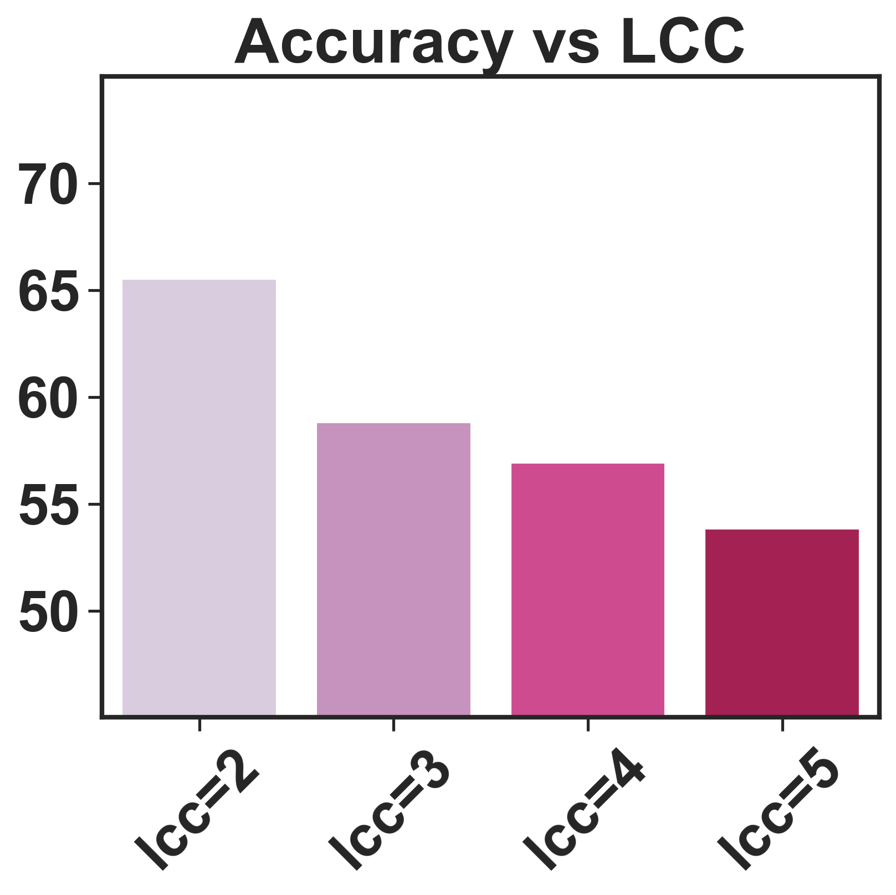

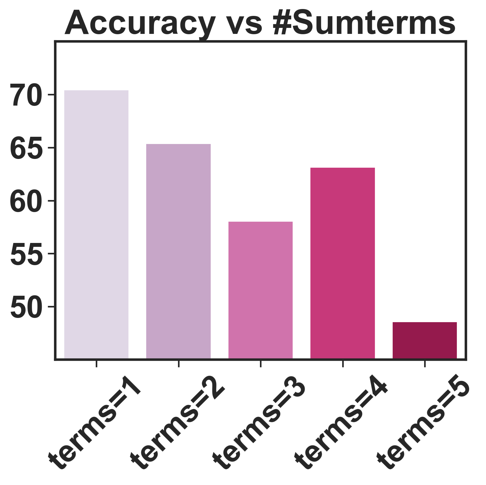

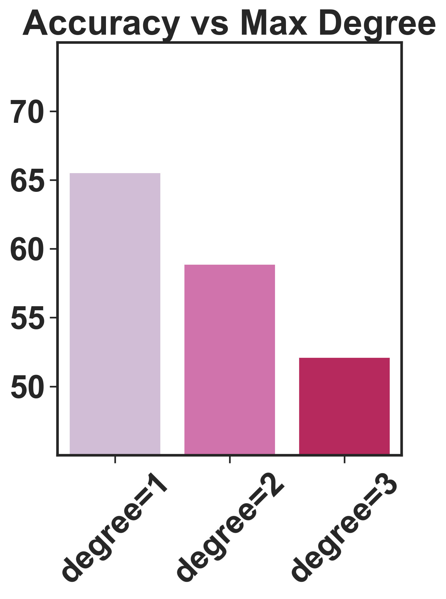

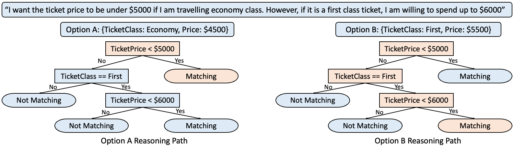

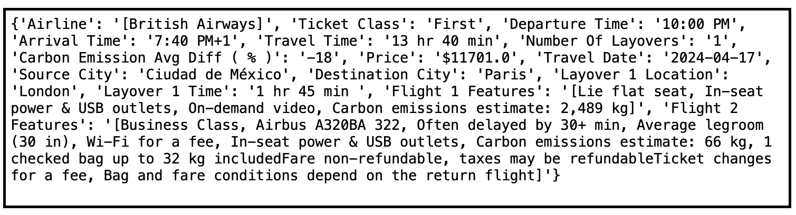

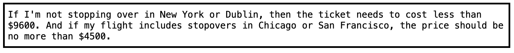

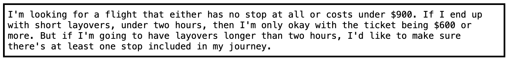

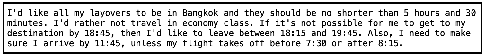

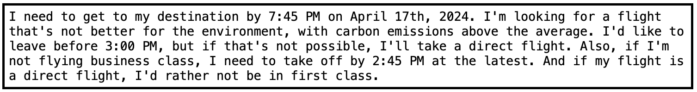

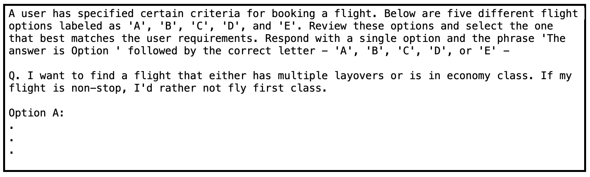

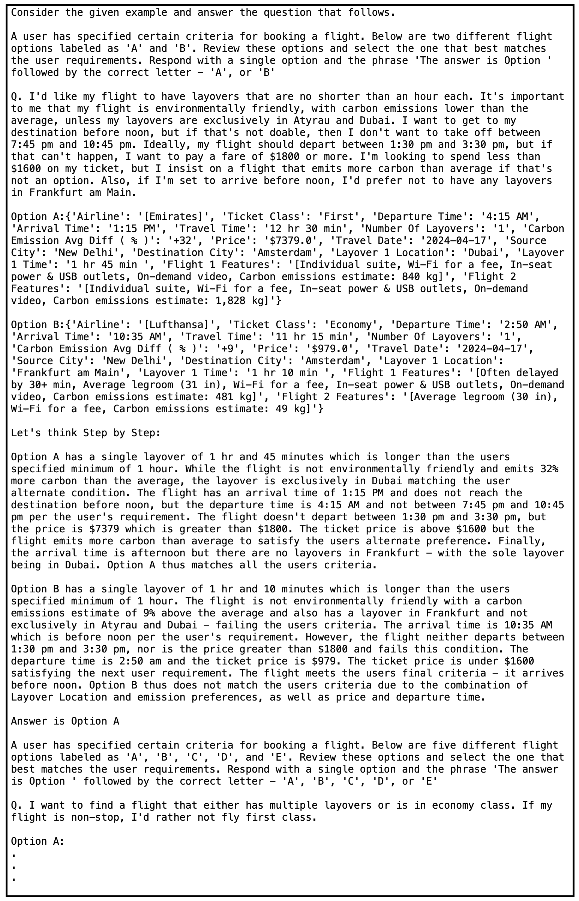

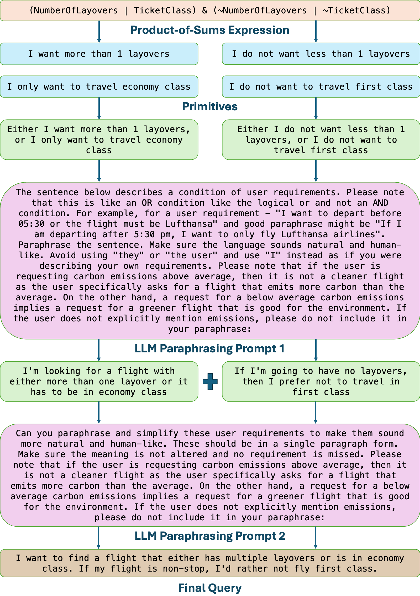

[Arxiv](https://arxiv.org/abs/2404.04237)