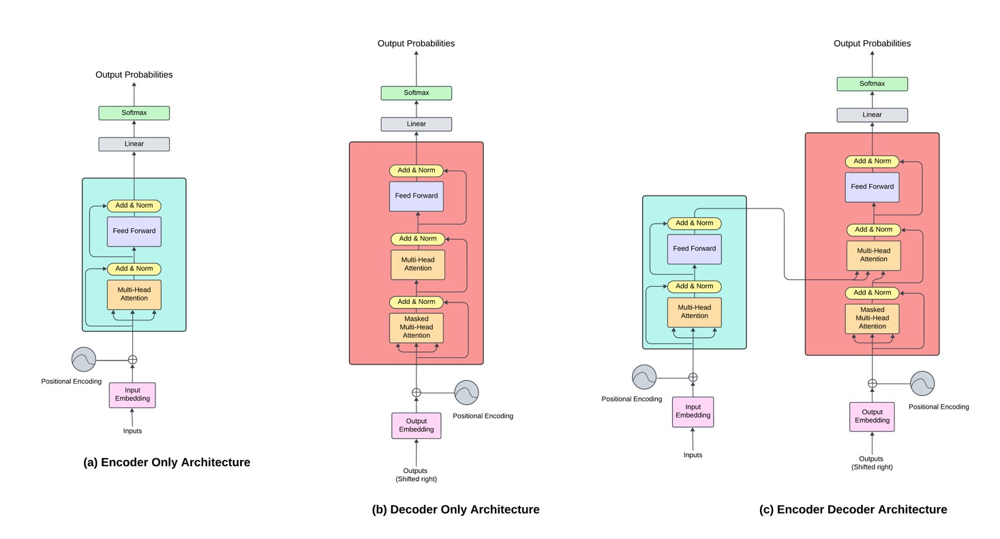
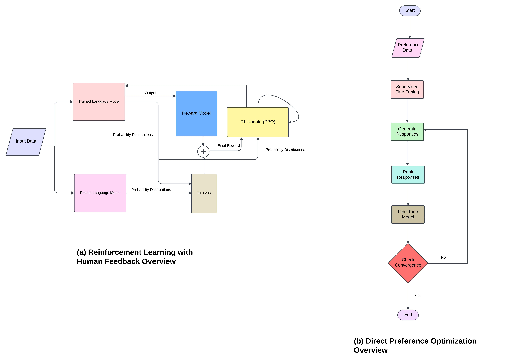
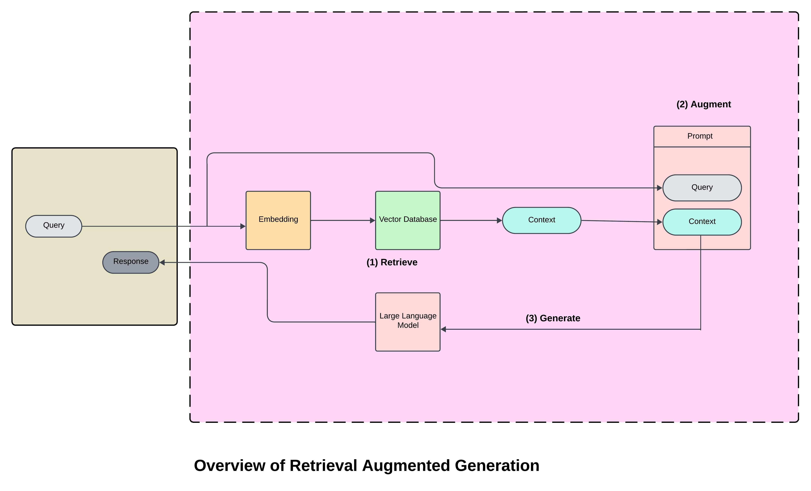
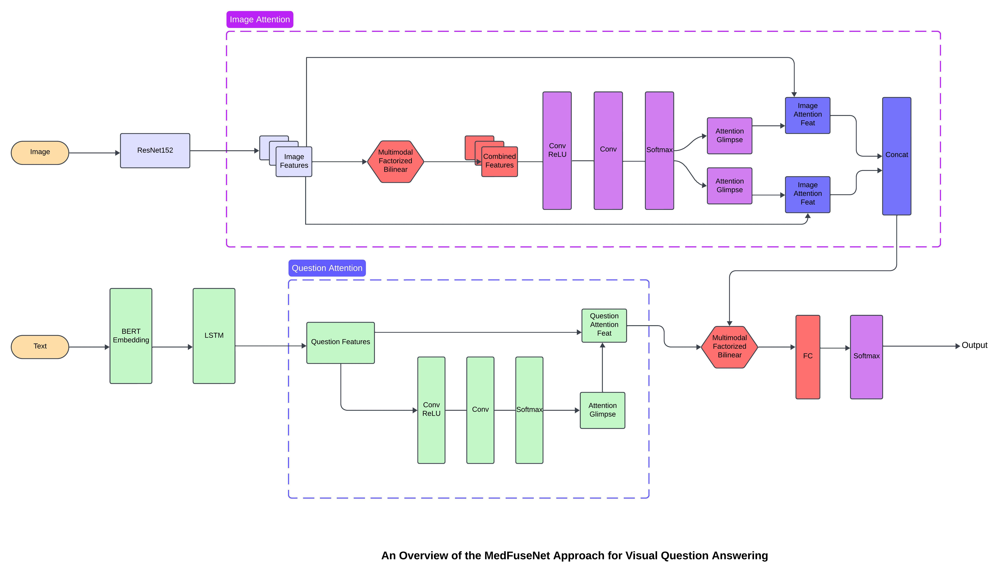

# 从大型语言模型的视角探究自主智能体：一篇综述性研究

发布时间：2024年04月05日

`Agent` `人工智能` `多领域应用`

> Exploring Autonomous Agents through the Lens of Large Language Models: A Review

# 摘要

> 大型语言模型（LLMs）正重塑人工智能的面貌，赋予自主代理在众多领域执行多样化任务的能力。这些代理擅长理解和生成类似人类的文本，预示着从客服到医疗等各行各业的重大变革。尽管如此，它们仍需克服多模态、价值观念与人的一致性、幻象以及评估等挑战。目前，我们正在研究提示、推理、工具应用和情境学习等技术，以提升它们的能力。通过AgentBench、WebArena和ToolLLM等评估平台，我们能够在复杂的情境中对这些代理进行严格的评估。这些技术进步正推动着更强壮、更高效的自主代理的发展，它们将成为我们数字生活中的重要组成部分，从处理电子邮件到诊断疾病，助我们一臂之力。以LLMs为领军的AI未来，前景令人期待。

> Large Language Models (LLMs) are transforming artificial intelligence, enabling autonomous agents to perform diverse tasks across various domains. These agents, proficient in human-like text comprehension and generation, have the potential to revolutionize sectors from customer service to healthcare. However, they face challenges such as multimodality, human value alignment, hallucinations, and evaluation. Techniques like prompting, reasoning, tool utilization, and in-context learning are being explored to enhance their capabilities. Evaluation platforms like AgentBench, WebArena, and ToolLLM provide robust methods for assessing these agents in complex scenarios. These advancements are leading to the development of more resilient and capable autonomous agents, anticipated to become integral in our digital lives, assisting in tasks from email responses to disease diagnosis. The future of AI, with LLMs at the forefront, is promising.

[Arxiv](https://arxiv.org/abs/2404.04442)