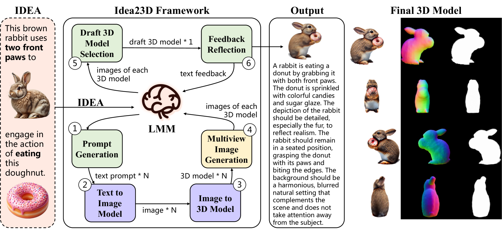
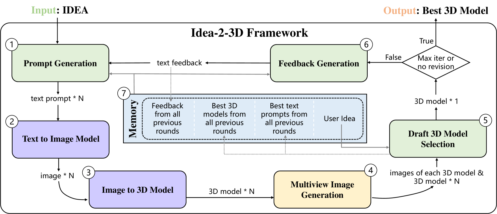
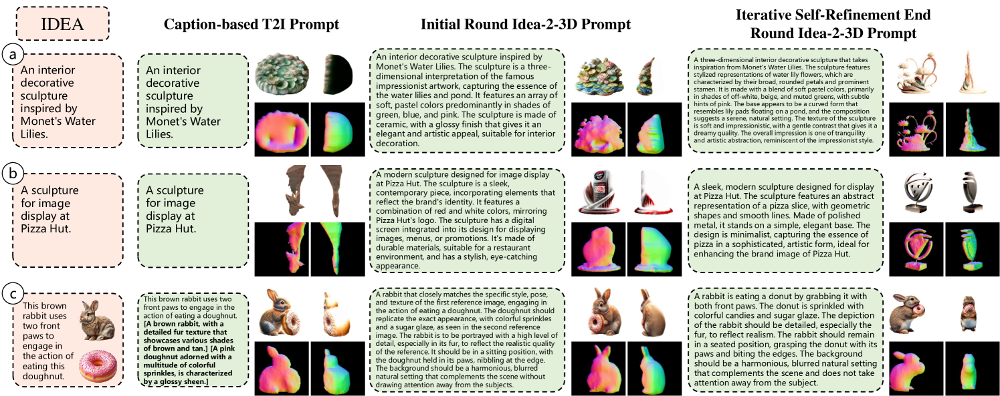
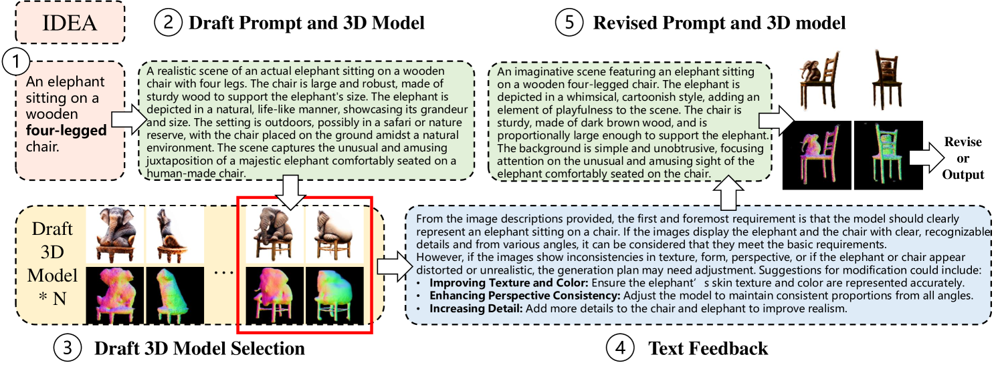
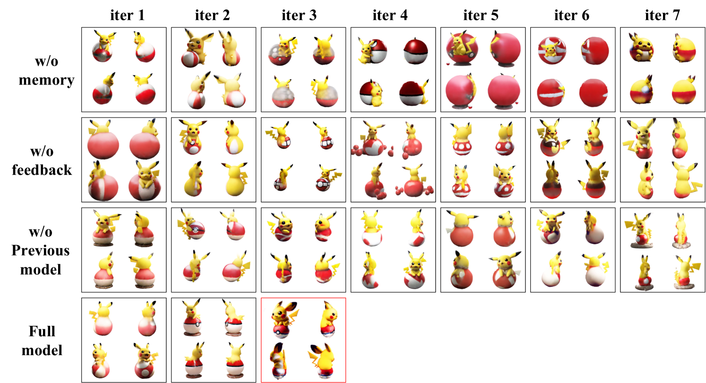
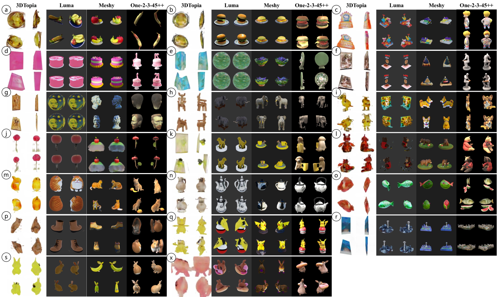

# Idea-2-3D：协同工作的LMM智能代理通过混合多模态输入实现3D模型的创建。

发布时间：2024年04月05日

`Agent` `三维建模` `人工智能生成内容`

> Idea-2-3D: Collaborative LMM Agents Enable 3D Model Generation from Interleaved Multimodal Inputs

# 摘要

> 本文提出了一种创新的三维人工智能生成内容（3D AIGC）场景：根据创意（IDEAs）生成三维内容。IDEA被定义为由文本、图像和三维模型组成的多模态输入的融合。我们首次研究这一富有挑战性和吸引力的领域。我们设计了一个名为Idea-2-3D的框架，通过三个基于大型多模态模型（LMMs）的智能代理，搭配现有算法工具，实现从IDEA到三维内容的转换。这些代理负责生成提示、选择模型和反馈调整，它们在一个自动化的循环中协同工作，相互批评以提升效果。该框架能够输出文本提示，生成与原始IDEA高度契合的三维模型。我们的实验结果显示，Idea-2-3D的成果远超现有技术。通过与一系列顶尖的3D AIGC模型进行定量对比，Idea-2-3D在94.2%的情况下能满足用户期望，其IDEA与三维模型的匹配度是传统方法的2.3倍。此外，93.5%的用户认为Idea-2-3D的表现优于其他方法。我们将公开提供相关代码、数据和模型，以供研究和应用。

> In this paper, we pursue a novel 3D AIGC setting: generating 3D content from IDEAs. The definition of an IDEA is the composition of multimodal inputs including text, image, and 3D models. To our knowledge, this challenging and appealing 3D AIGC setting has not been studied before. We propose the novel framework called Idea-2-3D to achieve this goal, which consists of three agents based upon large multimodel models (LMMs) and several existing algorithmic tools for them to invoke. Specifically, these three LMM-based agents are prompted to do the jobs of prompt generation, model selection and feedback reflection. They work in a cycle that involves both mutual collaboration and criticism. Note that this cycle is done in a fully automatic manner, without any human intervention. The framework then outputs a text prompt to generate 3D models that well align with input IDEAs. We show impressive 3D AIGC results that are beyond any previous methods can achieve. For quantitative comparisons, we construct caption-based baselines using a whole bunch of state-of-the-art 3D AIGC models and demonstrate Idea-2-3D out-performs significantly. In 94.2% of cases, Idea-2-3D meets users' requirements, marking a degree of match between IDEA and 3D models that is 2.3 times higher than baselines. Moreover, in 93.5% of the cases, users agreed that Idea-2-3D was better than baselines. Codes, data and models will made publicly available.

[Arxiv](https://arxiv.org/abs/2404.04363)