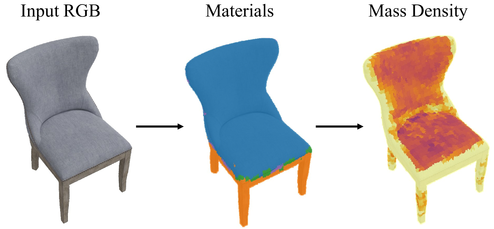
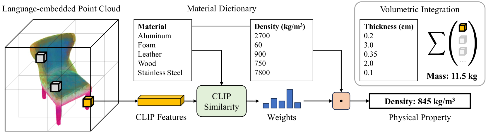

# 通过语言嵌入的特征场来掌握物理属性理解

发布时间：2024年04月05日

`LLM应用` `计算机视觉` `物理属性推理`

> Physical Property Understanding from Language-Embedded Feature Fields

# 摘要

> 电脑能否仅凭视觉识别物体的物理属性？研究显示，人类能仅凭外观通过视觉判断材料及其物理属性。本文介绍了一种创新方法，通过图像集合对物体的物理属性进行精确预测。受人类视觉物理推理启发，我们使用大型语言模型为每个物体推测可能的材料。接着，我们创建了一个融入语言信息的点云，并采用零-shot 核回归技术，对每个3D点的物理属性进行估计。此方法精准度高，无需人工注释，适用于任何开放世界中的对象。实验验证了该方法在多种物理属性推理任务上的高效性，如估算日常物体的重量，以及评估摩擦系数和硬度等属性。

> Can computers perceive the physical properties of objects solely through vision? Research in cognitive science and vision science has shown that humans excel at identifying materials and estimating their physical properties based purely on visual appearance. In this paper, we present a novel approach for dense prediction of the physical properties of objects using a collection of images. Inspired by how humans reason about physics through vision, we leverage large language models to propose candidate materials for each object. We then construct a language-embedded point cloud and estimate the physical properties of each 3D point using a zero-shot kernel regression approach. Our method is accurate, annotation-free, and applicable to any object in the open world. Experiments demonstrate the effectiveness of the proposed approach in various physical property reasoning tasks, such as estimating the mass of common objects, as well as other properties like friction and hardness.

[Arxiv](https://arxiv.org/abs/2404.04242)