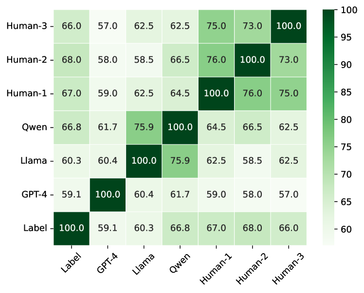
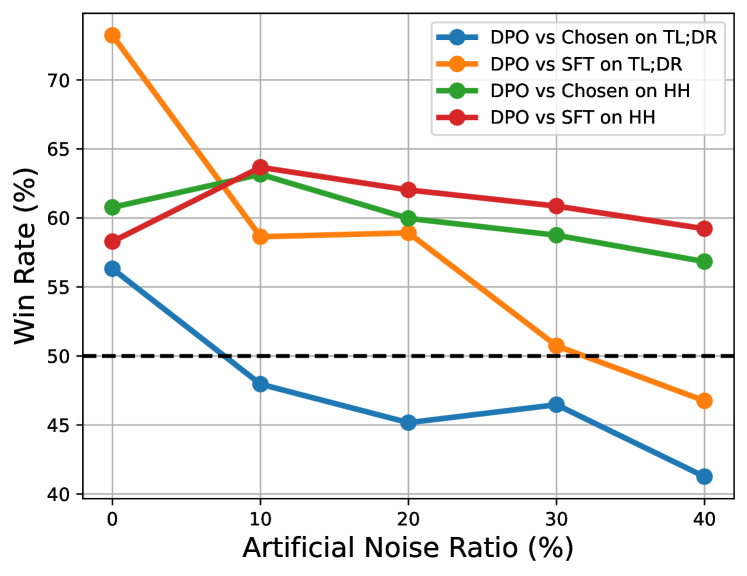
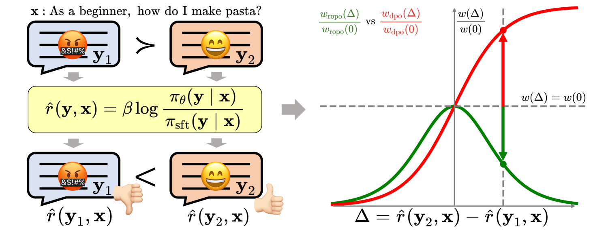

# 在大型语言模型中，我们研发了一种鲁棒偏好优化算法，它能够有效抵御噪声干扰，确保了算法的稳定性和可靠性。

发布时间：2024年04月05日

`LLM理论` `通用AI` `对齐技术`

> Robust Preference Optimization with Provable Noise Tolerance for LLMs

# 摘要

> 偏好对齐致力于让大型语言模型（LLMs）产出与人类价值观相符的回应，这对于构建通用AI系统非常关键。基于排名的方法作为一类充满前景的对齐技术，通过分析包含成对回应的数据集，优化对数似然边际来学习人类的偏好。然而，注释者偏好的个体差异导致回应对的排名标签噪声难以避免，这对现有基于排名的方法的可靠性构成了重大打击。为此，我们提出了一种新颖的抗噪声偏好对齐策略——RObust Preference Optimization（ROPO），这是首个提供抗噪声保证的偏好对齐技术。ROPO的核心在于动态地为那些标签不确定性较大的回应对分配较为保守的梯度权重，依据的是回应之间的对数似然边际。这种策略通过有效抑制噪声样本的梯度，确保了无论噪声的存在与否及其比例如何，预期风险的梯度方向都保持一致。在四个不同规模（从2.8B到13B）的基础模型上进行的三项开放式文本生成任务的实验表明，ROPO的性能显著超越了现有的基于排名的方法。

> The preference alignment aims to enable large language models (LLMs) to generate responses that conform to human values, which is essential for developing general AI systems. Ranking-based methods -- a promising class of alignment approaches -- learn human preferences from datasets containing response pairs by optimizing the log-likelihood margins between preferred and dis-preferred responses. However, due to the inherent differences in annotators' preferences, ranking labels of comparisons for response pairs are unavoidably noisy. This seriously hurts the reliability of existing ranking-based methods. To address this problem, we propose a provably noise-tolerant preference alignment method, namely RObust Preference Optimization (ROPO). To the best of our knowledge, ROPO is the first preference alignment method with noise-tolerance guarantees. The key idea of ROPO is to dynamically assign conservative gradient weights to response pairs with high label uncertainty, based on the log-likelihood margins between the responses. By effectively suppressing the gradients of noisy samples, our weighting strategy ensures that the expected risk has the same gradient direction independent of the presence and proportion of noise. Experiments on three open-ended text generation tasks with four base models ranging in size from 2.8B to 13B demonstrate that ROPO significantly outperforms existing ranking-based methods.

[Arxiv](https://arxiv.org/abs/2404.04102)