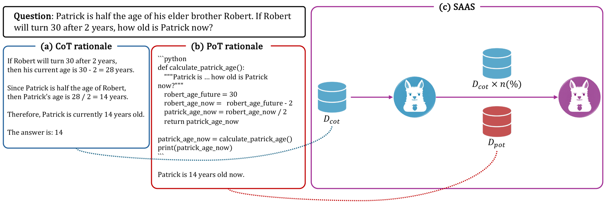
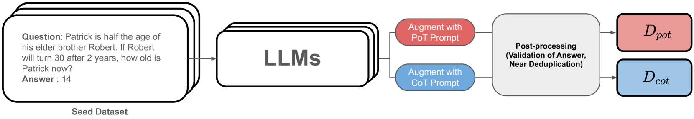
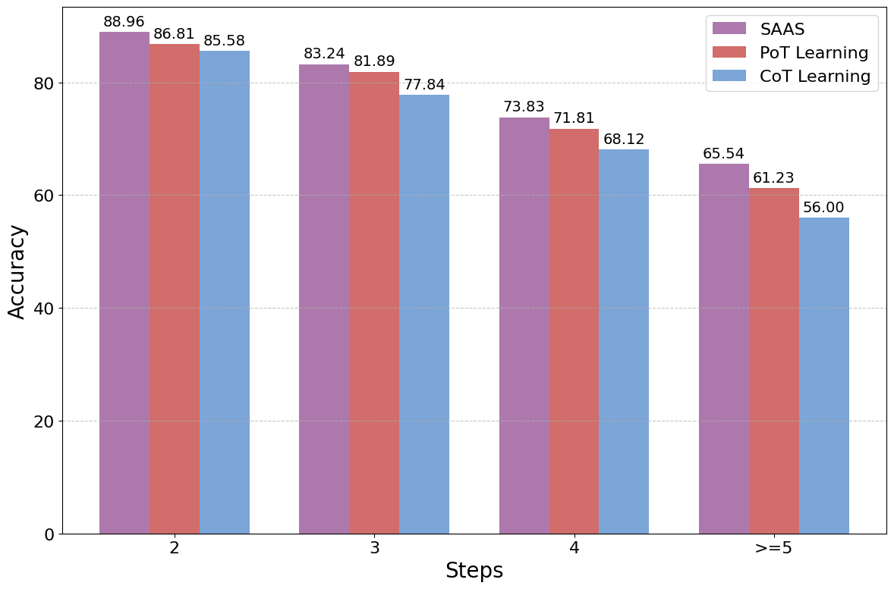
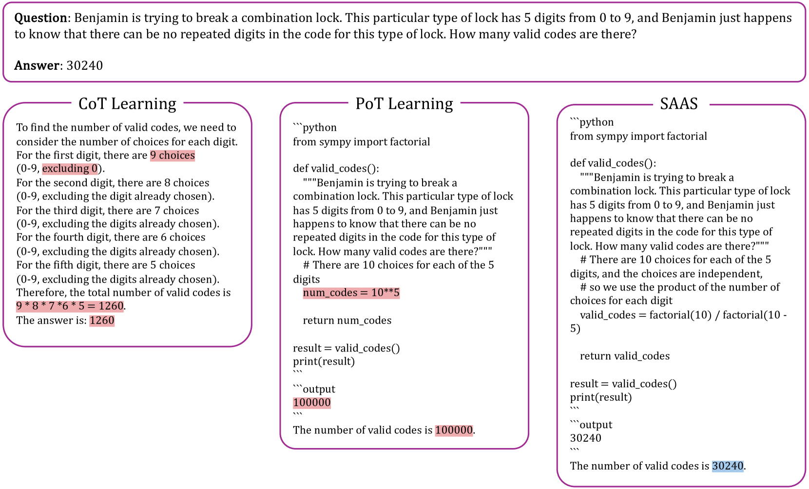

# SAAS：为大型语言模型注入数学推理的强化策略

发布时间：2024年04月05日

`LLM理论` `数学教育` `人工智能`

> SAAS: Solving Ability Amplification Strategy for Enhanced Mathematical Reasoning in Large Language Models

# 摘要

> 本研究展示了一种创新的学习方法，用以提升大型语言模型在数学推理和解题技巧上的造诣。我们着眼于融合思维链与思维程序的学习，推测优先培养数学逻辑能力对于提升解题能力大有裨益。CoT作为学习的起点，对于攻克复杂的数学难题极为关键。据此，我们设计了一种名为SAAS的顺序学习策略，它巧妙地将思维链学习过渡到思维程序学习。通过一系列基准测试的深入性能对比，我们的实证研究证实SAAS已达到业界领先水平。这一成果不仅凸显了我们方法的高效性，也为LLMs在数学推理领域的研究开辟了新的篇章。

> This study presents a novel learning approach designed to enhance both mathematical reasoning and problem-solving abilities of Large Language Models (LLMs). We focus on integrating the Chain-of-Thought (CoT) and the Program-of-Thought (PoT) learning, hypothesizing that prioritizing the learning of mathematical reasoning ability is helpful for the amplification of problem-solving ability. Thus, the initial learning with CoT is essential for solving challenging mathematical problems. To this end, we propose a sequential learning approach, named SAAS (Solving Ability Amplification Strategy), which strategically transitions from CoT learning to PoT learning. Our empirical study, involving an extensive performance comparison using several benchmarks, demonstrates that our SAAS achieves state-of-the-art (SOTA) performance. The results underscore the effectiveness of our sequential learning approach, marking a significant advancement in the field of mathematical reasoning in LLMs.

[Arxiv](https://arxiv.org/abs/2404.03887)