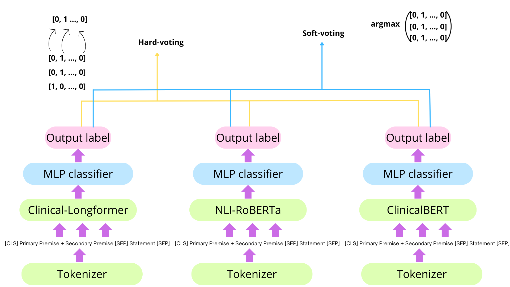
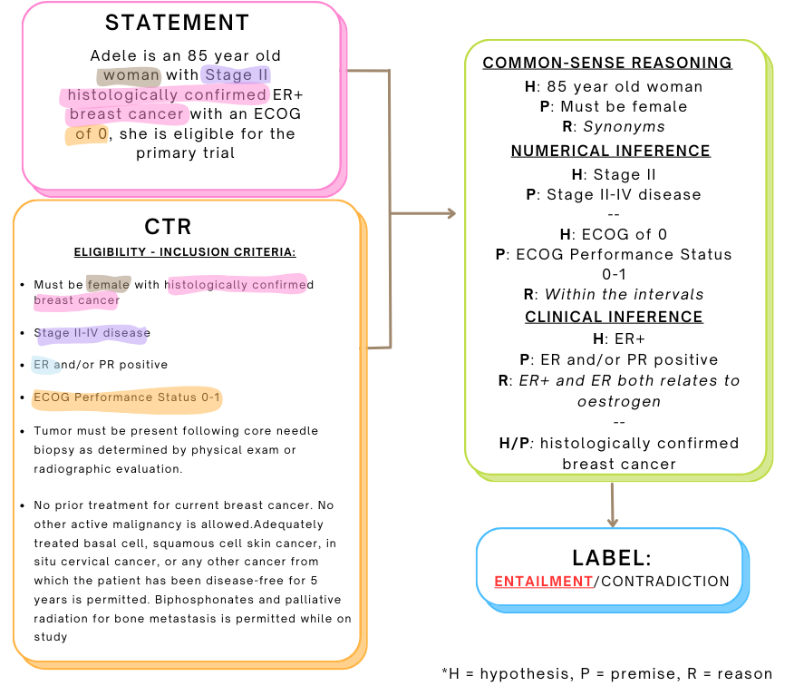
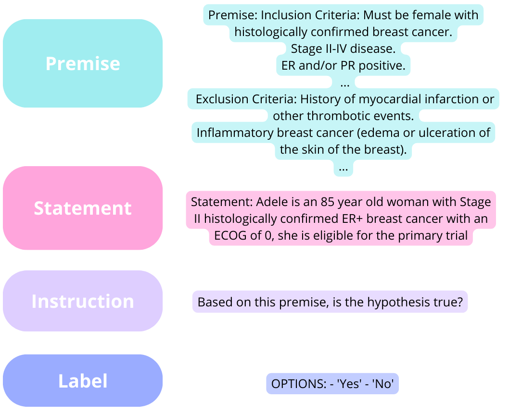
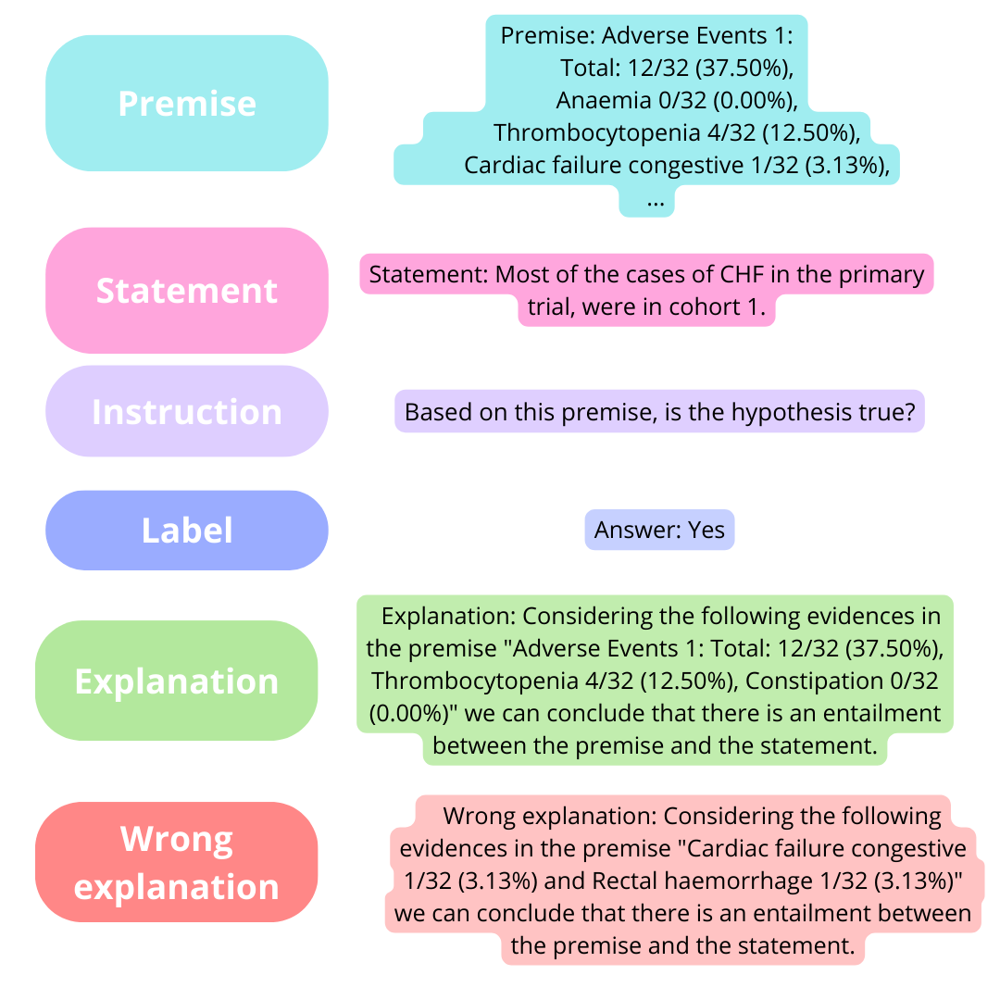

# SemEval-2024 任务 2 探讨了 SEME，通过对比遮蔽式和生成式语言模型在临床试验自然语言推理任务上的效果。

发布时间：2024年04月05日

`LLM应用`

> SEME at SemEval-2024 Task 2: Comparing Masked and Generative Language Models on Natural Language Inference for Clinical Trials

# 摘要

> 本文汇报了我们参与SemEval-2024第二项任务——针对临床试验的安全生物医学自然语言推理的成果。我们针对临床试验报告的自然语言推理模型，设计了一个文本蕴含任务，旨在评估其一致性和准确性。我们尝试了两种方法：一种是对掩码语言模型进行微调和集成，另一种是利用模板对大型语言模型进行提示，特别是采用了思维链和对比思维链技术。通过两次提示Flan-T5-large模型，我们获得了最佳系统效果，F1分数达到0.57，忠实度为0.64，一致性为0.56。

> This paper describes our submission to Task 2 of SemEval-2024: Safe Biomedical Natural Language Inference for Clinical Trials. The Multi-evidence Natural Language Inference for Clinical Trial Data (NLI4CT) consists of a Textual Entailment (TE) task focused on the evaluation of the consistency and faithfulness of Natural Language Inference (NLI) models applied to Clinical Trial Reports (CTR). We test 2 distinct approaches, one based on finetuning and ensembling Masked Language Models and the other based on prompting Large Language Models using templates, in particular, using Chain-Of-Thought and Contrastive Chain-Of-Thought. Prompting Flan-T5-large in a 2-shot setting leads to our best system that achieves 0.57 F1 score, 0.64 Faithfulness, and 0.56 Consistency.

[Arxiv](https://arxiv.org/abs/2404.03977)