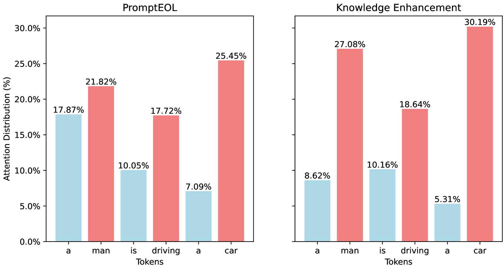

# 生成型语言模型中，提升句子嵌入的简易技巧。

发布时间：2024年04月05日

`LLM应用` `问答系统`

> Simple Techniques for Enhancing Sentence Embeddings in Generative Language Models

# 摘要

> 句子嵌入作为自然语言处理的基础任务，在搜索、专家系统和问答平台中扮演着重要角色。随着LLaMA、Mistral等大型语言模型的不断演进，句子嵌入领域也迎来了突破性进展。然而，这些成果主要针对微调场景，而直接推断句子表示的高效方法仍待深入。本研究旨在弥补这一研究空缺。我们通过广泛实验，质疑了预训练语言模型（PLMs）生成句子嵌入必须限制单词数量的传统观点。我们发现，尽管这种做法对直接推断的生成模型有所帮助，但对于鉴别模型或生成PLMs的微调并非必不可少。这一发现为未来研究中手动模板的设计提供了新思路。基于此，我们提出了两项创新的提示工程技术——假想思维链和知识增强，以增强PLMs原始嵌入的表现力。我们在多种PLM类型上验证了它们的有效性，并深入分析了它们成功背后的关键因素。

> Sentence Embedding stands as a fundamental task within the realm of Natural Language Processing, finding extensive application in search engines, expert systems, and question-and-answer platforms. With the continuous evolution of large language models such as LLaMA and Mistral, research on sentence embedding has recently achieved notable breakthroughs. However, these advancements mainly pertain to fine-tuning scenarios, leaving explorations into computationally efficient direct inference methods for sentence representation in a nascent stage. This paper endeavors to bridge this research gap. Through comprehensive experimentation, we challenge the widely held belief in the necessity of an Explicit One-word Limitation for deriving sentence embeddings from Pre-trained Language Models (PLMs). We demonstrate that this approach, while beneficial for generative models under direct inference scenario, is not imperative for discriminative models or the fine-tuning of generative PLMs. This discovery sheds new light on the design of manual templates in future studies. Building upon this insight, we propose two innovative prompt engineering techniques capable of further enhancing the expressive power of PLMs' raw embeddings: Pretended Chain of Thought and Knowledge Enhancement. We confirm their effectiveness across various PLM types and provide a detailed exploration of the underlying factors contributing to their success.

[Arxiv](https://arxiv.org/abs/2404.03921)