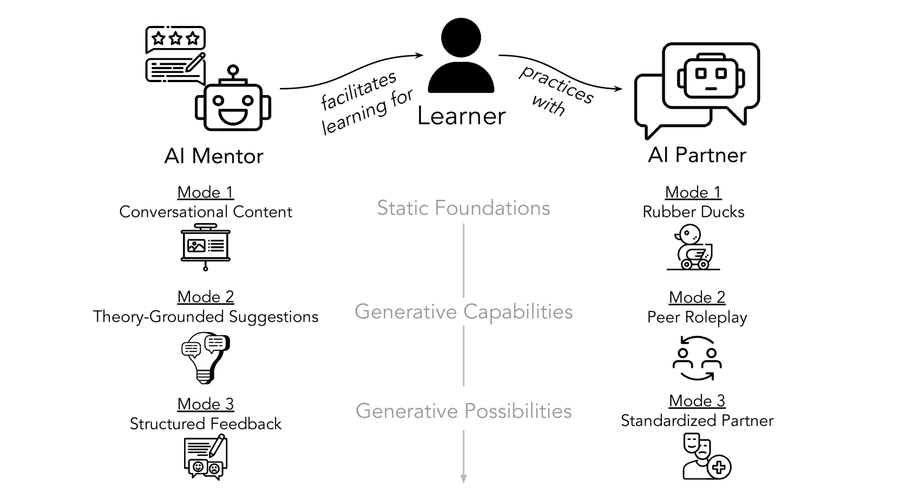

# 借助大型语言模型开展社交技巧培训

发布时间：2024年04月05日

`LLM应用` `社交技能培训` `人工智能`

> Social Skill Training with Large Language Models

# 摘要

> 社交技能如冲突解决对于人们在职场和个人生活中有效沟通和成功至关重要。但大多数人往往难以获得提升这些技能的实践机会。如何让社交技能训练变得更加普及、便捷且吸引人？本文综合了沟通学和心理学领域的跨学科研究，揭示了进入专业领域的社交技能障碍。接着，我们提出了一个创新方案，通过大型语言模型构建一个通用框架，以促进社交技能的培训。我们的AI伙伴——AI导师框架，将体验学习、实践练习和个性化反馈融为一体。这项研究最终倡导跨学科合作，以应对劳动力发展和社会公平等方面的挑战。

> People rely on social skills like conflict resolution to communicate effectively and to thrive in both work and personal life. However, practice environments for social skills are typically out of reach for most people. How can we make social skill training more available, accessible, and inviting? Drawing upon interdisciplinary research from communication and psychology, this perspective paper identifies social skill barriers to enter specialized fields. Then we present a solution that leverages large language models for social skill training via a generic framework. Our AI Partner, AI Mentor framework merges experiential learning with realistic practice and tailored feedback. This work ultimately calls for cross-disciplinary innovation to address the broader implications for workforce development and social equality.

[Arxiv](https://arxiv.org/abs/2404.04204)