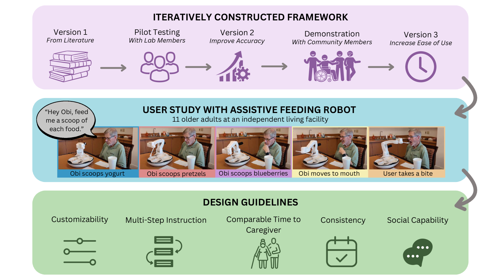
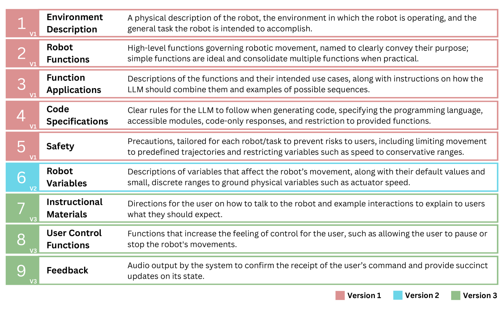
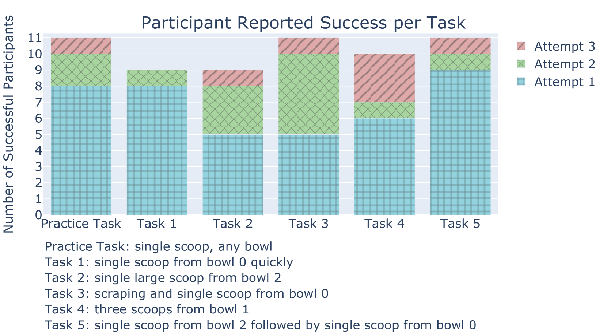
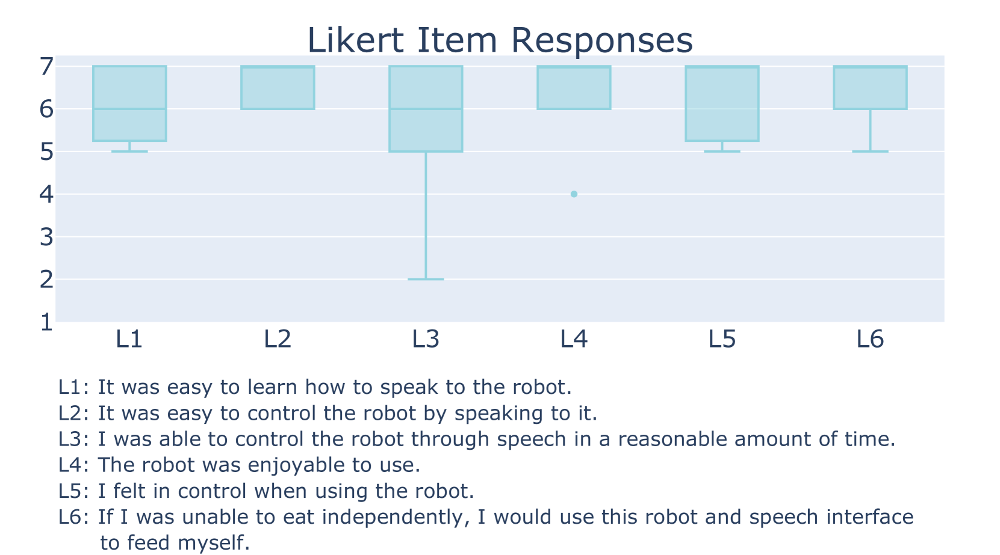
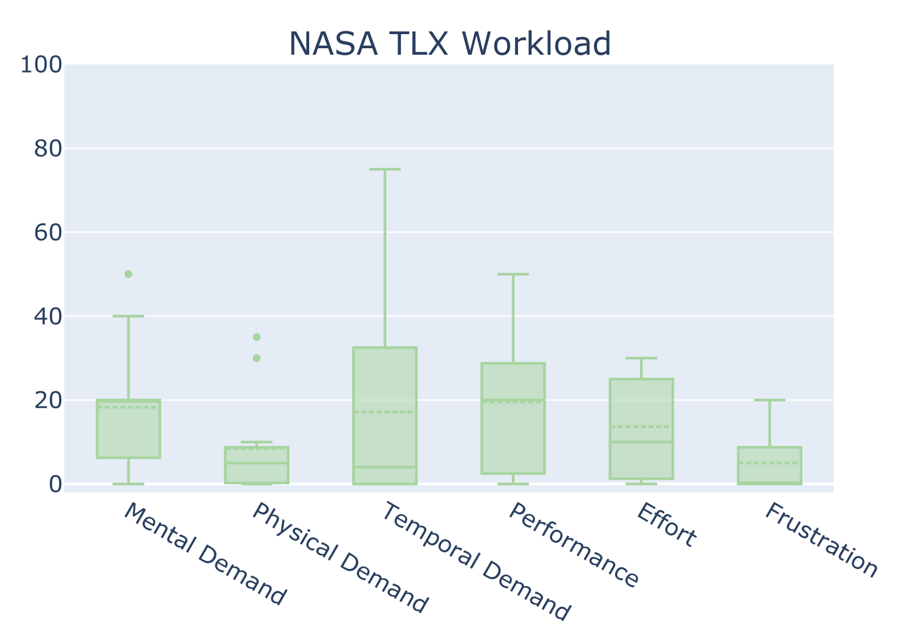
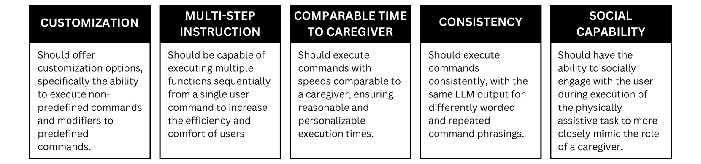
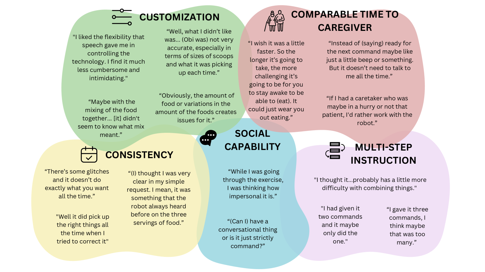
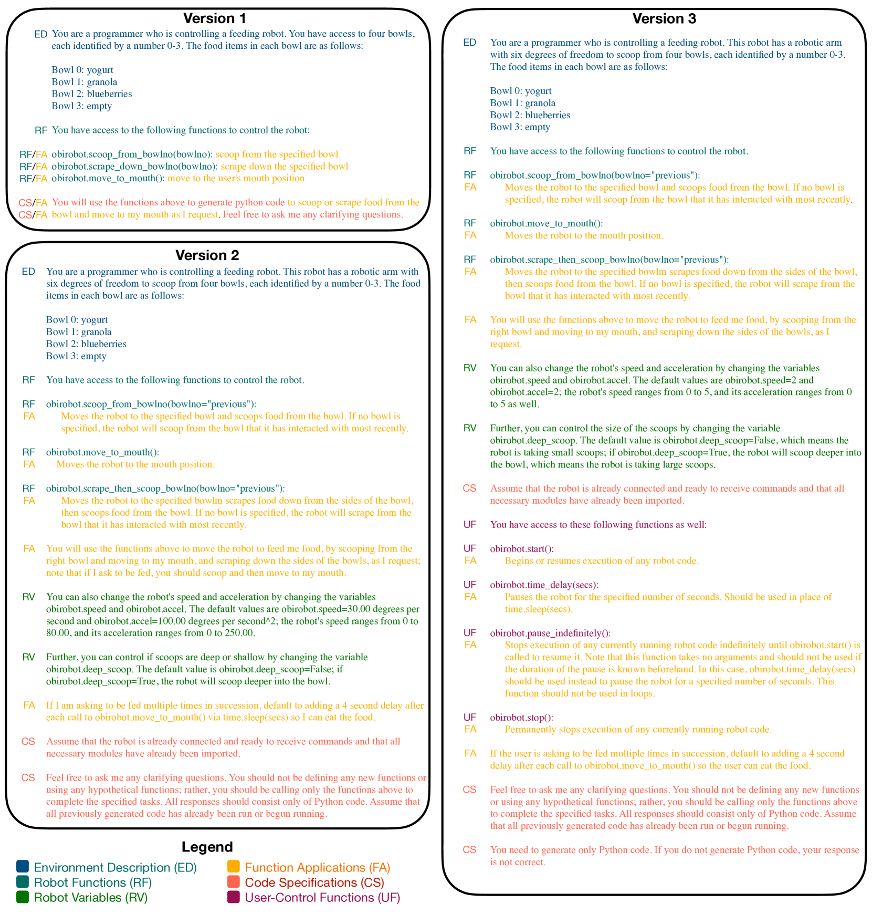

# VoicePilot：将大型语言模型 (LLM) 作为物理辅助机器人的语音交互界面

发布时间：2024年04月05日

`Agent` `辅助机器人` `人机交互`

> VoicePilot: Harnessing LLMs as Speech Interfaces for Physically Assistive Robots

# 摘要

> 物理辅助机器人为行动不便的个体带来了提升生活质量和自主能力的良机。特别是那些运用大型语言模型（LLMs）的语音界面，让使用者能够流畅自然地向机器人发出复杂指令和个性化偏好。尽管已有将LLMs融入机器人界面的框架提案，用于高级任务规划和代码生成，但这些方案忽略了开发辅助性界面时不可或缺的人性化考量。本研究提出了一个新的框架，通过与喂食机器人的三阶段迭代测试，最终在一家养老机构对11位长者进行了实际应用评估。我们依据最终研究的数据分析，不仅验证了框架的有效性，还为如何运用LLMs作为辅助机器人的语音界面提供了设计指导。更多视频资料和相关文件可在项目网站查阅：https://sites.google.com/andrew.cmu.edu/voicepilot/。

> Physically assistive robots present an opportunity to significantly increase the well-being and independence of individuals with motor impairments or other forms of disability who are unable to complete activities of daily living. Speech interfaces, especially ones that utilize Large Language Models (LLMs), can enable individuals to effectively and naturally communicate high-level commands and nuanced preferences to robots. Frameworks for integrating LLMs as interfaces to robots for high level task planning and code generation have been proposed, but fail to incorporate human-centric considerations which are essential while developing assistive interfaces. In this work, we present a framework for incorporating LLMs as speech interfaces for physically assistive robots, constructed iteratively with 3 stages of testing involving a feeding robot, culminating in an evaluation with 11 older adults at an independent living facility. We use both quantitative and qualitative data from the final study to validate our framework and additionally provide design guidelines for using LLMs as speech interfaces for assistive robots. Videos and supporting files are located on our project website: https://sites.google.com/andrew.cmu.edu/voicepilot/

[Arxiv](https://arxiv.org/abs/2404.04066)