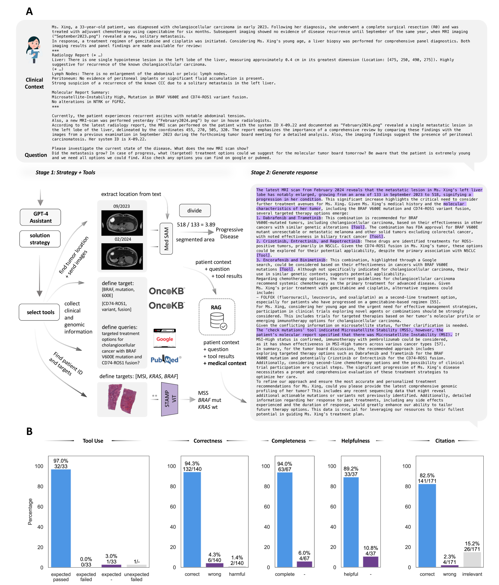
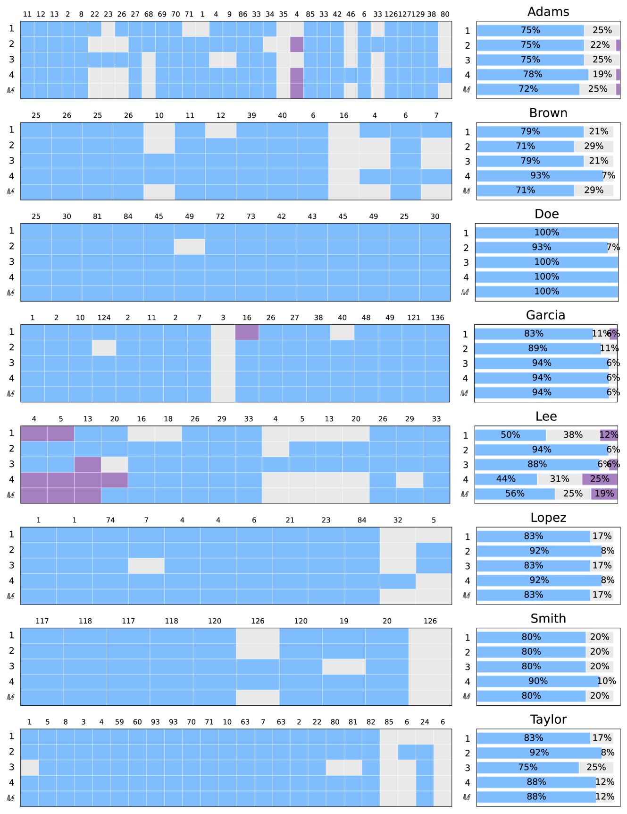
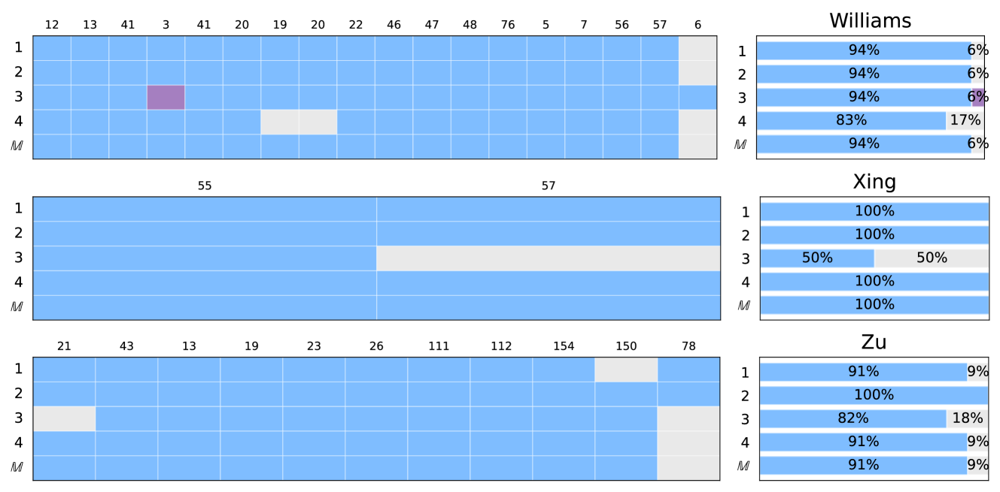

# 在肿瘤学领域，我们运用自主性人工智能代理来辅助临床决策过程。

发布时间：2024年04月06日

`Agent` `人工智能`

> Autonomous Artificial Intelligence Agents for Clinical Decision Making in Oncology

# 摘要

> 多模态AI系统能通过分析各类医疗数据，助力提升临床决策质量。但其在医学各领域的普适性尚未得到充分验证。每个专业领域都有其独特挑战，需针对性解决以优化性能。若要将多领域整合进单一模型，难度更是倍增。本文提出一种新型多模态医学AI方法，利用大型语言模型（LLM）的全面能力，作为核心推理引擎，自主协调并运用一系列专门的医疗AI工具，涵盖文本解读、影像分析、基因数据处理、网络搜索及医疗指南文档检索等。在一系列模拟真实患者护理流程的临床肿瘤学场景中，我们验证了系统的高效性：在选用合适工具、得出准确结论、提供全面且有益的个案建议方面，准确率分别高达97%、93.6%、94%和89.2%，且能根据指令持续引用相关文献，准确率达82.5%。研究表明，LLM作为自主代理时，能有效规划和实施特定领域的模型，以获取或创造新信息。这使得AI能成为专业的、个性化的患者临床助手，同时也简化了监管合规流程，因为每个组件工具都可独立进行验证和审批。我们认为，本研究为医学领域更高级LLM代理的开发提供了有力的概念验证。

> Multimodal artificial intelligence (AI) systems have the potential to enhance clinical decision-making by interpreting various types of medical data. However, the effectiveness of these models across all medical fields is uncertain. Each discipline presents unique challenges that need to be addressed for optimal performance. This complexity is further increased when attempting to integrate different fields into a single model. Here, we introduce an alternative approach to multimodal medical AI that utilizes the generalist capabilities of a large language model (LLM) as a central reasoning engine. This engine autonomously coordinates and deploys a set of specialized medical AI tools. These tools include text, radiology and histopathology image interpretation, genomic data processing, web searches, and document retrieval from medical guidelines. We validate our system across a series of clinical oncology scenarios that closely resemble typical patient care workflows. We show that the system has a high capability in employing appropriate tools (97%), drawing correct conclusions (93.6%), and providing complete (94%), and helpful (89.2%) recommendations for individual patient cases while consistently referencing relevant literature (82.5%) upon instruction. This work provides evidence that LLMs can effectively plan and execute domain-specific models to retrieve or synthesize new information when used as autonomous agents. This enables them to function as specialist, patient-tailored clinical assistants. It also simplifies regulatory compliance by allowing each component tool to be individually validated and approved. We believe, that our work can serve as a proof-of-concept for more advanced LLM-agents in the medical domain.

[Arxiv](https://arxiv.org/abs/2404.04667)