# 大型语言模型在处理多智能体群体行为问题时遭遇的难题

发布时间：2024年04月06日

`Agent` `机器人` `多智能体系统`

> Challenges Faced by Large Language Models in Solving Multi-Agent Flocking

# 摘要

> 群集现象，即多个智能体在一个系统中保持紧密联系，避免相互碰撞，同时维持既定队形，这在自然界中司空见惯，并在机器人领域得到广泛应用，如灾害搜救、动物追踪和边界巡逻等。近期，大型语言模型（LLMs）在解决协作任务方面展现出了非凡的决策能力。探索利用LLMs实现多智能体群集，将有助于证明其在空间分散决策场景中的实际效用。然而，实践发现，LLMs驱动的智能体在执行群集任务时，往往无法达到预期效果，它们倾向于聚集在初始位置的平均点或相互分离。深入分析后，我们意识到LLMs难以有效理解如何维持特定形状或距离。攻克这一难题，不仅能提升LLMs在协作空间推理方面的能力，也为处理更为复杂的多智能体任务打下坚实基础。本文深入剖析了LLMs在多智能体群集问题上的挑战，并对未来的优化方向和研究领域提出了建议。

> Flocking is a behavior where multiple agents in a system attempt to stay close to each other while avoiding collision and maintaining a desired formation. This is observed in the natural world and has applications in robotics, including natural disaster search and rescue, wild animal tracking, and perimeter surveillance and patrol. Recently, large language models (LLMs) have displayed an impressive ability to solve various collaboration tasks as individual decision-makers. Solving multi-agent flocking with LLMs would demonstrate their usefulness in situations requiring spatial and decentralized decision-making. Yet, when LLM-powered agents are tasked with implementing multi-agent flocking, they fall short of the desired behavior. After extensive testing, we find that agents with LLMs as individual decision-makers typically opt to converge on the average of their initial positions or diverge from each other. After breaking the problem down, we discover that LLMs cannot understand maintaining a shape or keeping a distance in a meaningful way. Solving multi-agent flocking with LLMs would enhance their ability to understand collaborative spatial reasoning and lay a foundation for addressing more complex multi-agent tasks. This paper discusses the challenges LLMs face in multi-agent flocking and suggests areas for future improvement and research.

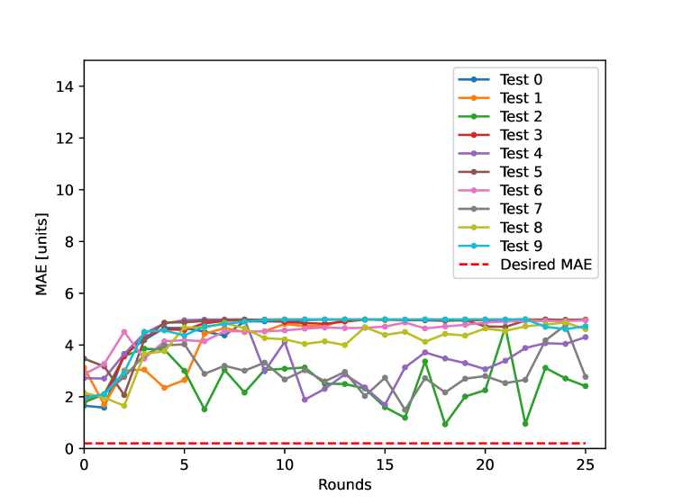

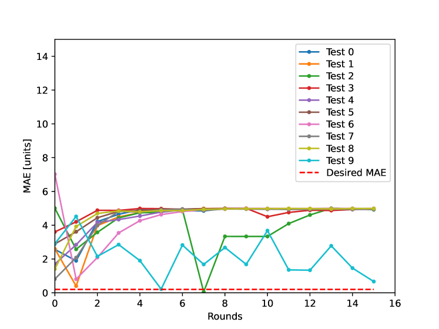

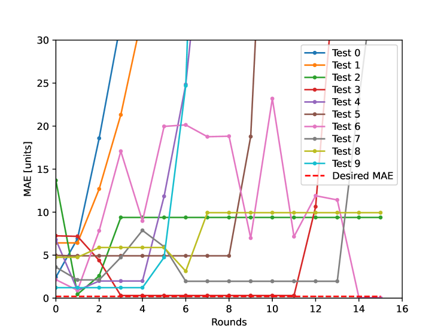

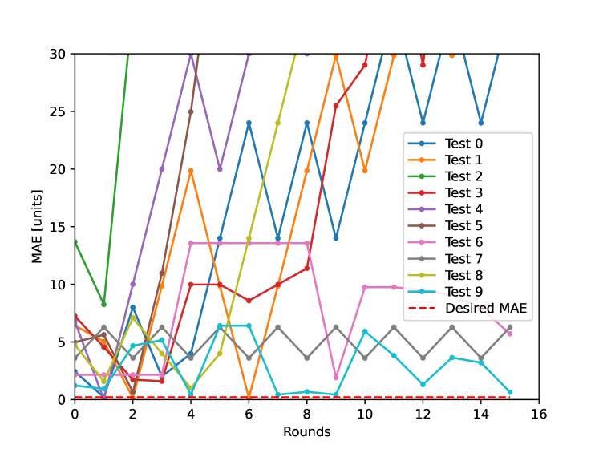

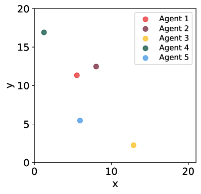

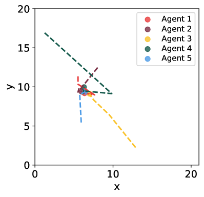

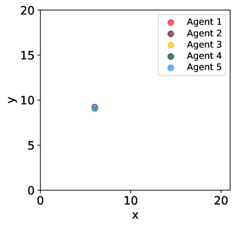

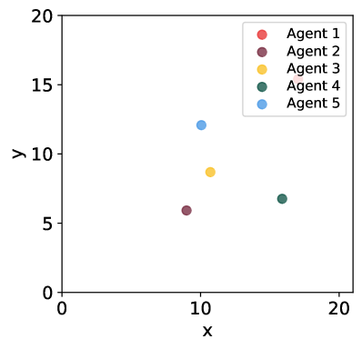

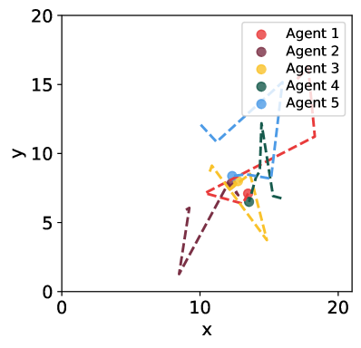

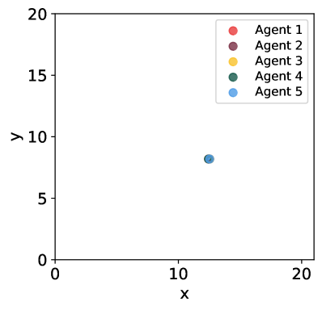

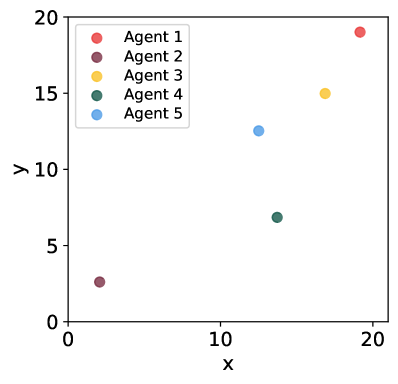

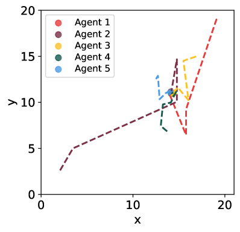

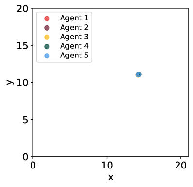

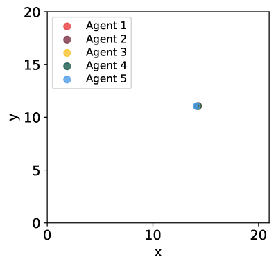

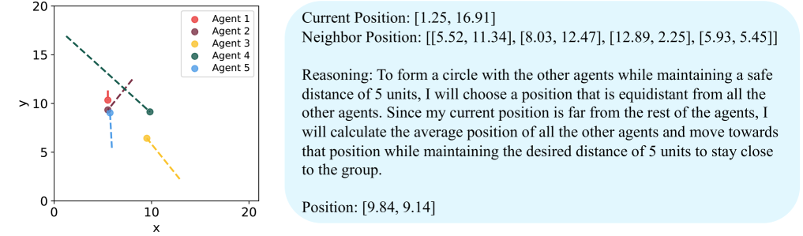

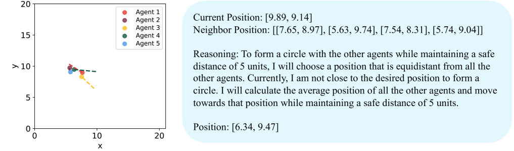

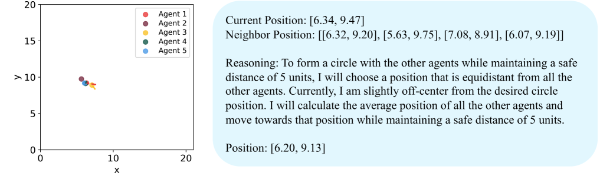

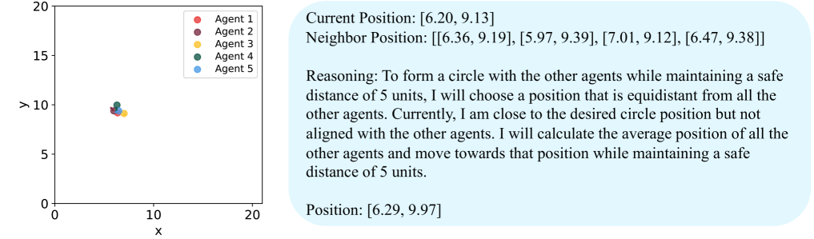

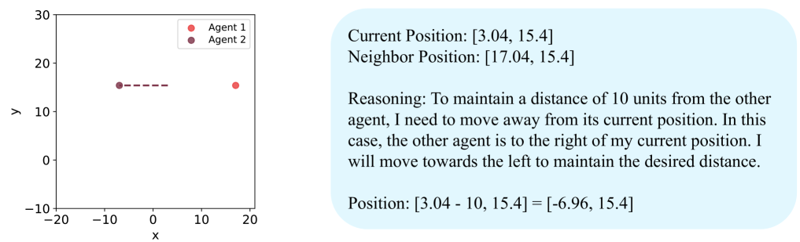

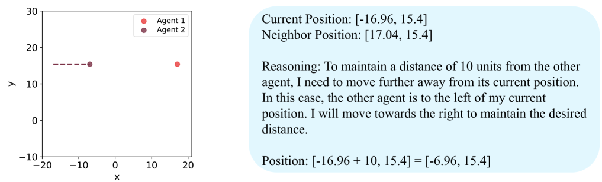

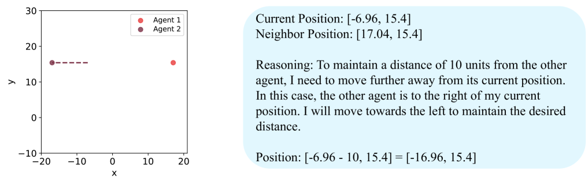

[Arxiv](https://arxiv.org/abs/2404.04752)