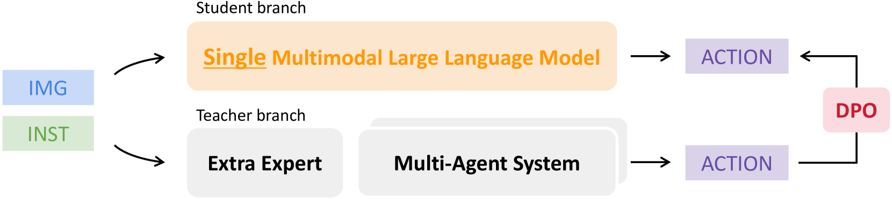
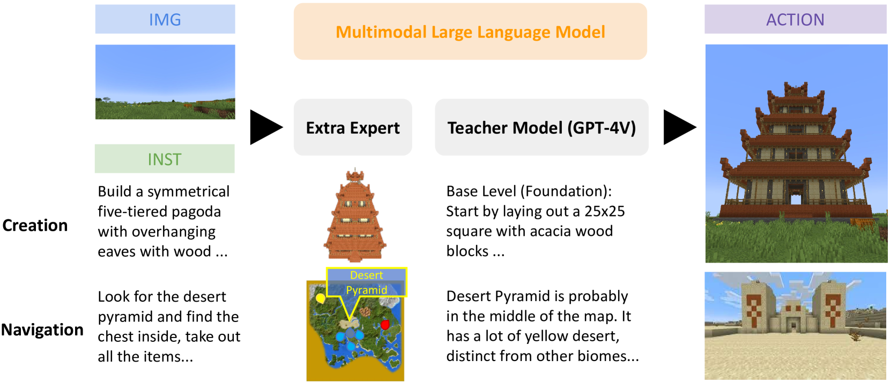
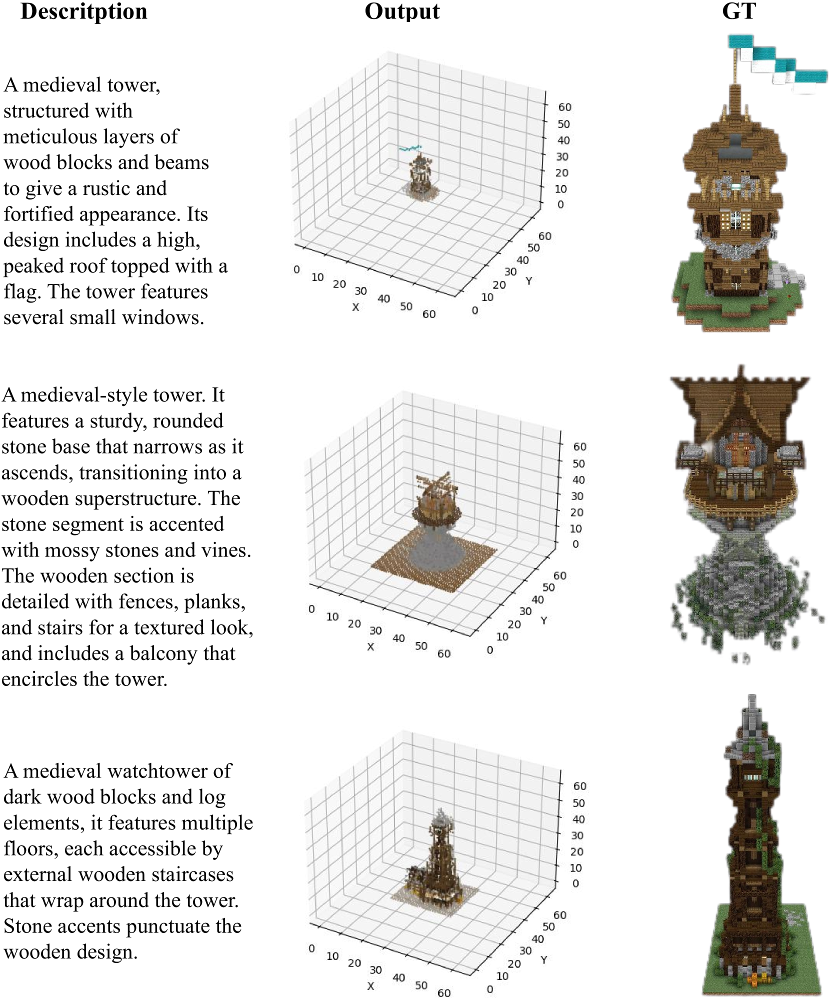

# 我们真的需要构建复杂的代理系统吗？不如将具身智能体简化为一个模型。

发布时间：2024年04月06日

`Agent` `智能体` `多模态感知`

> Do We Really Need a Complex Agent System? Distill Embodied Agent into a Single Model

# 摘要

> 借助大型语言模型的力量，具身智能体能够灵活领会人类指令，制定清晰的指导方案，并付诸实践。多模态语言模型进一步融合了多种感知信号，让具身智能体对世界的洞察更为敏锐。然而，现有研究存在局限：一是智能体在从感知到行动的过程中各自为战，导致任务执行上的断层；二是MLMs在静态数据上训练，难以适应不断变化的开放式环境；三是直接输入先验知识，限制了应用的适应性。我们推出了STEVE-2框架，它通过分层任务划分、镜像蒸馏技术以及引入专家模型的方式，实现了开放式具身任务的知识蒸馏。经过这一过程，智能体即便在缺少专家指导的情况下，也能胜任复杂多变的任务，展现出多功能LLM的强大实力。在导航和创造等领域的广泛测试中，STEVE-2的性能提升显著，达到了1.4至7.3倍。

> With the power of large language models (LLMs), open-ended embodied agents can flexibly understand human instructions, generate interpretable guidance strategies, and output executable actions. Nowadays, Multi-modal Language Models~(MLMs) integrate multi-modal signals into LLMs, further bringing richer perception to entity agents and allowing embodied agents to perceive world-understanding tasks more delicately. However, existing works: 1) operate independently by agents, each containing multiple LLMs, from perception to action, resulting in gaps between complex tasks and execution; 2) train MLMs on static data, struggling with dynamics in open-ended scenarios; 3) input prior knowledge directly as prompts, suppressing application flexibility. We propose STEVE-2, a hierarchical knowledge distillation framework for open-ended embodied tasks, characterized by 1) a hierarchical system for multi-granular task division, 2) a mirrored distillation method for parallel simulation data, and 3) an extra expert model for bringing additional knowledge into parallel simulation. After distillation, embodied agents can complete complex, open-ended tasks without additional expert guidance, utilizing the performance and knowledge of a versatile MLM. Extensive evaluations on navigation and creation tasks highlight the superior performance of STEVE-2 in open-ended tasks, with $1.4 \times$ - $7.3 \times$ in performance.

[Arxiv](https://arxiv.org/abs/2404.04619)