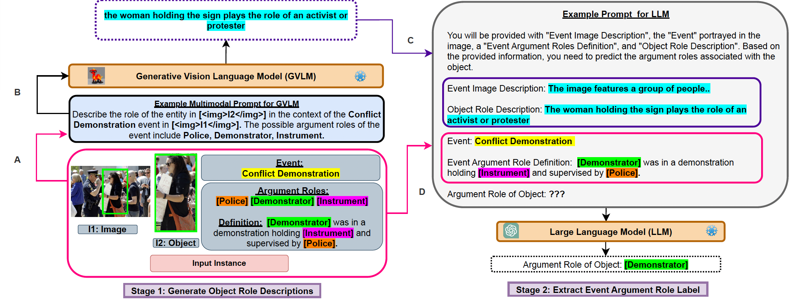
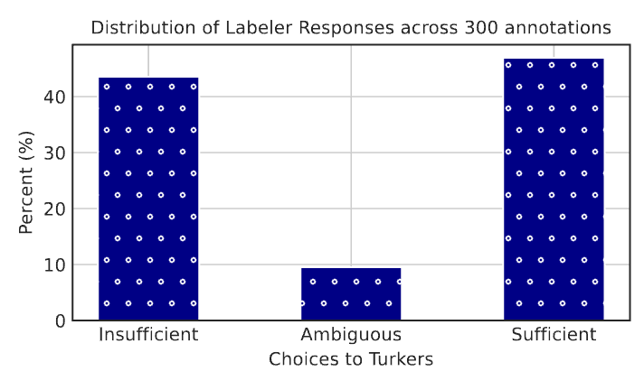
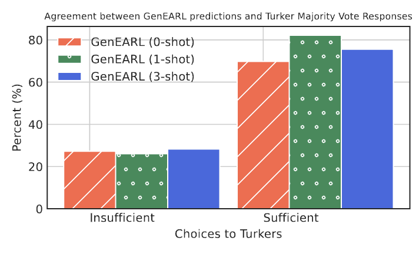

# GenEARL：一种无需训练的多模态事件角色标注生成框架

发布时间：2024年04月06日

`LLM应用` `计算机视觉`

> GenEARL: A Training-Free Generative Framework for Multimodal Event Argument Role Labeling

# 摘要

> 多模态事件参数角色标注（EARL）任务，即在图像中为每个事件参与者分配特定角色，是一项颇具挑战性的工作。它涉及对整个图像、事件本身以及各参与对象间的互动进行全面推理。现有模型依赖优质的事件标注数据来把握事件的语义和结构，却难以适应新事件类型和不同领域。本文提出了GenEARL，一个无需训练的生成式框架，它借助现代生成模型的能力，通过图像上下文理解事件任务描述，从而执行EARL任务。具体而言，GenEARL由两个生成式提示阶段组成，分别运用固定的视觉-语言模型（VLM）和大型语言模型（LLM）。首先，生成性VLM掌握事件参数角色的语义，根据图像生成聚焦事件的对象描述。接着，LLM根据这些生成的对象描述，配合预设的EARL模板进行提示（即为对象指派事件参数角色）。实验结果显示，GenEARL在M2E2和SwiG数据集上的零-shot EARL任务中，准确率分别比CLIP基线提升了9.4%和14.2%。同时，在M2E2数据集上，其精确度比CLIP-Event高出22%。此框架还具备灵活适应和推广至未知领域的优势。

> Multimodal event argument role labeling (EARL), a task that assigns a role for each event participant (object) in an image is a complex challenge. It requires reasoning over the entire image, the depicted event, and the interactions between various objects participating in the event. Existing models heavily rely on high-quality event-annotated training data to understand the event semantics and structures, and they fail to generalize to new event types and domains. In this paper, we propose GenEARL, a training-free generative framework that harness the power of the modern generative models to understand event task descriptions given image contexts to perform the EARL task. Specifically, GenEARL comprises two stages of generative prompting with a frozen vision-language model (VLM) and a frozen large language model (LLM). First, a generative VLM learns the semantics of the event argument roles and generates event-centric object descriptions based on the image. Subsequently, a LLM is prompted with the generated object descriptions with a predefined template for EARL (i.e., assign an object with an event argument role). We show that GenEARL outperforms the contrastive pretraining (CLIP) baseline by 9.4% and 14.2% accuracy for zero-shot EARL on the M2E2 and SwiG datasets, respectively. In addition, we outperform CLIP-Event by 22% precision on M2E2 dataset. The framework also allows flexible adaptation and generalization to unseen domains.

[Arxiv](https://arxiv.org/abs/2404.04763)