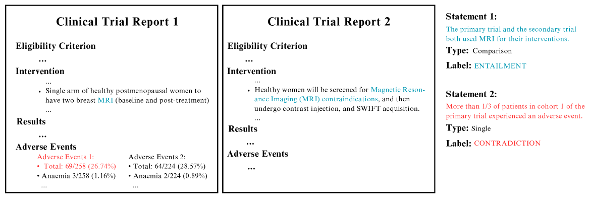
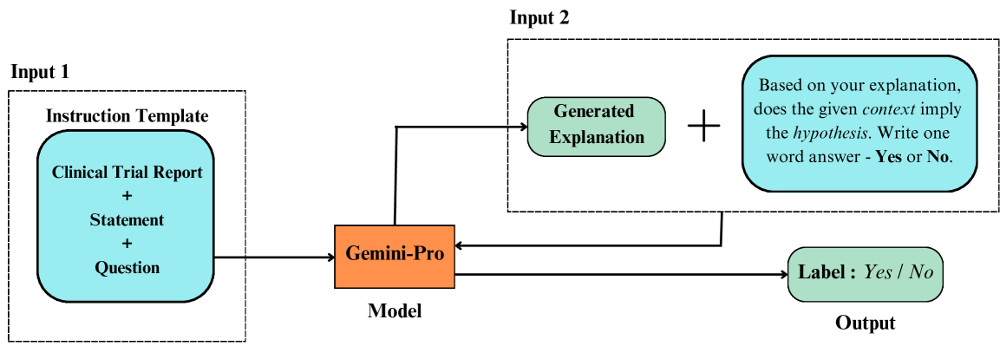
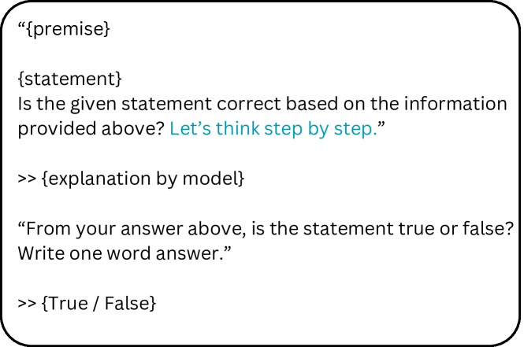
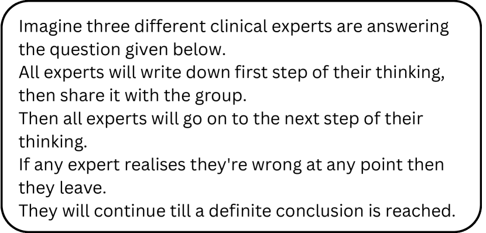
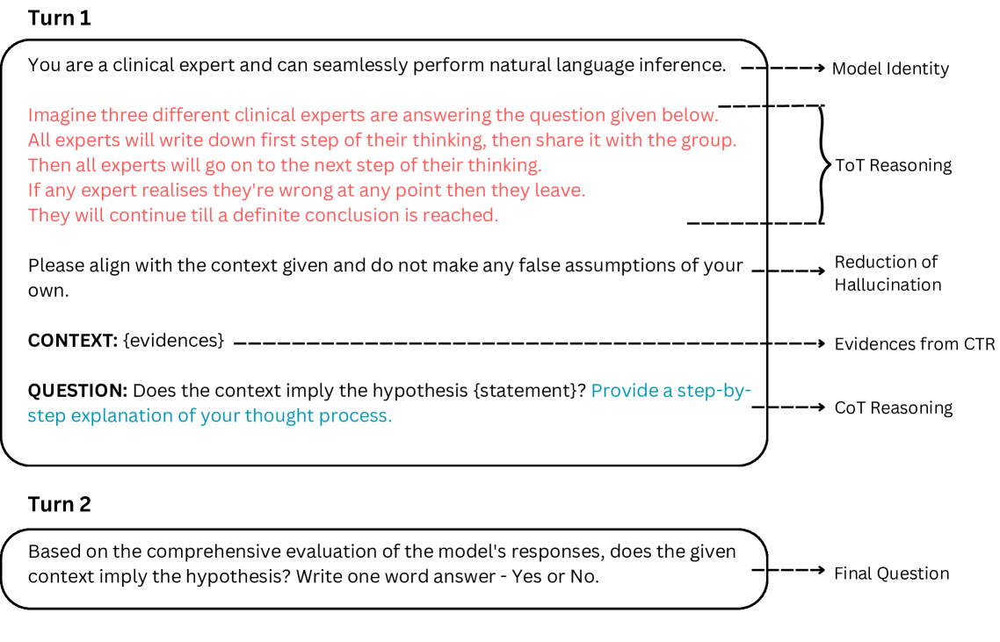
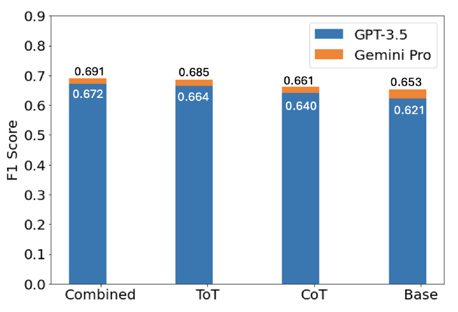
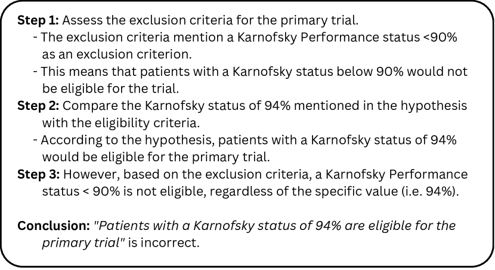
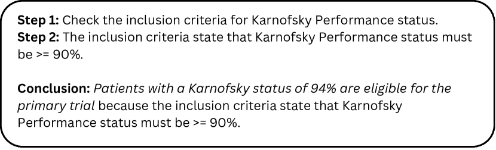
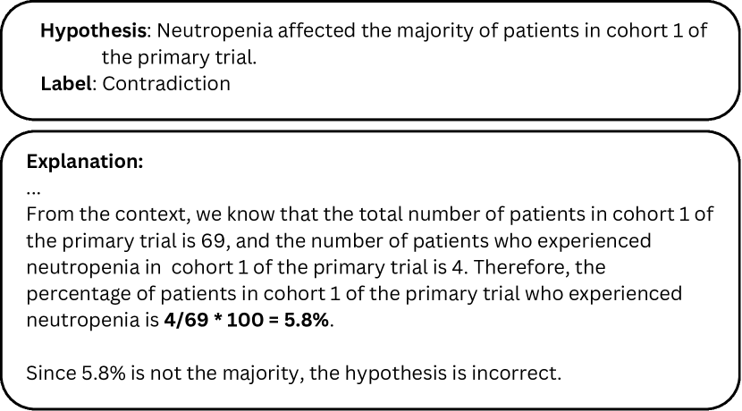

# IITK 参与 SemEval-2024 的第二项任务，旨在挖掘大型语言模型在临床试验领域进行安全生物医学自然语言推理的潜力。

发布时间：2024年04月06日

`RAG`

> IITK at SemEval-2024 Task 2: Exploring the Capabilities of LLMs for Safe Biomedical Natural Language Inference for Clinical Trials

# 摘要

> 大型语言模型（LLMs）在多个自然语言处理（NLP）任务中展现了顶尖的性能，但它们也容易出现学习上的捷径和事实性的错误。本研究深入探讨了LLMs在SemEval 2024任务2的背景下，处理乳腺癌临床试验报告（CTRs）的自然语言推理（NLI）时的稳健性、一致性和准确性。我们评估了LLMs的推理能力和解决逻辑问题的技巧。通过使用检索增强生成（RAG）框架，在零-shot条件下对预训练语言模型（PLMs）、GPT-3.5和Gemini Pro进行了对比分析，整合了多种推理链条。测试结果显示，F1分数达到0.69，一致性得分为0.71，忠实度得分高达0.90。

> Large Language models (LLMs) have demonstrated state-of-the-art performance in various natural language processing (NLP) tasks across multiple domains, yet they are prone to shortcut learning and factual inconsistencies. This research investigates LLMs' robustness, consistency, and faithful reasoning when performing Natural Language Inference (NLI) on breast cancer Clinical Trial Reports (CTRs) in the context of SemEval 2024 Task 2: Safe Biomedical Natural Language Inference for Clinical Trials. We examine the reasoning capabilities of LLMs and their adeptness at logical problem-solving. A comparative analysis is conducted on pre-trained language models (PLMs), GPT-3.5, and Gemini Pro under zero-shot settings using Retrieval-Augmented Generation (RAG) framework, integrating various reasoning chains. The evaluation yields an F1 score of 0.69, consistency of 0.71, and a faithfulness score of 0.90 on the test dataset.

[Arxiv](https://arxiv.org/abs/2404.04510)