# 心血管血流动力学评估中的可解释性多模态学习

发布时间：2024年04月06日

`这个论文涉及到了医学图像处理、电子健康记录分析以及图注意力网络等多个方面，但并没有明确涉及到Agent、RAG、LLM应用或LLM理论。然而，考虑到该论文使用了机器学习方法来预测PAWP，并且结合了多种数据源，我们可以将其归类为机器学习应用领域。在这四个分类中，没有一个专门针对机器学习应用的分类，但我们可以选择最接近的分类。

考虑到该论文使用了多种数据源和图注意力网络来预测PAWP，这可以被视为一种基于数据的预测模型，因此我们可以将其归类为LLM应用。虽然这不是一个典型的LLM应用，但在缺乏更具体的分类情况下，这是最接近的分类。` `心血管` `医学影像`

> Interpretable Multimodal Learning for Cardiovascular Hemodynamics Assessment

# 摘要

> 肺动脉楔压（PAWP）作为心脏衰竭的关键指标，在心血管血液动力学监测中扮演着重要角色。在实际临床操作中，虽然右心导管检查是评估心脏功能的黄金标准，但在大规模人群中筛查高危患者时，往往需要依赖无创手段。本研究提出了一种结合多种数据的学习流程，旨在准确预测PAWP。我们结合了心脏磁共振成像（CMR）的短轴和四腔视图以及电子健康记录（EHRs）的信息。通过张量学习技术，我们从CMR图像中提取时空特征，并设计了图注意力网络来挑选对预测至关重要的EHR特征。我们将研究对象视作图节点，特征间的关系则通过注意力机制定义为图的边。我们还开发了四种特征融合策略：早期融合、中期融合、晚期融合和混合融合。这一流程结合线性分类器和线性融合技术，保证了模型的可解释性。在ASPIRE数据库中2641名受试者的数据集上进行验证，结果显示我们的流程优于现有技术。决策曲线分析进一步证实了其在大规模人群筛查中的应用潜力。相关代码已在GitHub上公开。

> Pulmonary Arterial Wedge Pressure (PAWP) is an essential cardiovascular hemodynamics marker to detect heart failure. In clinical practice, Right Heart Catheterization is considered a gold standard for assessing cardiac hemodynamics while non-invasive methods are often needed to screen high-risk patients from a large population. In this paper, we propose a multimodal learning pipeline to predict PAWP marker. We utilize complementary information from Cardiac Magnetic Resonance Imaging (CMR) scans (short-axis and four-chamber) and Electronic Health Records (EHRs). We extract spatio-temporal features from CMR scans using tensor-based learning. We propose a graph attention network to select important EHR features for prediction, where we model subjects as graph nodes and feature relationships as graph edges using the attention mechanism. We design four feature fusion strategies: early, intermediate, late, and hybrid fusion. With a linear classifier and linear fusion strategies, our pipeline is interpretable. We validate our pipeline on a large dataset of $2,641$ subjects from our ASPIRE registry. The comparative study against state-of-the-art methods confirms the superiority of our pipeline. The decision curve analysis further validates that our pipeline can be applied to screen a large population. The code is available at https://github.com/prasunc/hemodynamics.

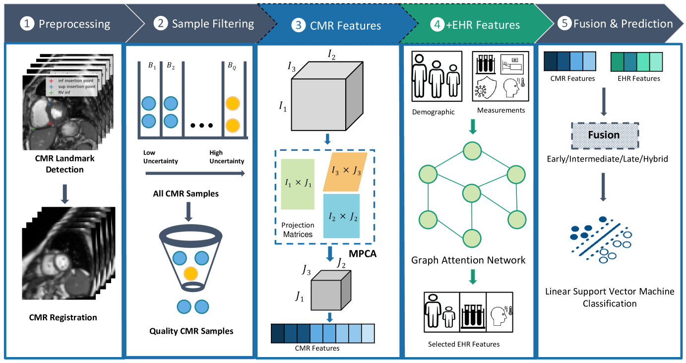

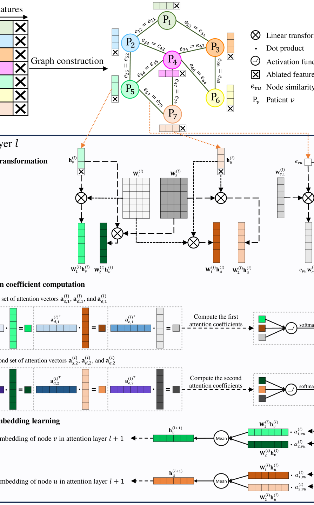

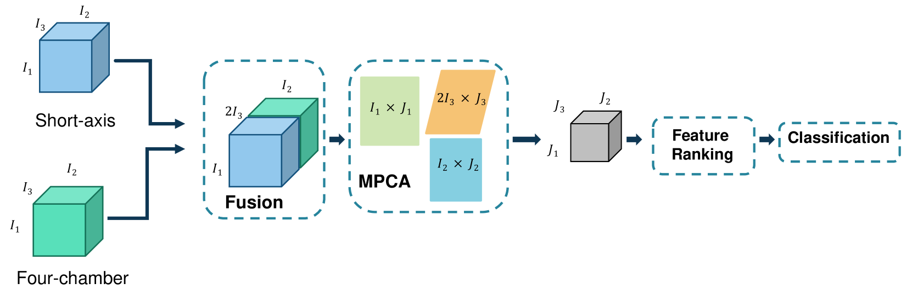

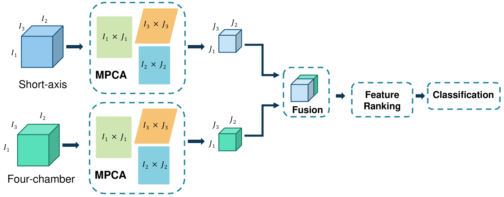

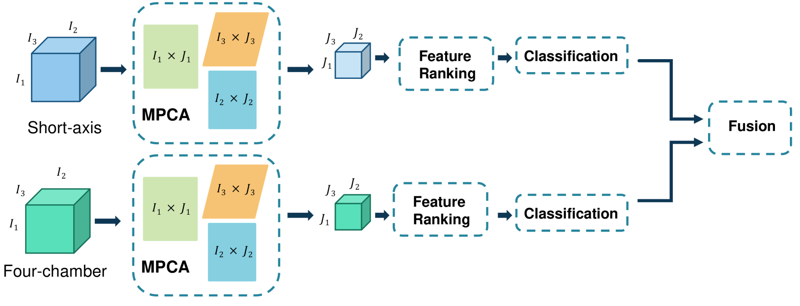

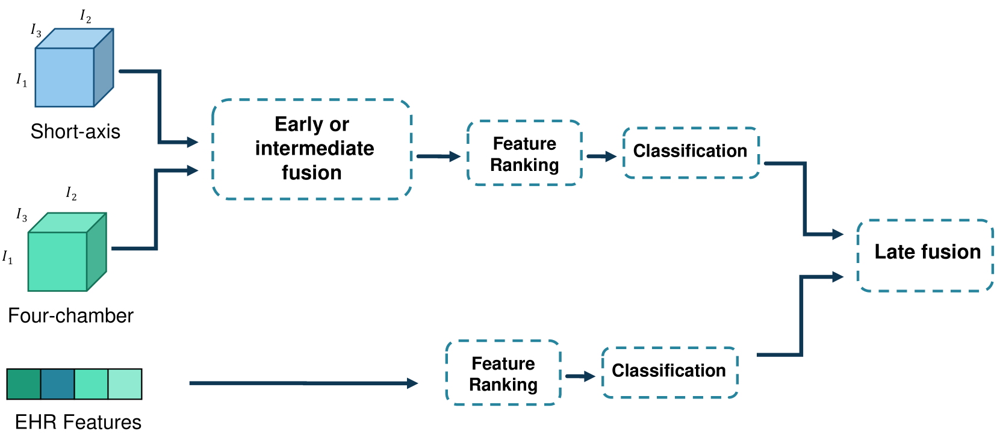

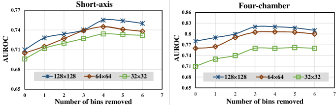

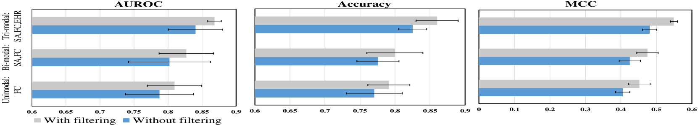

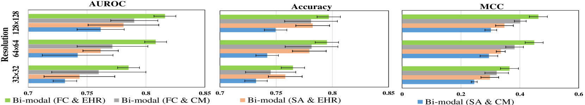

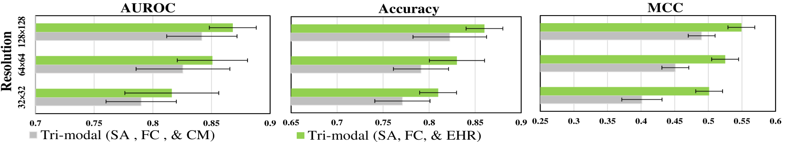

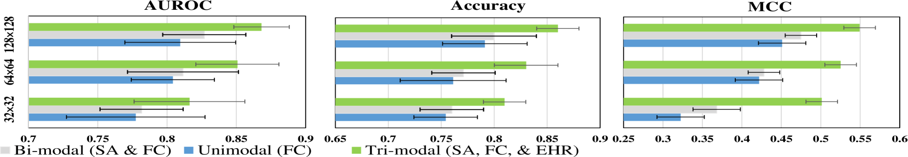

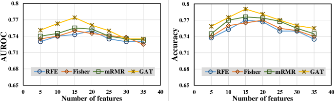

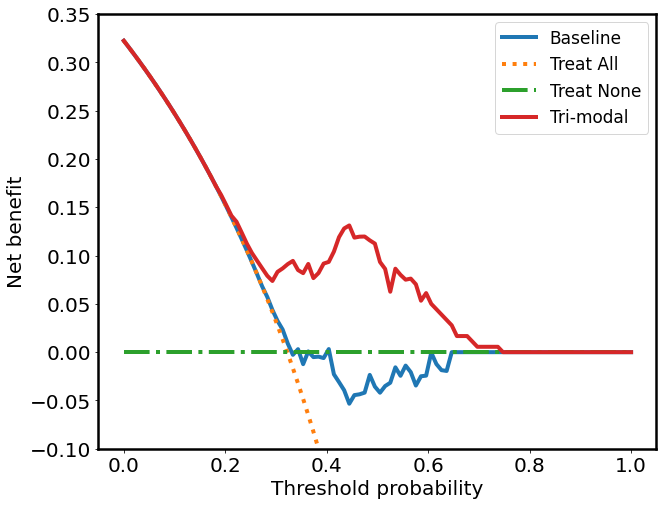

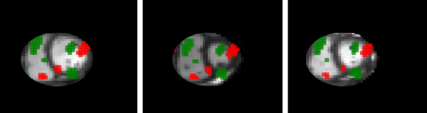

[Arxiv](https://arxiv.org/abs/2404.04718)