# 通过结合视觉和文本提示，我们利用多模态大型语言模型，显著提升了对物体中心的感知能力。

发布时间：2024年04月06日

`LLM应用` `视觉问答` `多模态学习`

> Joint Visual and Text Prompting for Improved Object-Centric Perception with Multimodal Large Language Models

# 摘要

> 像 GPT-4V 和 Gemini Pro 这样的多模态大型语言模型在视觉问答领域要达到人类水平的识别能力还有一段距离，尤其是在需要对物体细节进行精准理解的对象识别任务上。这些挑战主要源于模型在融合复杂视觉信息和文本数据方面的能力限制，以及可能出现的物体误识别问题。本文提出了一种创新的方法——联合视觉文本提示（VTPrompt），通过利用细粒度的视觉信息来提升模型在 VQA 任务中的性能，尤其是在处理对象识别问题时。VTPrompt 通过结合视觉和文本提示来提炼问题中的核心概念，并利用检测模型在图像中标注出相关物体，作为视觉提示。这些经过处理的图像和文本提示被一起输入到 MLLMs 中，以生成更精确的答案。在三个标准测试集 MME、MMB 和 POPE 上的实验结果显示，我们的这种方法显著提高了模型的性能。特别是，GPT-4V 在 MME 测试上的得分最高提升了 183.5 分，同时在 MMB 测试中，GPT-4V 的性能提升了 8.17%，Gemini Pro 则提升了 15.69%。

> Multimodal Large Language Models (MLLMs) such as GPT-4V and Gemini Pro face challenges in achieving human-level perception in Visual Question Answering (VQA), particularly in object-oriented perception tasks which demand fine-grained understanding of object identities, locations or attributes, as indicated by empirical findings. This is mainly due to their limited capability to effectively integrate complex visual cues with textual information and potential object hallucinations. In this paper, we present a novel approach, Joint Visual and Text Prompting (VTPrompt), that employs fine-grained visual information to enhance the capability of MLLMs in VQA, especially for object-oriented perception. VTPrompt merges visual and text prompts to extract key concepts from textual questions and employs a detection model to highlight relevant objects as visual prompts in images. The processed images alongside text prompts are subsequently fed into MLLMs to produce more accurate answers. Our experiments with GPT-4V and Gemini Pro, on three benchmarks, i.e., MME , MMB and POPE, demonstrate significant improvements. Particularly, our method led to a score improvement of up to 183.5 for GPT-4V on MME and enhanced MMB performance by 8.17\% for GPT-4V and 15.69\% for Gemini Pro.

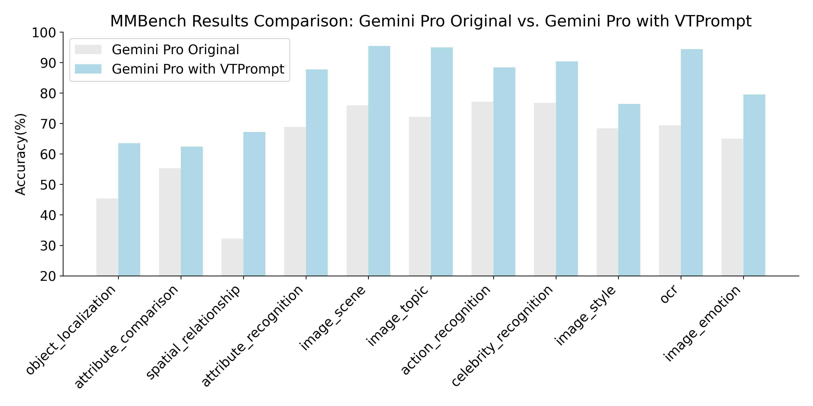

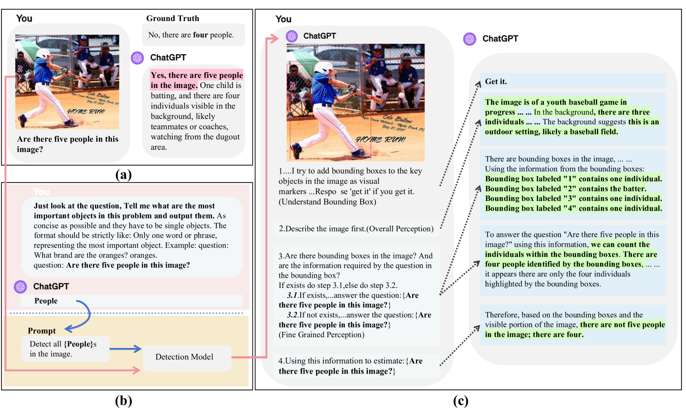

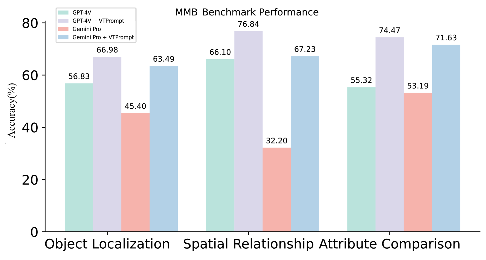

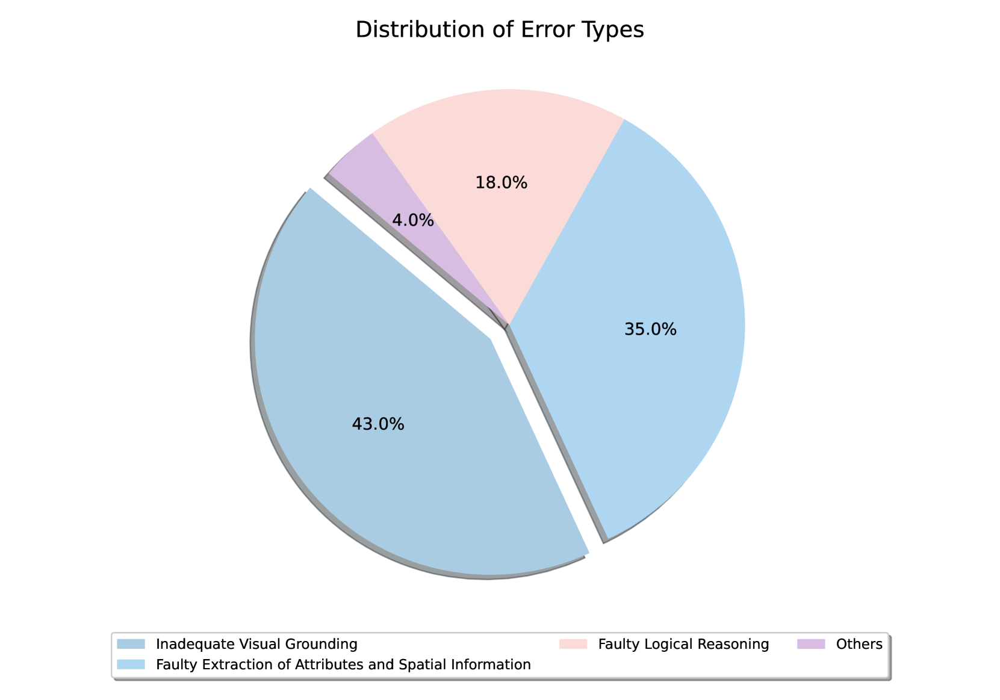

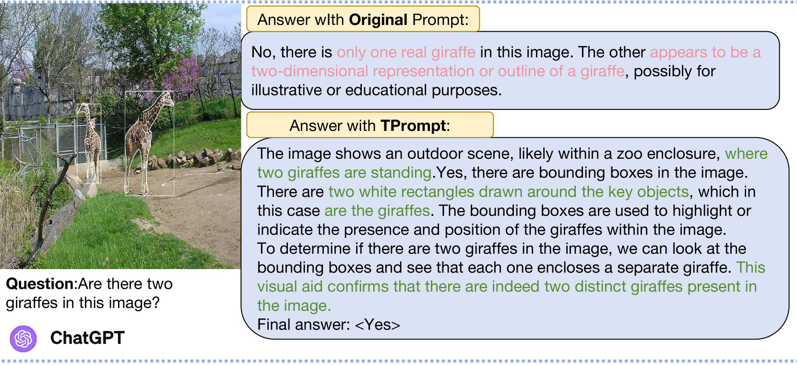

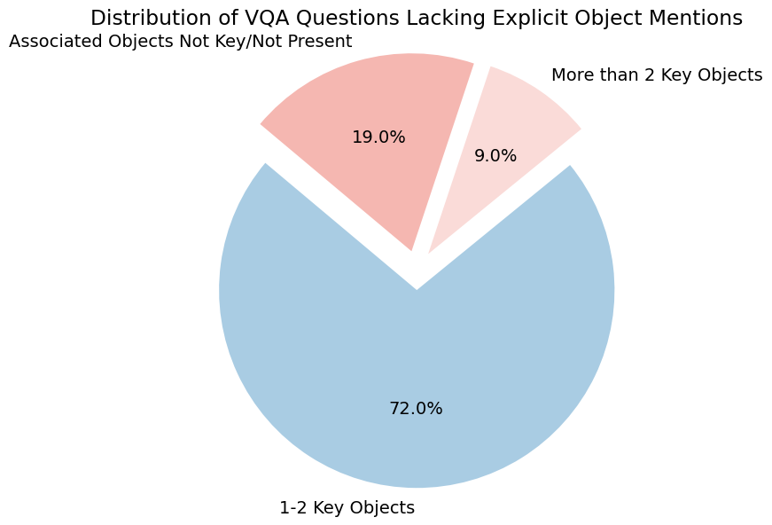

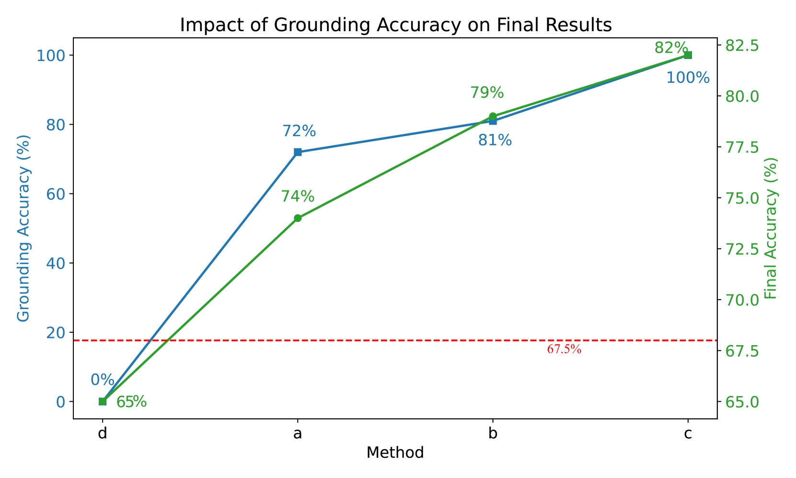

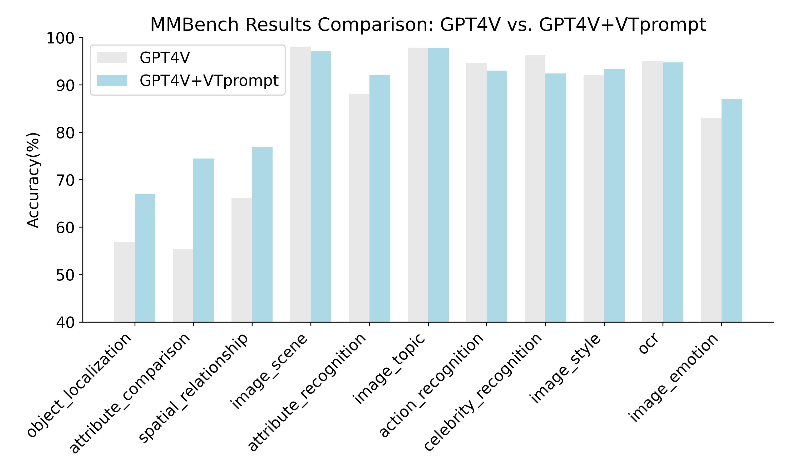

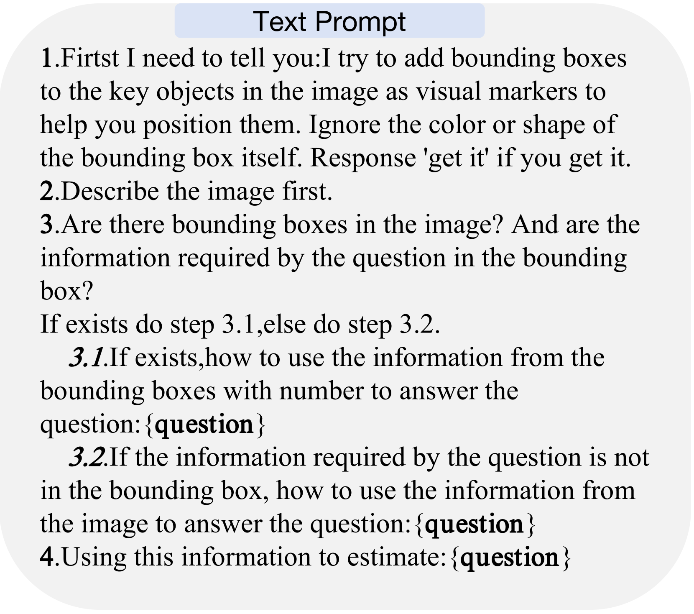

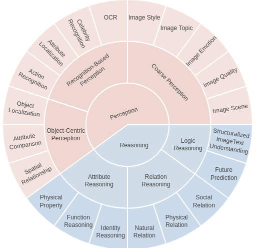

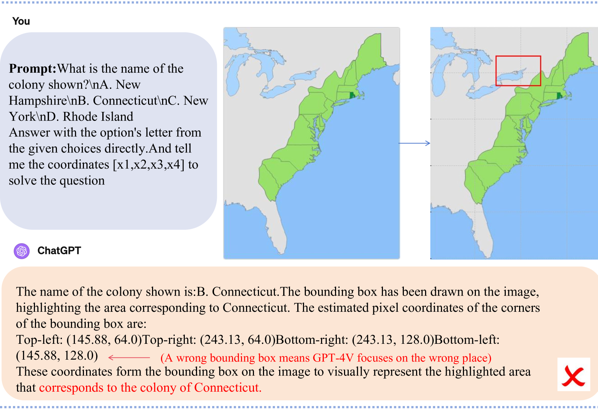

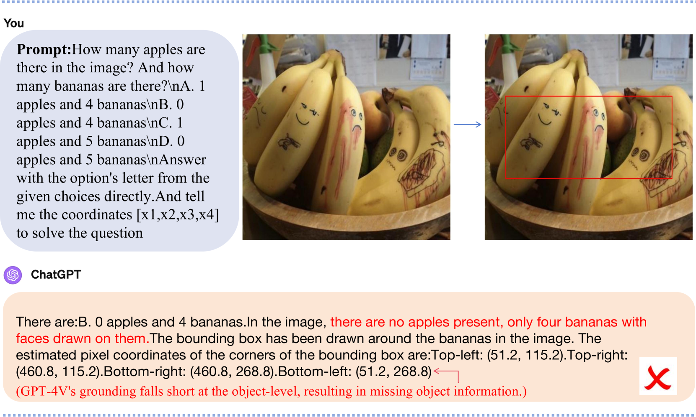

[Arxiv](https://arxiv.org/abs/2404.04514)