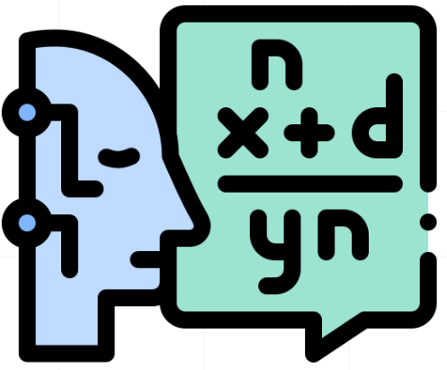
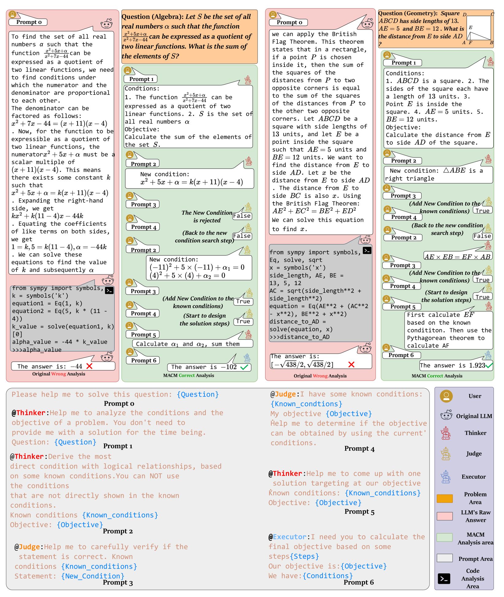
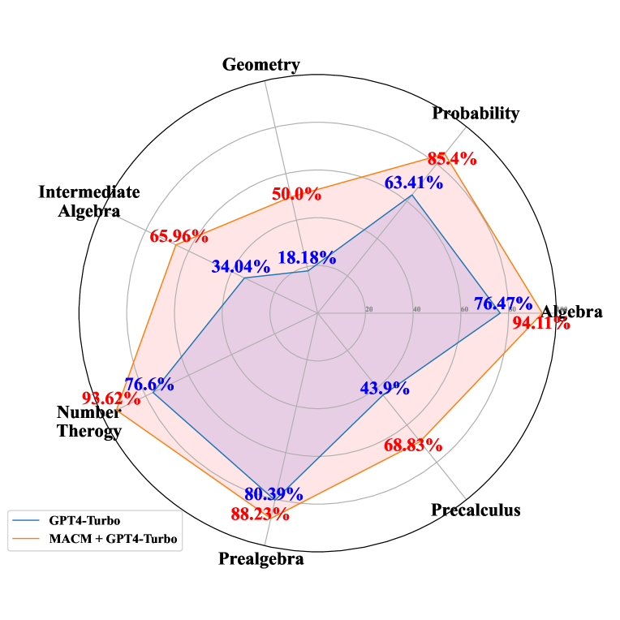
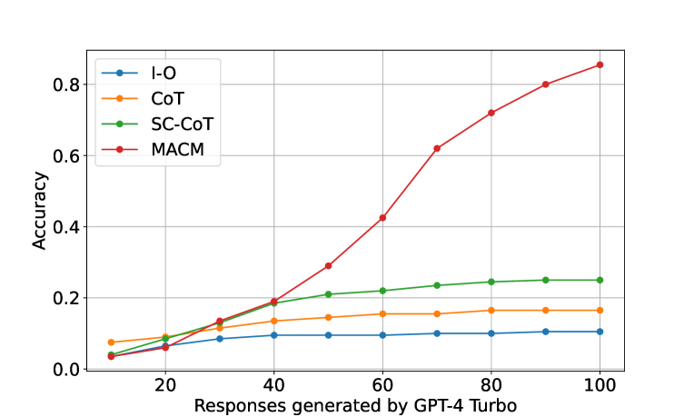

# MACM：通过多智能体系统进行条件挖掘，以应对复杂的数学难题。

发布时间：2024年04月06日

`LLM应用` `人工智能`

> MACM: Utilizing a Multi-Agent System for Condition Mining in Solving Complex Mathematical Problems

# 摘要

> 最新的大型语言模型如GPT-4在处理常规查询方面表现出色。然而，面对需要复杂逻辑推理的高级数学问题，这些模型的表现却大打折扣。为了提升它们的推理能力，研究者们开始探索“提示工程”，例如思维树和思维图等方法。但这些方法有两个主要局限：一是在解决复杂数学问题上的能力受限；二是需要为每个问题定制提示，这限制了它们的通用性。针对这些问题，本研究提出了一种名为“条件挖掘的多智能体系统”（MACM）的新型提示方法。MACM不仅能有效解决棘手的数学难题，还能在不同数学领域展现出强大的泛化能力。得益于MACM的支持，GPT-4 Turbo在MATH数据集中难度最高的五级数学问题上的准确率从54.68%飙升至76.73%。相关代码已在GitHub上公开，链接为：https://github.com/bin123apple/MACM。

> Recent advancements in large language models, such as GPT-4, have demonstrated remarkable capabilities in processing standard queries. Despite these advancements, their performance substantially declines in \textbf{advanced mathematical problems requiring complex, multi-step logical reasoning}. To enhance their inferential capabilities, current research has delved into \textit{prompting engineering}, exemplified by methodologies such as the Tree of Thought and Graph of Thought. Nonetheless, these existing approaches encounter two significant limitations. Firstly, their effectiveness in tackling complex mathematical problems is somewhat constrained. Secondly, the necessity to design distinct prompts for individual problems hampers their generalizability. In response to these limitations, this paper introduces the \textit{Multi-Agent System for conditional Mining} (\textbf{MACM}) prompting method. It not only resolves intricate mathematical problems but also demonstrates strong generalization capabilities across various mathematical contexts. With the assistance of MACM, the accuracy of GPT-4 Turbo on the most challenging level five mathematical problems in the MATH dataset increase from $\mathbf{54.68\%} \text{ to } \mathbf{76.73\%}$. The code is available in \url{https://github.com/bin123apple/MACM}.

[Arxiv](https://arxiv.org/abs/2404.04735)