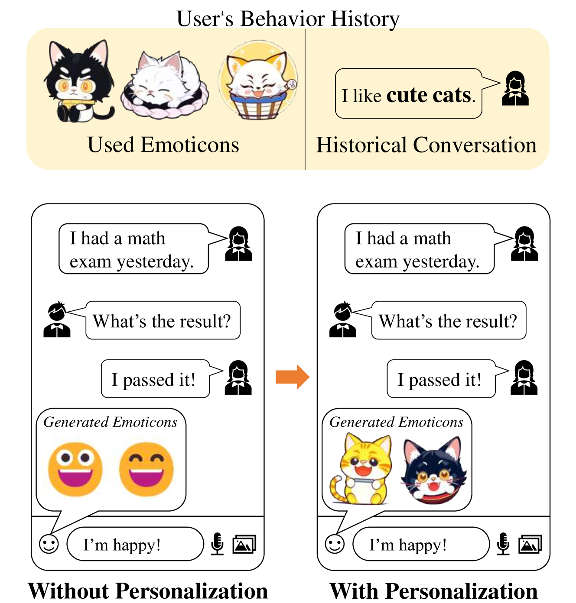
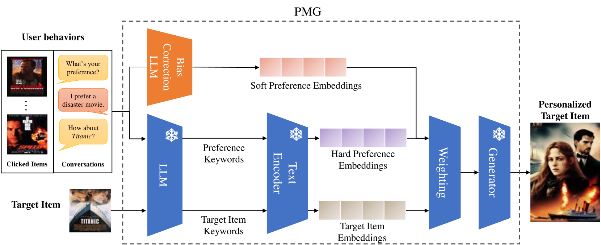
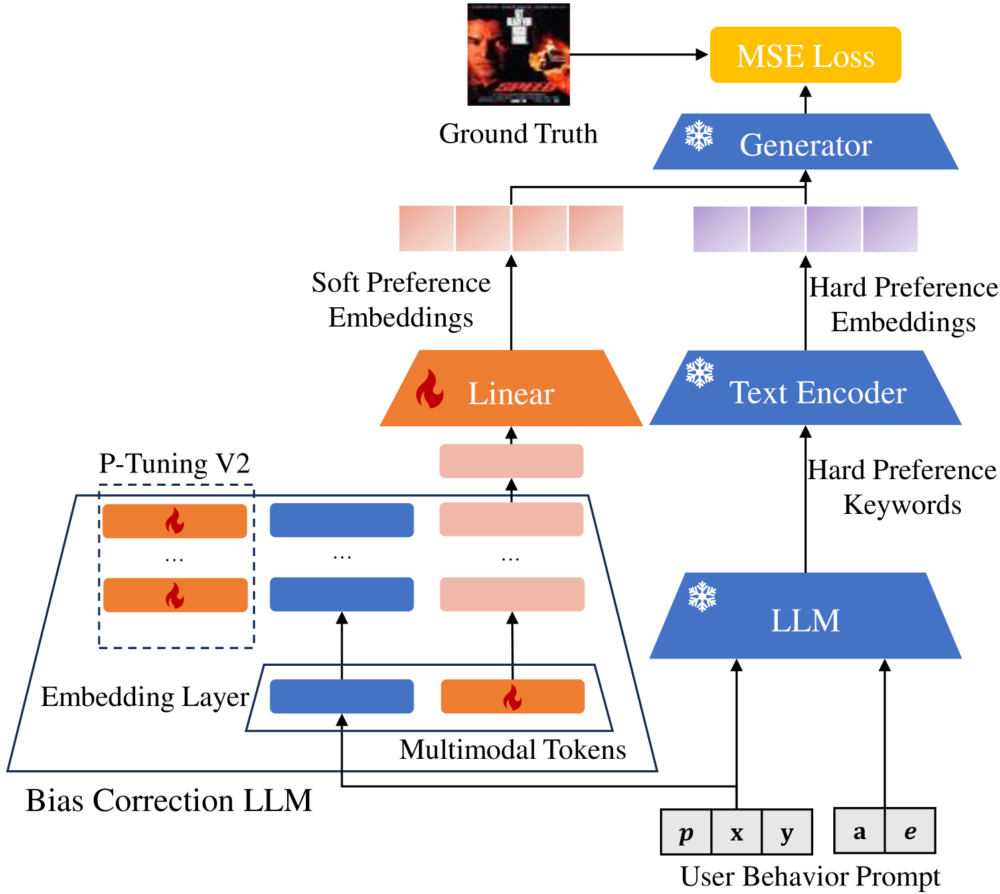
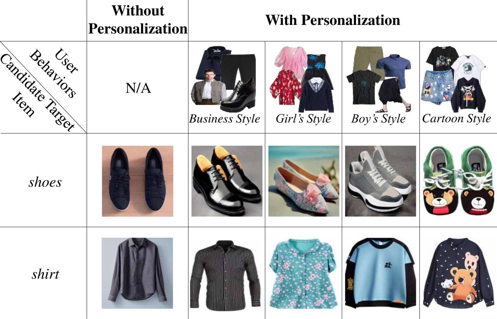
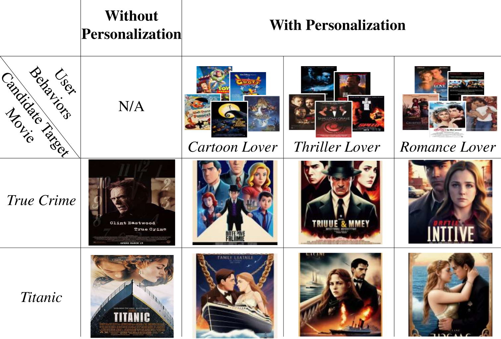
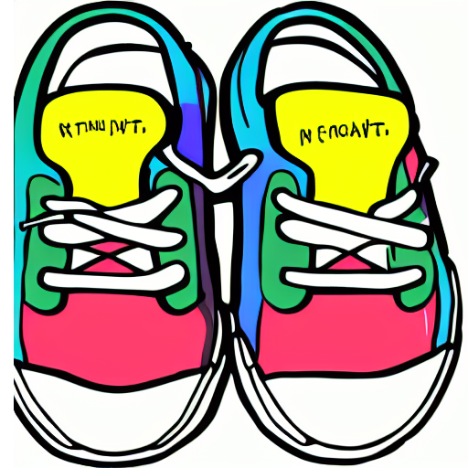
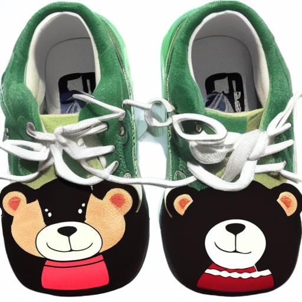
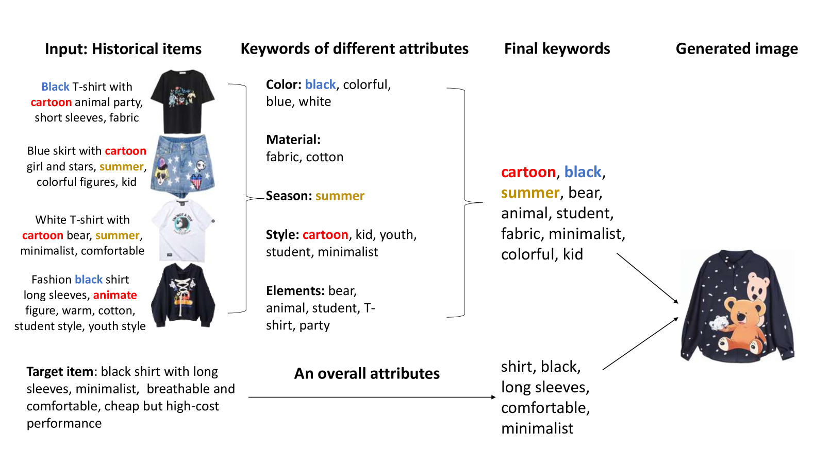

# PMG：借助大型语言模型实现个性化的多模态创作

发布时间：2024年04月06日

`LLM应用` `推荐系统` `多模态生成`

> PMG : Personalized Multimodal Generation with Large Language Models

# 摘要

> 大型语言模型（LLMs）的诞生，为文本的理解和创造带来了翻天覆地的变化。尽管多模态生成受到了业界和学界的广泛关注，但个性化生成这一领域，尤其是在推荐系统等关键应用中，尚待深入探索。本文首次提出一种基于LLMs的个性化多模态生成方法——个性化多模态生成（简称PMG），并通过两个数据集的广泛实验验证了其有效性。PMG通过将用户行为转化为自然语言，帮助LLM捕捉并解析用户偏好，进而生成定制化内容。为了更精准地反映用户的个性需求，我们创新性地让LLM输出包含显式关键词和隐式嵌入的复合表示。这一复合表示随后被用作生成器的提示条件。通过优化准确性和用户偏好得分的加权和，PMG在保持生成准确性的同时，实现了个性化程度的显著提升，最高可达8%的LPIPS增益。

> The emergence of large language models (LLMs) has revolutionized the capabilities of text comprehension and generation. Multi-modal generation attracts great attention from both the industry and academia, but there is little work on personalized generation, which has important applications such as recommender systems. This paper proposes the first method for personalized multimodal generation using LLMs, showcases its applications and validates its performance via an extensive experimental study on two datasets. The proposed method, Personalized Multimodal Generation (PMG for short) first converts user behaviors (e.g., clicks in recommender systems or conversations with a virtual assistant) into natural language to facilitate LLM understanding and extract user preference descriptions. Such user preferences are then fed into a generator, such as a multimodal LLM or diffusion model, to produce personalized content. To capture user preferences comprehensively and accurately, we propose to let the LLM output a combination of explicit keywords and implicit embeddings to represent user preferences. Then the combination of keywords and embeddings are used as prompts to condition the generator. We optimize a weighted sum of the accuracy and preference scores so that the generated content has a good balance between them. Compared to a baseline method without personalization, PMG has a significant improvement on personalization for up to 8% in terms of LPIPS while retaining the accuracy of generation.

[Arxiv](https://arxiv.org/abs/2404.08677)