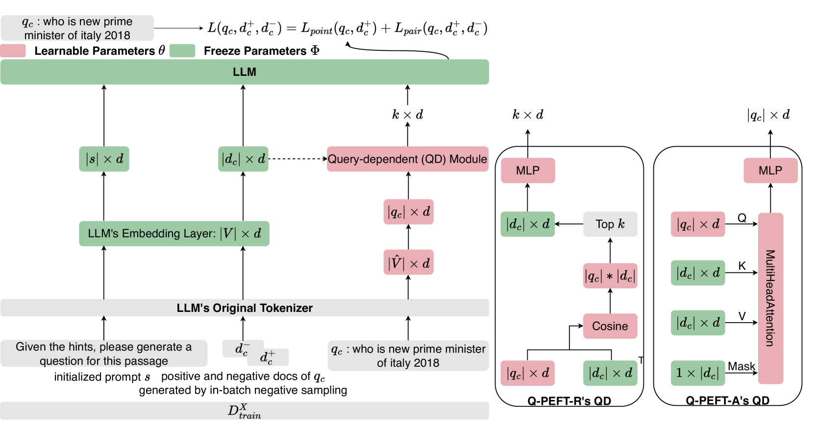
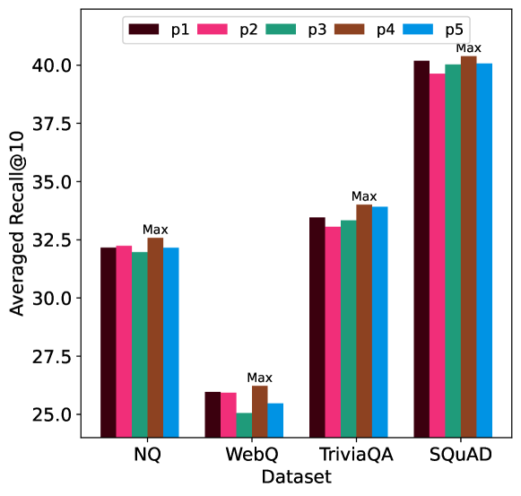
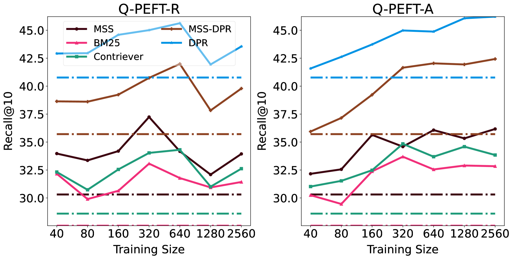
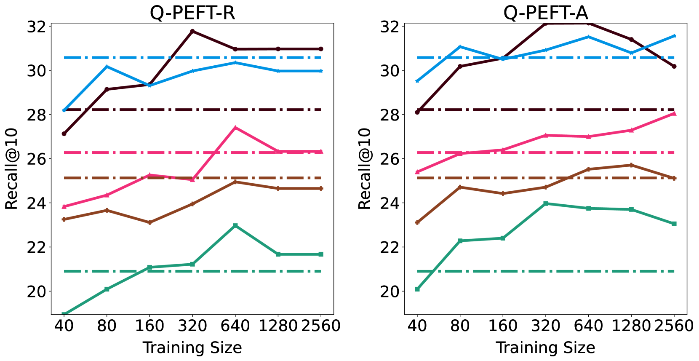
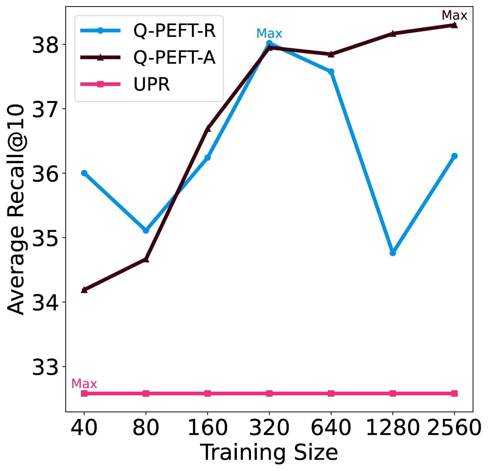
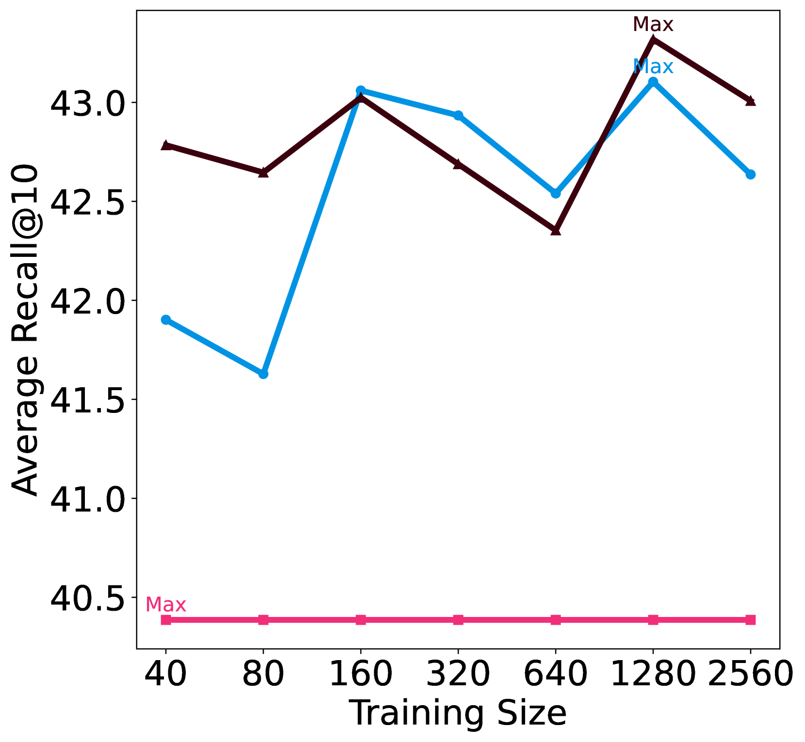
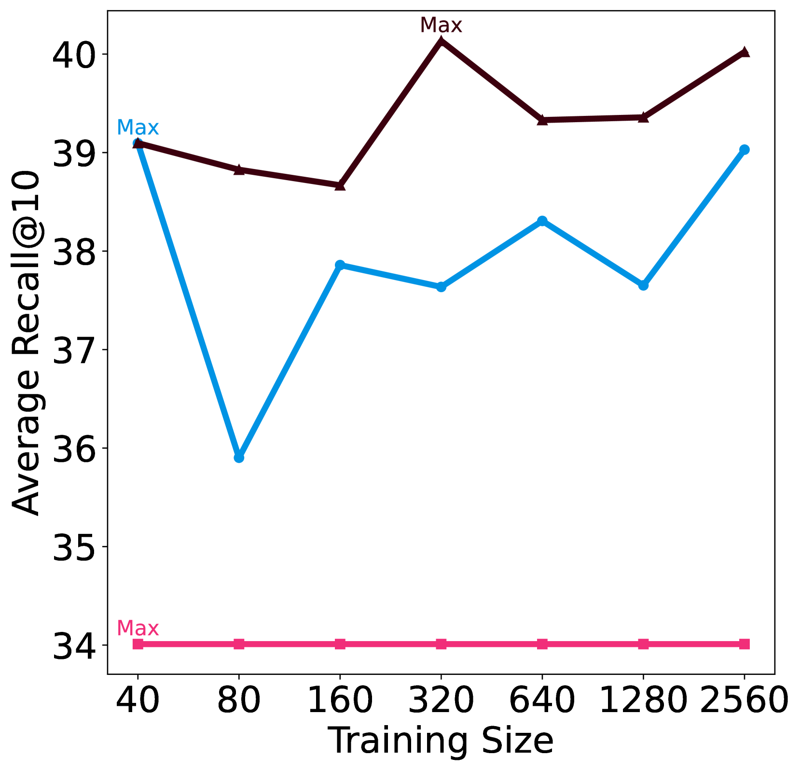

# Q-PEFT 技术：为大型语言模型在文本重排序任务中提供基于查询的高效参数调整方法

发布时间：2024年04月06日

`LLM应用` `信息检索` `文本处理`

> Q-PEFT: Query-dependent Parameter Efficient Fine-tuning for Text Reranking with Large Language Models

# 摘要

> 参数高效微调（PEFT）技术在大型语言模型（LLMs）中得到了广泛应用，提升了各项下游任务的表现，而无需对整个模型进行昂贵的微调。尽管如此，现有研究在利用PEFT进行LLMs微调时仍存在局限，比如固定的提示不利于适应不同文档，对特定任务的过拟合问题，以及适应性的不足。本文提出了一种新颖的依赖查询的参数高效微调（Q-PEFT）策略，用于文本的重新排序。该策略通过将真实查询的信息传递给LLMs，简化了从输入文档生成准确查询的过程。我们利用查询来挑选出连接文档中的前$k$个关键标记，作为上下文提示。此外，我们通过引入多头注意力层替代传统的检索机制，实现了端到端的训练，确保文档中的每个标记都得到关注，引导模型生成更贴合文档内容的合成查询，进一步提升了文本重排序的效果。我们在四个公开数据集上进行了大量实验，实验结果验证了我们方法的有效性。

> Parameter Efficient Fine-Tuning (PEFT) methods have been extensively utilized in Large Language Models (LLMs) to improve the down-streaming tasks without the cost of fine-tuing the whole LLMs. Recent studies have shown how to effectively use PEFT for fine-tuning LLMs in ranking tasks with convincing performance; there are some limitations, including the learned prompt being fixed for different documents, overfitting to specific tasks, and low adaptation ability. In this paper, we introduce a query-dependent parameter efficient fine-tuning (Q-PEFT) approach for text reranking to leak the information of the true queries to LLMs and then make the generation of true queries from input documents much easier. Specifically, we utilize the query to extract the top-$k$ tokens from concatenated documents, serving as contextual clues. We further augment Q-PEFT by substituting the retrieval mechanism with a multi-head attention layer to achieve end-to-end training and cover all the tokens in the documents, guiding the LLMs to generate more document-specific synthetic queries, thereby further improving the reranking performance. Extensive experiments are conducted on four public datasets, demonstrating the effectiveness of our proposed approach.

[Arxiv](https://arxiv.org/abs/2404.04522)