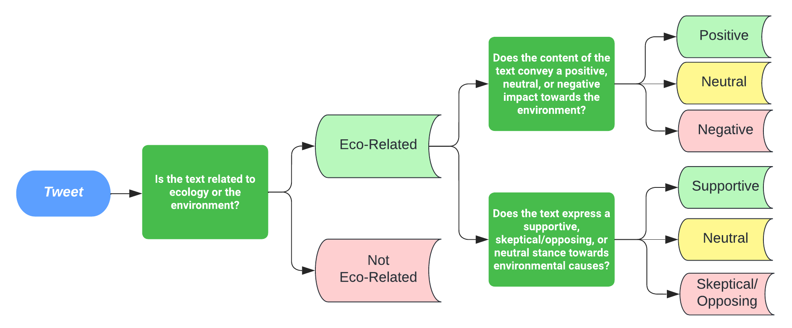

# EcoVerse: 一个针对生态相关性分类、环境影响评估和立场识别的推特数据集注释项目

发布时间：2024年04月07日

`LLM应用` `环境科学`

> EcoVerse: An Annotated Twitter Dataset for Eco-Relevance Classification, Environmental Impact Analysis, and Stance Detection

# 摘要

> 人为生态危机对学术界，尤其是自然语言处理领域，提出了紧迫的挑战。尽管气候相关话题日益受到关注，其他关键的环境和生态议题却鲜少被触及。本文介绍了EcoVerse——一个包含3023条推文的英文Twitter数据集，覆盖多样的环境主题。我们设计了三级标注体系，用于生态相关性分类、立场检测，并创新性地进行环境影响分析。文章详述了数据的收集、筛选和标注流程。高度的标注者间一致性证明了我们的标注体系能够带来高质量的一致性结果。我们进一步展示了基于BERT模型，包括ClimateBERT在内的分类实验，取得了积极成果，同时也揭示了为环境文本定制模型的潜力。为推动相关研究，该数据集现免费开放获取。

> Anthropogenic ecological crisis constitutes a significant challenge that all within the academy must urgently face, including the Natural Language Processing (NLP) community. While recent years have seen increasing work revolving around climate-centric discourse, crucial environmental and ecological topics outside of climate change remain largely unaddressed, despite their prominent importance. Mainstream NLP tasks, such as sentiment analysis, dominate the scene, but there remains an untouched space in the literature involving the analysis of environmental impacts of certain events and practices. To address this gap, this paper presents EcoVerse, an annotated English Twitter dataset of 3,023 tweets spanning a wide spectrum of environmental topics. We propose a three-level annotation scheme designed for Eco-Relevance Classification, Stance Detection, and introducing an original approach for Environmental Impact Analysis. We detail the data collection, filtering, and labeling process that led to the creation of the dataset. Remarkable Inter-Annotator Agreement indicates that the annotation scheme produces consistent annotations of high quality. Subsequent classification experiments using BERT-based models, including ClimateBERT, are presented. These yield encouraging results, while also indicating room for a model specifically tailored for environmental texts. The dataset is made freely available to stimulate further research.

[Arxiv](https://arxiv.org/abs/2404.05133)