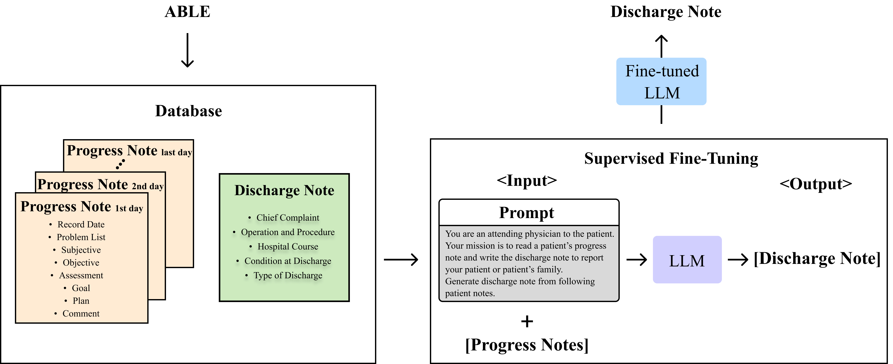

# 利用大型语言模型优化临床工作流程：自动撰写心脏病患者出院小结。

发布时间：2024年04月07日

`LLM应用`

> Enhancing Clinical Efficiency through LLM: Discharge Note Generation for Cardiac Patients

# 摘要

> 医疗文档，尤其是出院记录，对保障患者护理的品质和连贯性极为关键。但手工编写这些文档既费时又易出错。运用人工智能（AI）自动化文档制作，是医疗创新领域的一片蓝海。本研究针对手工制作出院记录的低效率和错误率问题，尤其是心脏病患者的记录，采用了大型语言模型（LLM）等AI技术。通过分析心脏病中心的丰富医疗记录和医生评估数据，我们评估了LLM在提升文档制作效率方面的潜力。在众多模型中，Mistral-7B模型以其精准生成出院记录的能力脱颖而出，显著提升了文档制作的效率和患者护理的连贯性。这些记录经过医学专家的细致评审，以其临床相关性、完整性、易读性以及对决策和护理规划的贡献获得了高度评价。结合定量分析，我们证实了Mistral-7B在简化复杂医疗信息、生成精炼摘要方面的有效性。研究结果凸显了Mistral-7B等专业LLM在优化医疗文档流程和提升患者护理质量上的显著潜力。本研究为将先进AI技术进一步融入医疗领域奠定了基础，展现了它们在革新患者文档管理和促进更优质护理成果方面的巨大潜力。

> Medical documentation, including discharge notes, is crucial for ensuring patient care quality, continuity, and effective medical communication. However, the manual creation of these documents is not only time-consuming but also prone to inconsistencies and potential errors. The automation of this documentation process using artificial intelligence (AI) represents a promising area of innovation in healthcare. This study directly addresses the inefficiencies and inaccuracies in creating discharge notes manually, particularly for cardiac patients, by employing AI techniques, specifically large language model (LLM). Utilizing a substantial dataset from a cardiology center, encompassing wide-ranging medical records and physician assessments, our research evaluates the capability of LLM to enhance the documentation process. Among the various models assessed, Mistral-7B distinguished itself by accurately generating discharge notes that significantly improve both documentation efficiency and the continuity of care for patients. These notes underwent rigorous qualitative evaluation by medical expert, receiving high marks for their clinical relevance, completeness, readability, and contribution to informed decision-making and care planning. Coupled with quantitative analyses, these results confirm Mistral-7B's efficacy in distilling complex medical information into concise, coherent summaries. Overall, our findings illuminate the considerable promise of specialized LLM, such as Mistral-7B, in refining healthcare documentation workflows and advancing patient care. This study lays the groundwork for further integrating advanced AI technologies in healthcare, demonstrating their potential to revolutionize patient documentation and support better care outcomes.

[Arxiv](https://arxiv.org/abs/2404.05144)