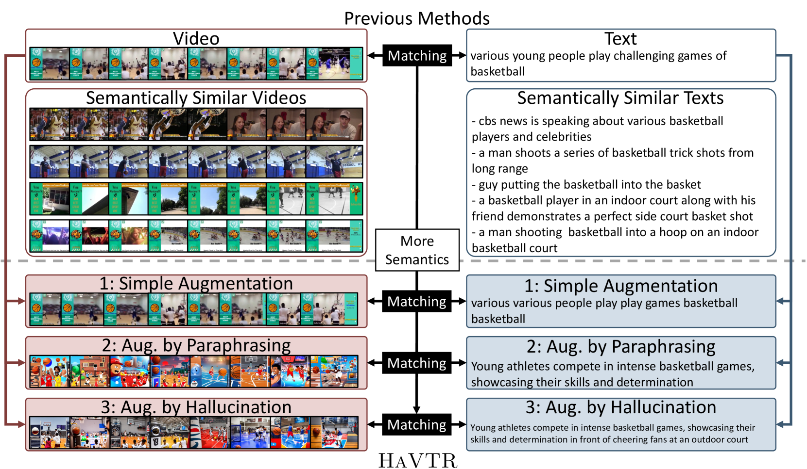
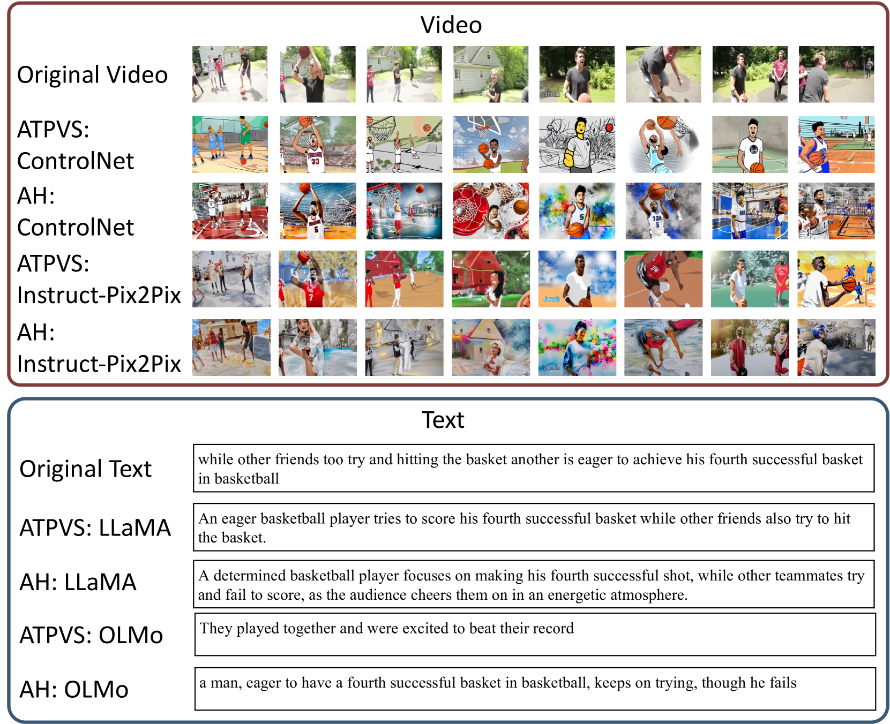
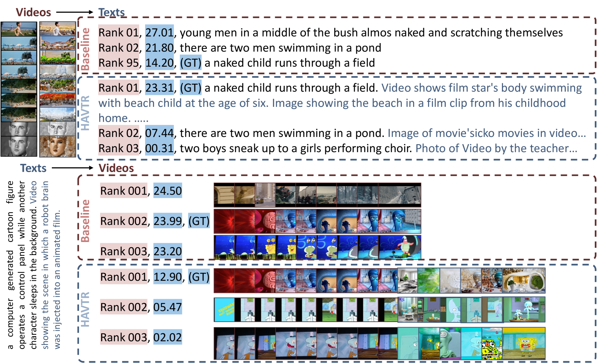

# HaVTR：借助大型基础模型的增强功能，提升视频与文本的检索效能

发布时间：2024年04月07日

`LLM应用` `视频检索` `多媒体`

> HaVTR: Improving Video-Text Retrieval Through Augmentation Using Large Foundation Models

# 摘要

> 近期视频-文本检索的进展主要得益于先进模型架构和训练策略的探索，但其表示学习能力仍受限于不足的训练数据注释。为此，我们引入了一种创新的学习范式HaVTR，通过扩充视频与文本数据学习更广泛的特征。我们首先使用简单的数据增强技术，随机复制或删除词汇和帧来创造相似数据。受视觉与语言生成模型最新发展的启发，我们进一步提出了一种通过LLMs进行文本改写和VGMs进行视频风格化的强化学习方法。此外，我们还探索了一种幻觉式数据增强法，利用LLMs和VGMs为原始数据添加新的相关信息。这些丰富的数据使得HaVTR在多个视频-文本检索测试中展现出超越传统方法的优势。

> While recent progress in video-text retrieval has been driven by the exploration of powerful model architectures and training strategies, the representation learning ability of video-text retrieval models is still limited due to low-quality and scarce training data annotations. To address this issue, we present a novel video-text learning paradigm, HaVTR, which augments video and text data to learn more generalized features. Specifically, we first adopt a simple augmentation method, which generates self-similar data by randomly duplicating or dropping subwords and frames. In addition, inspired by the recent advancement in visual and language generative models, we propose a more powerful augmentation method through textual paraphrasing and video stylization using large language models (LLMs) and visual generative models (VGMs). Further, to bring richer information into video and text, we propose a hallucination-based augmentation method, where we use LLMs and VGMs to generate and add new relevant information to the original data. Benefiting from the enriched data, extensive experiments on several video-text retrieval benchmarks demonstrate the superiority of HaVTR over existing methods.

[Arxiv](https://arxiv.org/abs/2404.05083)