# 利用大型语言模型与行为树，实现机器人的自适应任务执行。

发布时间：2024年04月07日

`Agent` `机器人` `自适应控制`

> LLM-BT: Performing Robotic Adaptive Tasks based on Large Language Models and Behavior Trees

# 摘要

> 大型语言模型（LLMs）广泛应用于机器人复杂任务的执行，但在任务执行过程中应对外部干扰仍是待解难题。本研究提出了一种创新方法，结合LLMs与行为树（BTs），实现机器人任务的自适应性。通过ChatGPT对任务步骤进行逻辑推理，利用物体识别算法构建环境的语义地图，以便ChatGPT能够感知周围环境。接着，设计了一个基于BERT的解析器模块，将任务步骤转化为初始BTs。此外，开发了一种BTs更新算法，使BTs能够根据环境变化动态扩展，指导机器人完成自适应任务。与传统LLM方法相比，本方法生成的BTs具有变量性，能够适应环境变化，添加并执行新动作，有效抵御外部干扰。通过在多种实际情境下的模拟验证，本方法展现了其有效性。

> Large Language Models (LLMs) have been widely utilized to perform complex robotic tasks. However, handling external disturbances during tasks is still an open challenge. This paper proposes a novel method to achieve robotic adaptive tasks based on LLMs and Behavior Trees (BTs). It utilizes ChatGPT to reason the descriptive steps of tasks. In order to enable ChatGPT to understand the environment, semantic maps are constructed by an object recognition algorithm. Then, we design a Parser module based on Bidirectional Encoder Representations from Transformers (BERT) to parse these steps into initial BTs. Subsequently, a BTs Update algorithm is proposed to expand the initial BTs dynamically to control robots to perform adaptive tasks. Different from other LLM-based methods for complex robotic tasks, our method outputs variable BTs that can add and execute new actions according to environmental changes, which is robust to external disturbances. Our method is validated with simulation in different practical scenarios.

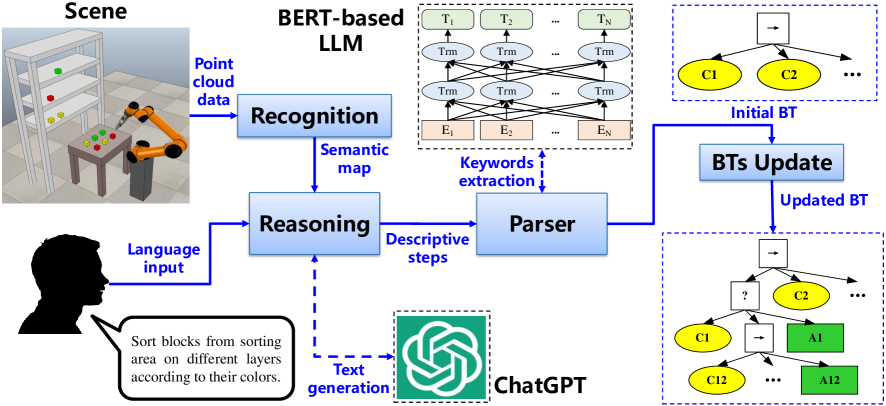

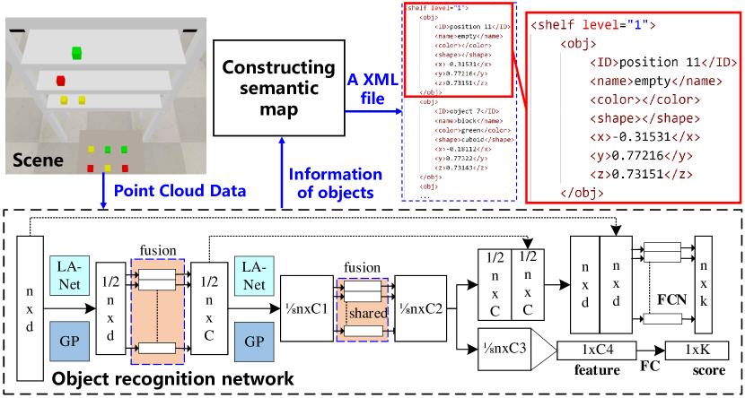

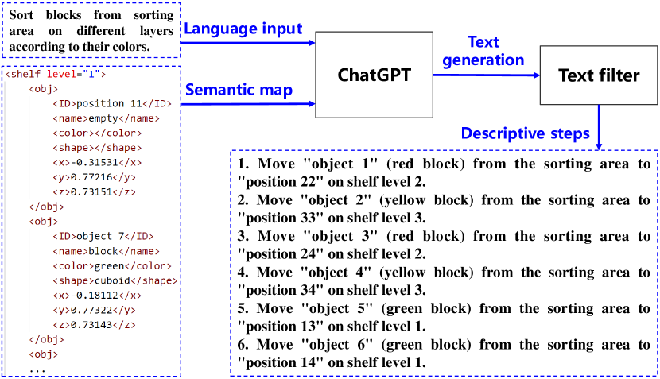

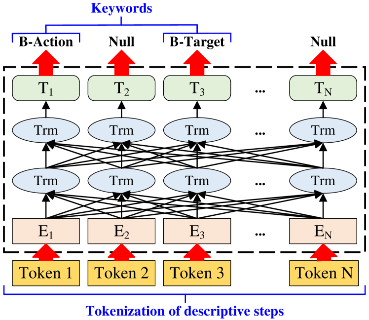

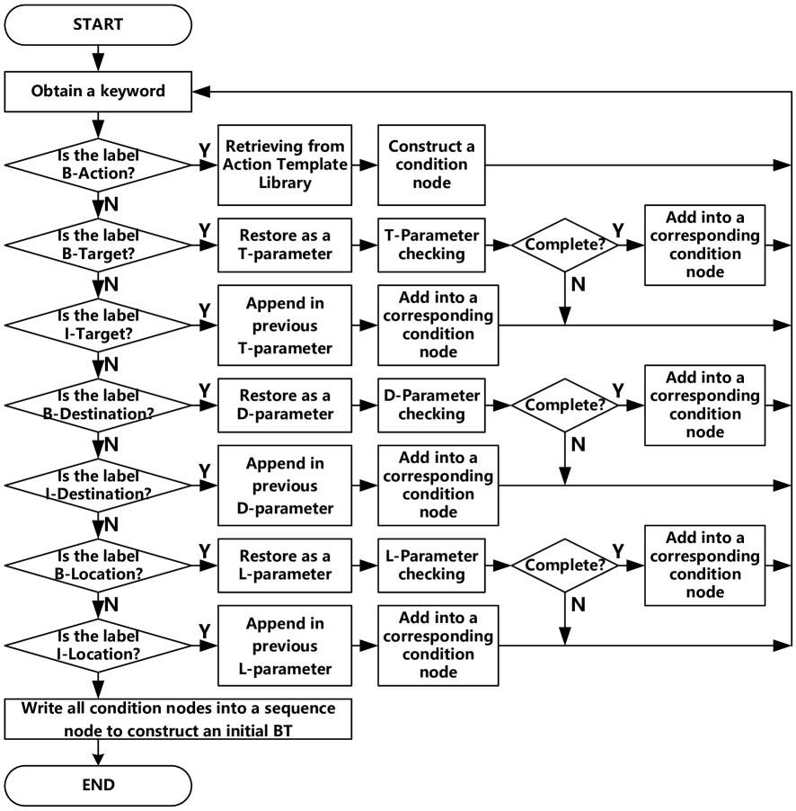

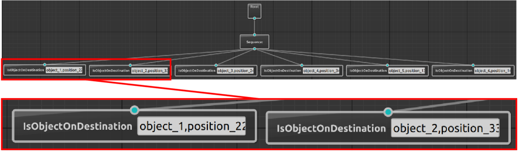

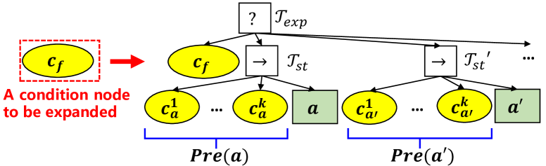

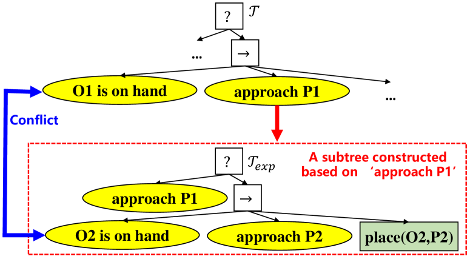

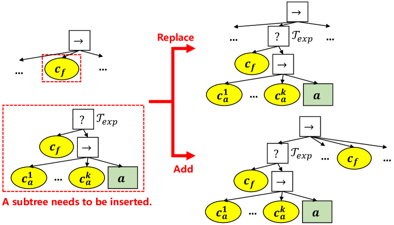

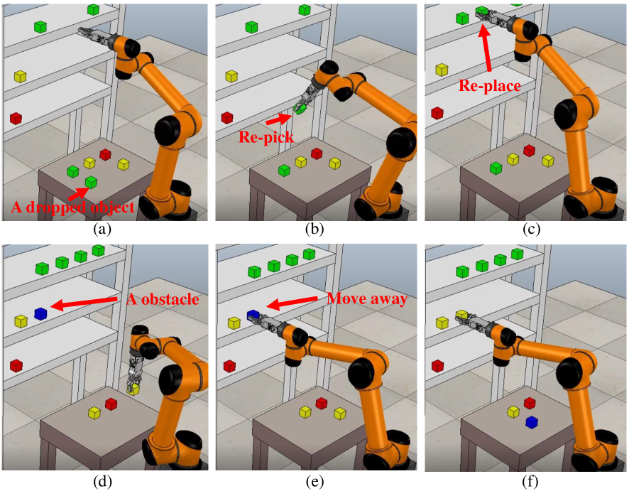

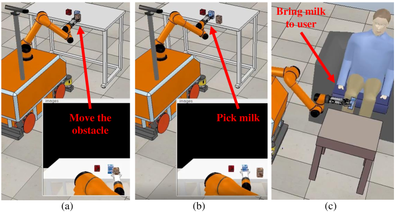

[Arxiv](https://arxiv.org/abs/2404.05134)