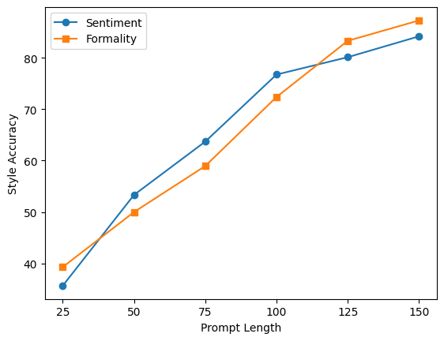
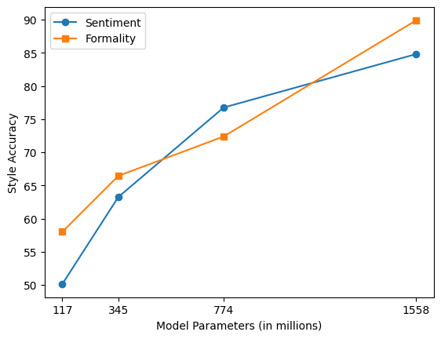

# 玩转提示：巧用提示调整技术驾驭文本生成

发布时间：2024年04月07日

`LLM应用` `情感分析`

> Plug and Play with Prompts: A Prompt Tuning Approach for Controlling Text Generation

# 摘要

> 基于Transformer的巨型语言模型在文本提示下展现出非凡的文字创造能力。但要通过文字提示精准操控文本生成的方向，对小模型来说尤为棘手。本研究尝试运用提示调整技术，以实现对语言生成的精确控制。通过训练一个小型语言模型作为鉴别器，利用提示嵌入来引导文本生成。值得一提的是，即便仅用几百个样本的微小数据集，也能有效地训练这些提示嵌入。这种方法在控制语言模型输出方面，既节省数据又减少参数。我们对四个数据集进行了深入评估，包括SST-5和Yelp（用于情感分析）、GYAFC（衡量正式程度）以及JIGSAW（检测有毒言论）。最终，我们的研究展示了该方法在减少语言模型产生的有害、有毒和偏见文本方面的显著效果。

> Transformer-based Large Language Models (LLMs) have shown exceptional language generation capabilities in response to text-based prompts. However, controlling the direction of generation via textual prompts has been challenging, especially with smaller models. In this work, we explore the use of Prompt Tuning to achieve controlled language generation. Generated text is steered using prompt embeddings, which are trained using a small language model, used as a discriminator. Moreover, we demonstrate that these prompt embeddings can be trained with a very small dataset, with as low as a few hundred training examples. Our method thus offers a data and parameter efficient solution towards controlling language model outputs. We carry out extensive evaluation on four datasets: SST-5 and Yelp (sentiment analysis), GYAFC (formality) and JIGSAW (toxic language). Finally, we demonstrate the efficacy of our method towards mitigating harmful, toxic, and biased text generated by language models.

[Arxiv](https://arxiv.org/abs/2404.05143)