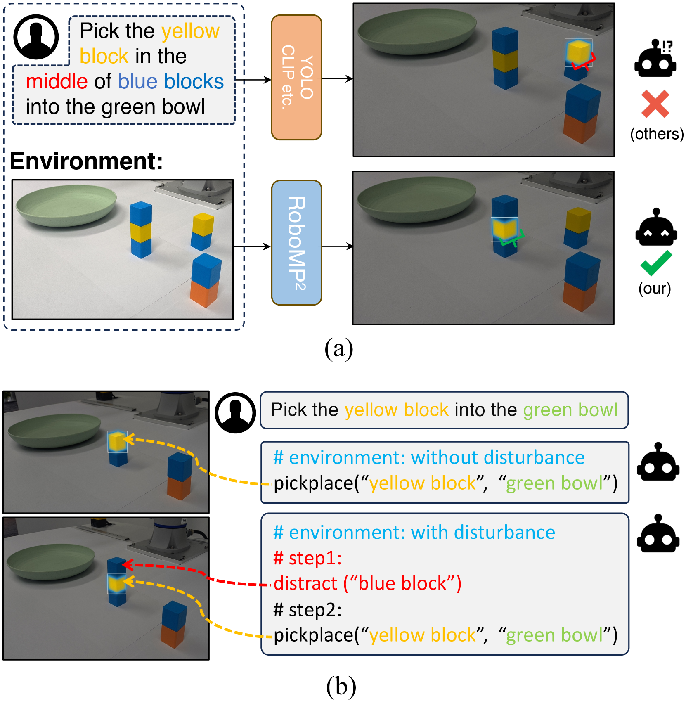
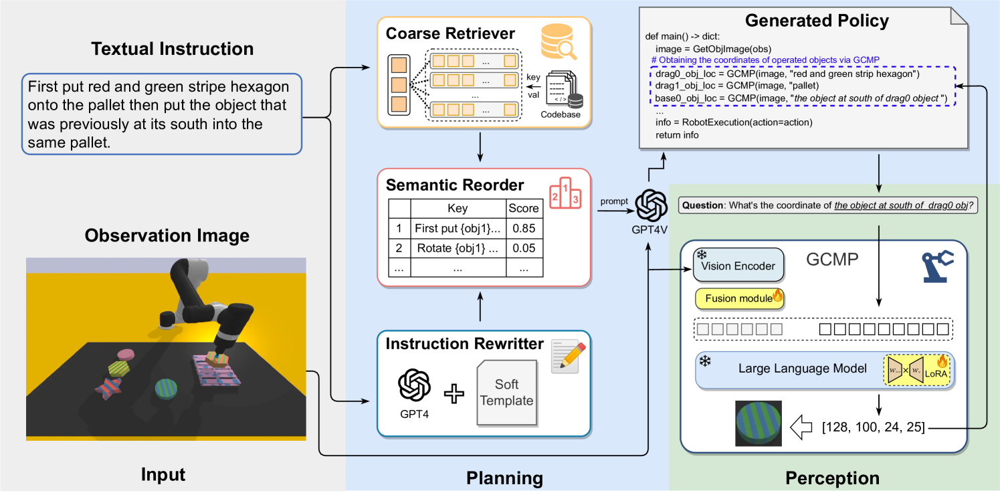
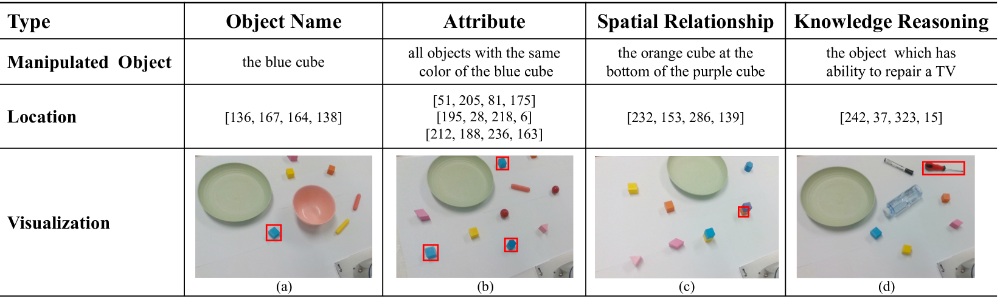
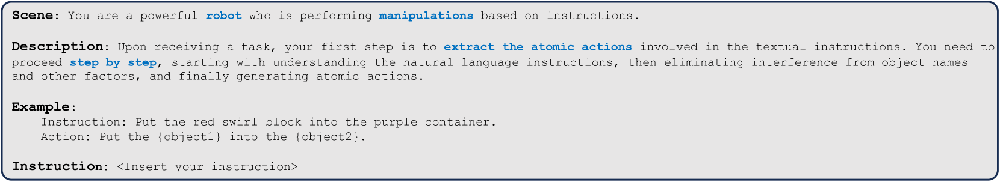
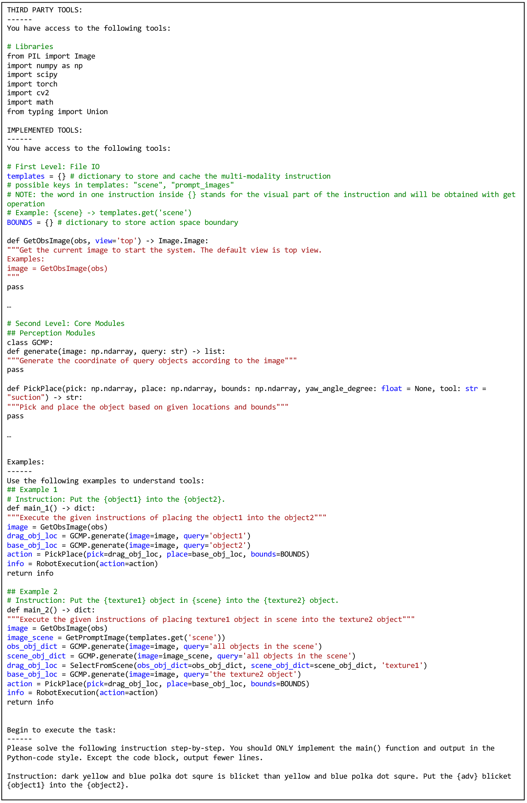

# RoboMP$^2$：融合多模态大型语言模型的机器人感知与规划架构

发布时间：2024年04月07日

`Agent` `机器人` `感知-规划`

> RoboMP$^2$: A Robotic Multimodal Perception-Planning Framework with Multimodal Large Language Models

# 摘要

> 多模态大型语言模型（MLLMs）在众多领域展现出卓越的推理和通用智能，激励研究者们训练一体化的MLLMs或利用大型模型为具身智能体制定策略。然而，这些方法在应对未知任务或场景时泛化能力受限，同时忽略了对机器人决策至关重要的多模态环境信息。本文提出了一种创新的机器人多模态感知-规划（RoboMP$^2$）框架，专为机器人操控设计，包含目标条件的多模态预ceptor（GCMP）和检索增强的多模态规划器（RAMP）。GCMP通过定制的MLLMs捕捉环境状态，具备语义理解和定位功能。RAMP采用由粗到细的检索方法，寻找$k$个最相关的策略作为上下文示例，以提升规划效率。大量实验证明，RoboMP$^2$在VIMA基准测试和现实世界任务中均显著优于现有技术，相比基线提升了约10%。

> Multimodal Large Language Models (MLLMs) have shown impressive reasoning abilities and general intelligence in various domains. It inspires researchers to train end-to-end MLLMs or utilize large models to generate policies with human-selected prompts for embodied agents. However, these methods exhibit limited generalization capabilities on unseen tasks or scenarios, and overlook the multimodal environment information which is critical for robots to make decisions. In this paper, we introduce a novel Robotic Multimodal Perception-Planning (RoboMP$^2$) framework for robotic manipulation which consists of a Goal-Conditioned Multimodal Preceptor (GCMP) and a Retrieval-Augmented Multimodal Planner (RAMP). Specially, GCMP captures environment states by employing a tailored MLLMs for embodied agents with the abilities of semantic reasoning and localization. RAMP utilizes coarse-to-fine retrieval method to find the $k$ most-relevant policies as in-context demonstrations to enhance the planner. Extensive experiments demonstrate the superiority of RoboMP$^2$ on both VIMA benchmark and real-world tasks, with around 10% improvement over the baselines.

[Arxiv](https://arxiv.org/abs/2404.04929)