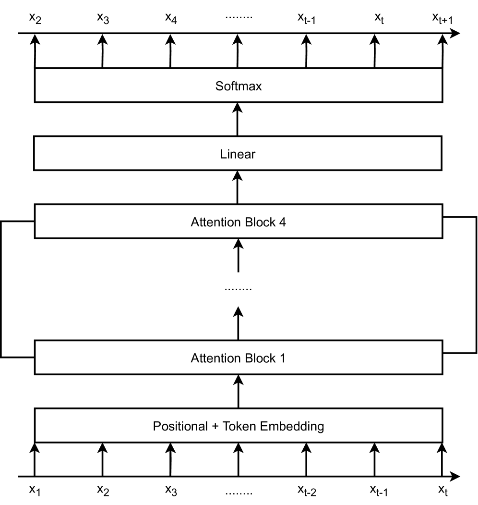
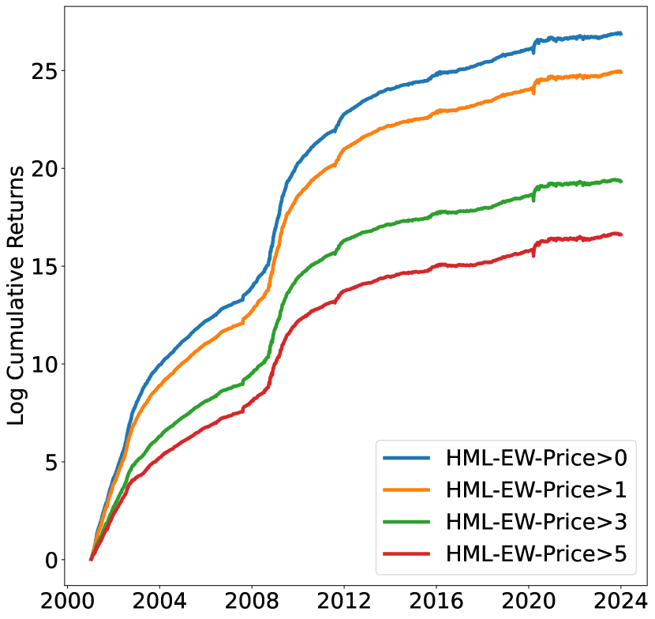
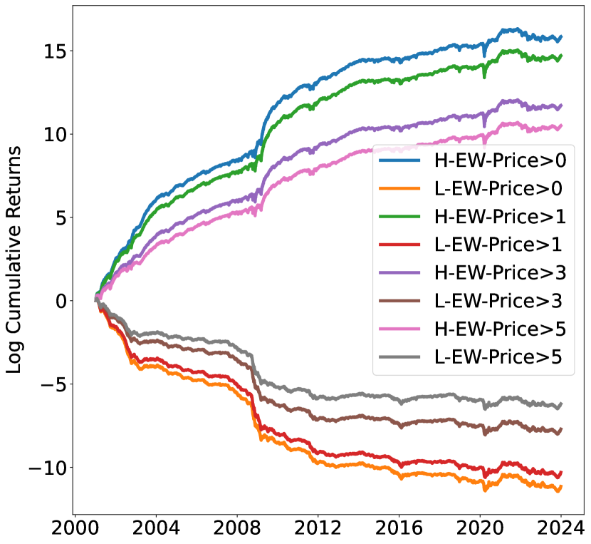
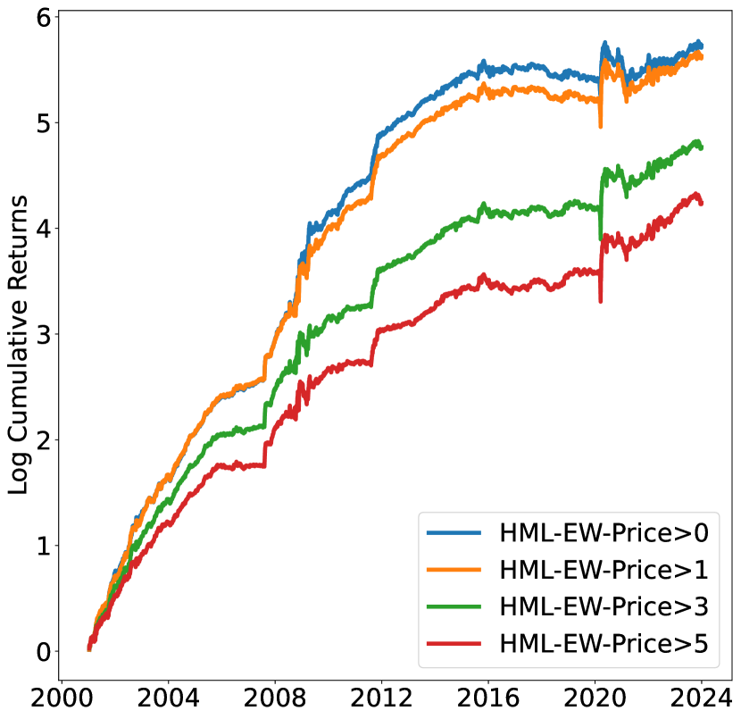
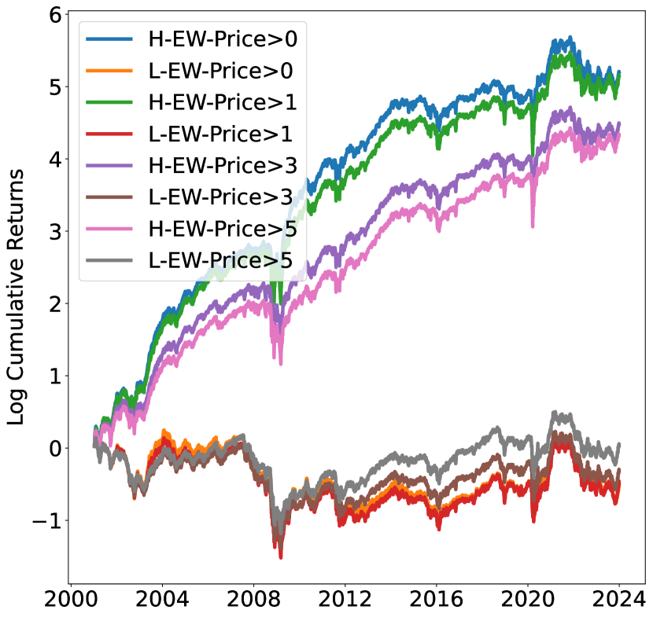
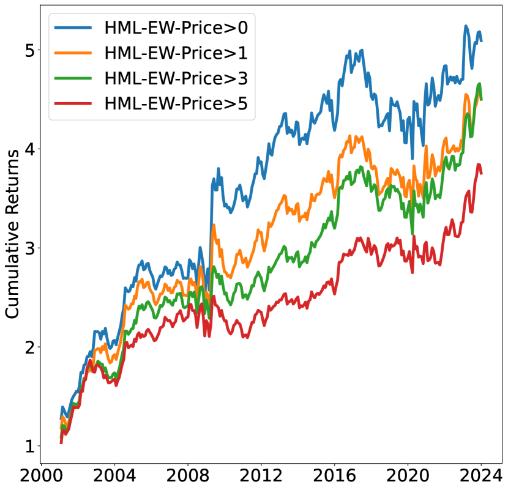
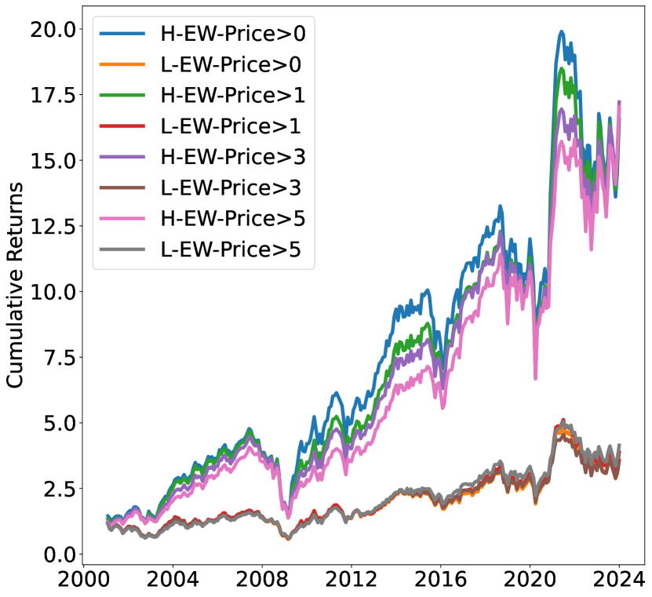
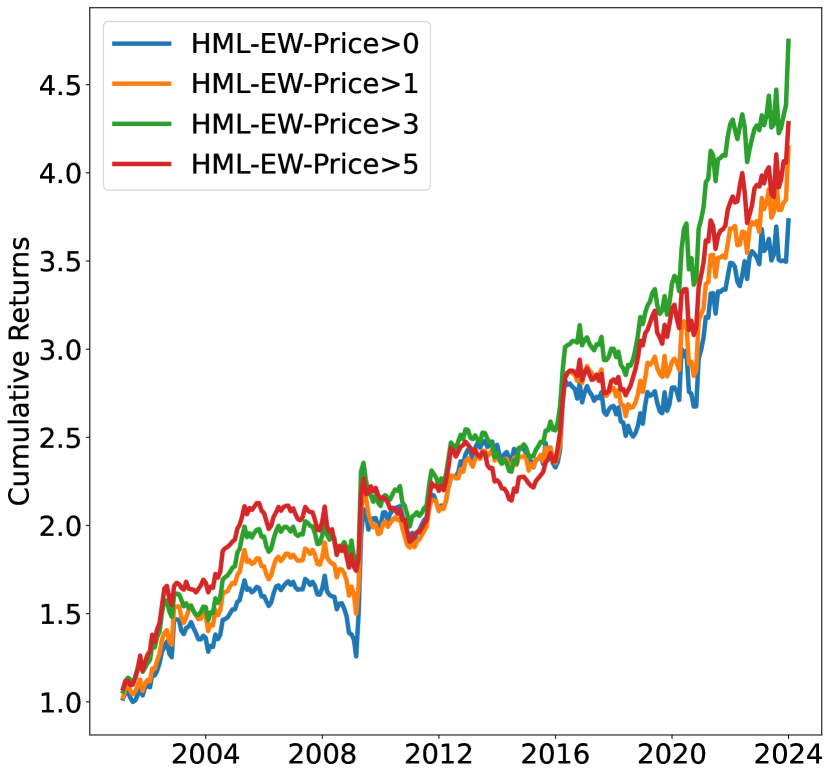
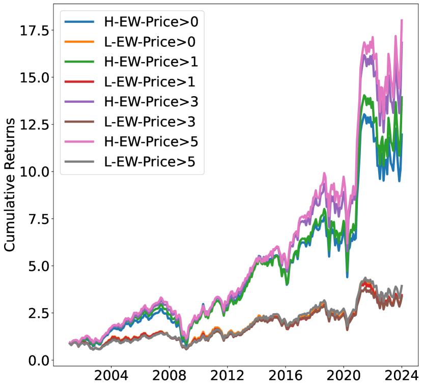

# StockGPT：一款股票预测与交易的智能AI模型

发布时间：2024年04月07日

`LLM应用` `股市预测`

> StockGPT: A GenAI Model for Stock Prediction and Trading

# 摘要

> 本文隆重推出StockGPT，一种直接基于美国股市日回报历史数据预训练的自回归式“数字”模型。该模型将每一系列收益率视作一串标记，精于洞悉并预测错综复杂的股市回报变化。StockGPT摒弃了依赖历史股价的人为交易模式，通过其独特的注意力机制，自主学习未来收益的潜在预测因素。在2001至2023年的独立测试样本中，依据StockGPT预测构建的日度调整的长短对冲投资组合，年化收益率高达119%，夏普比率高达6.5。这一投资组合彻底阐释了市场动量及长短期反转现象，省却了人工制定基于价格策略的繁琐，同时也覆盖了大多数主要股市因子。这一成果不仅展示了生成性AI在复杂金融投资决策上超越人类的巨大潜力，也彰显了大型语言模型的注意力机制在跨界应用中的卓越效能。

> This paper introduces StockGPT, an autoregressive "number" model pretrained directly on the history of daily U.S. stock returns. Treating each return series as a sequence of tokens, the model excels at understanding and predicting the highly intricate stock return dynamics. Instead of relying on handcrafted trading patterns using historical stock prices, StockGPT automatically learns the hidden representations predictive of future returns via its attention mechanism. On a held-out test sample from 2001 to 2023, a daily rebalanced long-short portfolio formed from StockGPT predictions earns an annual return of 119% with a Sharpe ratio of 6.5. The StockGPT-based portfolio completely explains away momentum and long-/short-term reversals, eliminating the need for manually crafted price-based strategies and also encompasses most leading stock market factors. This highlights the immense promise of generative AI in surpassing human in making complex financial investment decisions and illustrates the efficacy of the attention mechanism of large language models when applied to a completely different domain.

[Arxiv](https://arxiv.org/abs/2404.05101)