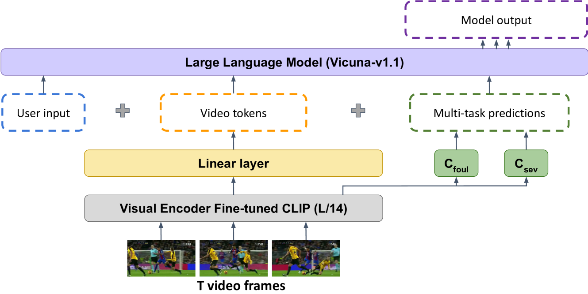

# X-VARS：运用多模态大型语言模型，为足球裁判决策带来可解释性。

发布时间：2024年04月07日

`LLM应用` `人工智能`

> X-VARS: Introducing Explainability in Football Refereeing with Multi-Modal Large Language Model

# 摘要

> 随着人工智能的飞速发展，自动化决策变得更加高效。但模型性能的提升往往牺牲了决策过程的清晰度和透明度。本文探讨了大型语言模型在解释决策方面的能力，以足球裁判为例，因其决策既复杂又具主观性。我们提出了 X-VARS 系统，这是一个多模态的大型语言模型，专为从裁判视角解读足球视频而设计。X-VARS 不仅能够描述视频、回答问题、识别动作，还能根据足球规则与视频内容进行深入对话。通过在包含 22,000 多个视频问题答案组合的 SoccerNet-XFoul 数据集上的测试，X-VARS 展现了其在解读复杂足球场景方面的出色表现。研究和人类评估进一步证实了 X-VARS 达到甚至超越人类水平的潜力，未来有望辅助足球裁判的工作。

> The rapid advancement of artificial intelligence has led to significant improvements in automated decision-making. However, the increased performance of models often comes at the cost of explainability and transparency of their decision-making processes. In this paper, we investigate the capabilities of large language models to explain decisions, using football refereeing as a testing ground, given its decision complexity and subjectivity. We introduce the Explainable Video Assistant Referee System, X-VARS, a multi-modal large language model designed for understanding football videos from the point of view of a referee. X-VARS can perform a multitude of tasks, including video description, question answering, action recognition, and conducting meaningful conversations based on video content and in accordance with the Laws of the Game for football referees. We validate X-VARS on our novel dataset, SoccerNet-XFoul, which consists of more than 22k video-question-answer triplets annotated by over 70 experienced football referees. Our experiments and human study illustrate the impressive capabilities of X-VARS in interpreting complex football clips. Furthermore, we highlight the potential of X-VARS to reach human performance and support football referees in the future.

[Arxiv](https://arxiv.org/abs/2404.06332)